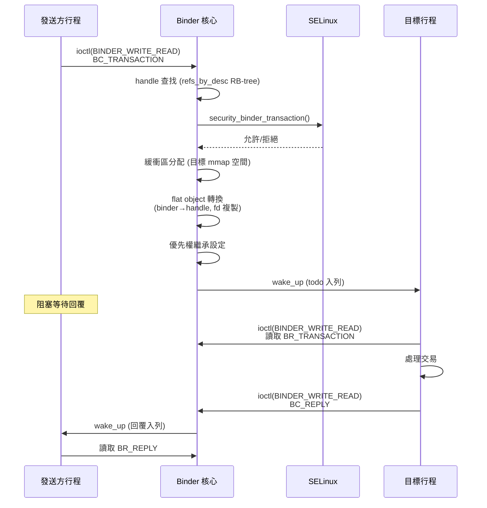

# Binder 交易流程深度分析

## 總覽

Binder 是 Android 的核心 IPC 機制，每秒處理數千筆跨行程交易。本分析追蹤一筆典型 Binder 交易從發起到完成的完整路徑，標註每個階段的鎖定狀態、記憶體操作與安全檢查。

## 交易類型

Binder 支援兩種交易模式：

- **同步交易 (BC_TRANSACTION)**：發送方阻塞等待目標行程回覆（BC_REPLY）
- **異步交易 (ONE_WAY)**：發送方不等待回覆，交易排入目標的 async_todo 列表

## 完整交易流程

### 階段 1：使用者空間進入核心

```
使用者空間 ioctl(fd, BINDER_WRITE_READ, &bwr)
    ↓
binder_ioctl()                     @ drivers/android/binder.c
    ↓ 取得 binder_thread（per-thread 結構體）
binder_ioctl_write_read()
    ↓ 複製 binder_write_read 結構體從使用者空間
binder_thread_write()
    ↓ 解析 BC_TRANSACTION 命令
binder_transaction()               @ ~1,000 行核心函式
```

### 階段 2：目標解析與安全檢查

`binder_transaction()` 的前半段負責找到目標行程：

1. **Handle 查找**：透過發送方的 `binder_proc->refs_by_desc` 紅黑樹查找 `binder_ref`，取得對應的 `binder_node`
2. **目標行程確認**：從 `binder_node->proc` 取得目標 `binder_proc`
3. **SELinux 檢查**：呼叫 `security_binder_transaction()`，觸發 SELinux hook `selinux_binder_transaction()`，驗證發送方對目標的 `call` 或 `transfer` 權限

**鎖定序列**（目標解析）：
```
proc->outer_lock      [取得] — 保護 refs_by_desc 查找
  → node->lock        [取得] — 讀取 node 狀態
  → proc->outer_lock  [釋放]
  → node->lock        [釋放]
```

### 階段 3：緩衝區分配

在目標行程的位址空間中分配共享記憶體緩衝區：

1. **大小計算**：交易資料 + offsets 陣列 + security context（如有）
2. **緩衝區搜尋**：在目標 `binder_alloc` 的可用緩衝區列表中找到合適區塊
3. **頁面對映**：按需分配實體頁面並對映到目標行程的 mmap 區域
4. **描述符分配**：使用 `dbitmap` 動態 bitmap 分配新的 binder 描述符

**關鍵效能點**：Binder 的「零拷貝」並非完全零拷貝——資料從發送方使用者空間複製到核心，再對映到目標行程位址空間。實際只有一次 `copy_from_user()` 加上頁面表操作。

### 階段 4：Flat Object 轉換

交易資料中可能包含特殊物件（flat objects），需要逐一轉換：

- **BINDER_TYPE_BINDER → BINDER_TYPE_HANDLE**：本地物件轉為遠端引用
- **BINDER_TYPE_HANDLE → BINDER_TYPE_BINDER**（若目標是物件擁有者）
- **BINDER_TYPE_FD**：檔案描述符在目標行程中複製（`binder_translate_fd()`），需呼叫 `security_binder_transfer_file()` 進行安全檢查

**鎖定序列**（物件轉換）：
```
對每個 flat object:
  target_proc->outer_lock  [取得] — 建立/查找引用
    → node->lock           [取得] — 更新引用計數
    → node->lock           [釋放]
  target_proc->outer_lock  [釋放]
```

### 階段 5：優先權繼承

對於同步交易，Binder 實現優先權繼承以避免優先權反轉：

1. 記錄發送方當前排程策略和優先權
2. 將目標執行緒的有效優先權提升至發送方等級（若較高）
3. 交易完成後恢復原始優先權

### 階段 6：交易入列

```
target_proc->inner_lock  [取得]
  → 選擇目標執行緒（優先使用已在等待的執行緒）
  → 將 binder_transaction 加入 target_thread->todo 或 target_proc->todo
  → 如果是同步交易，加入 thread->transaction_stack
  → wake_up_interruptible(target_wait)
target_proc->inner_lock  [釋放]
```

**執行緒選擇策略**：
- 優先選擇已阻塞在 `BINDER_WRITE_READ` 且 `transaction_stack` 匹配的執行緒（回覆同一交易鏈）
- 次選任何空閒等待中的執行緒
- 若無空閒執行緒，排入 `proc->todo`（由下一個呼叫 ioctl 的執行緒處理）

### 階段 7：目標行程讀取

目標執行緒被喚醒後進入 `binder_thread_read()`：

```
binder_thread_read()
    ↓ 從 thread->todo 或 proc->todo 取出 work
    ↓ 將 binder_transaction 轉換為 BR_TRANSACTION 命令
    ↓ copy_to_user() 將 transaction_data 結構體寫回使用者空間
    ↓ （資料本身在 mmap 區域，使用者空間直接存取）
    → 返回使用者空間
```

### 階段 8：回覆（同步交易）

目標行程處理完畢後，發送 BC_REPLY：

```
binder_transaction() [reply = true]
    ↓ 從 transaction_stack 取出原始交易
    ↓ 在原始發送方的 alloc 中分配回覆緩衝區
    ↓ 複製回覆資料
    ↓ 喚醒原始發送方執行緒
```

## 鎖定層次總結

Binder 使用嚴格的三層 spinlock 層次結構，任何時候的取鎖順序必須遵守：

```
outer_lock (proc 級)
  → node->lock (節點級)
    → inner_lock (proc 級，保護 todo/stack)
```

函式命名慣例標註鎖定狀態：`_olocked`（持有 outer_lock）、`_nlocked`（持有 node->lock）、`_ilocked`（持有 inner_lock）。

## 效能瓶頸分析

1. **copy_from_user() / copy_to_user()**：每筆交易至少兩次使用者空間-核心空間資料複製（發送方寫入 + 目標方讀取結構體）
2. **頁面表操作**：大型交易需要在目標行程分配和對映實體頁面
3. **鎖定競爭**：高負載時 `inner_lock` 是主要競爭點（todo 列表和 transaction_stack）
4. **SELinux 檢查**：每筆交易都觸發 AVC 查找（hash table + 可能的策略計算）
5. **FD 轉移**：跨行程檔案描述符複製涉及 VFS 層操作

## 凍結機制

ACK 的 Binder 支援行程凍結（`BINDER_FREEZE` ioctl），用於低記憶體管理：

- 凍結的行程不再處理新交易（`proc->is_frozen = true`）
- 同步交易返回 `BR_FROZEN_REPLY` 給發送方
- 異步交易暫存，解凍後繼續處理
- 凍結狀態透過 `BINDER_GET_FROZEN_INFO` 查詢

## 異步交易垃圾郵件偵測

為防止異步交易洪水攻擊，Binder 追蹤 `oneway_spam_suspect` 標誌：當目標行程的 async_todo 隊列過長時標記發送方，後續交易可能被拒絕。

## Mermaid 流程圖



## 交叉參考

- [Binder 實體](../entities/binder.md) — 完整元件分析
- [Binderfs](../entities/binderfs.md) — 裝置管理
- [`binder_proc`](../data-structures/binder_proc.md) — 核心資料結構
- [安全子系統](../subsystems/security.md) — SELinux Binder hooks
- [鎖定原語](../concepts/locking-primitives.md) — Spinlock 機制
- [Vendor Hooks 分佈](vendor-hooks-distribution.md) — Binder 無 vendor hooks 的設計選擇
