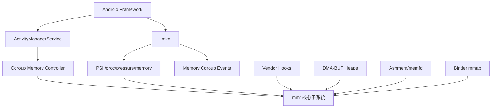

# 記憶體管理 Android 擴展分析

## 總覽

記憶體管理是 Android 裝置效能的關鍵瓶頸——行動裝置記憶體有限（通常 4-16 GB），卻需要同時維護數十個應用程式的狀態。ACK 在上游 Linux mm 子系統（140,000+ 行）的基礎上，透過少量精準修改和外部機制來滿足 Android 的記憶體管理需求。

## Android 記憶體管理生態系

## 核心修改分析

### 1. Multi-Gen LRU 預設啟用

**修改**：`CONFIG_LRU_GEN=y` + `CONFIG_LRU_GEN_ENABLED=y`（GKI defconfig）

**上游狀態**：Multi-Gen LRU（MGLRU）已合入上游 Linux 6.1，但上游預設**關閉**。ACK 預設**啟用**。

**設計決策分析**：

傳統 active/inactive 兩級 LRU 在 Android 上表現不佳，原因是行動裝置的記憶體存取模式與伺服器截然不同——應用切換頻繁導致工作集快速變化，二級 LRU 無法有效區分「最近被喚醒的前景 app」和「已被使用者忘記但還在記憶體的 app」。

MGLRU 引入世代（generation）概念，透過頁表掃描追蹤每個頁面的存取新鮮度，產生更精確的回收順序。在 Android 工作負載下，MGLRU 可減少 kswapd 的不必要回收，降低應用冷啟動時間。

### 2. Vendor Hook — 回收比率控制

**Hook**：`android_rvh_set_balance_anon_file_reclaim` @ `mm/vmscan.c:2579`（restricted）

**作用**：允許廠商覆寫 anon page 和 file page 的回收比率。

**設計決策分析**：

上游 Linux 根據 swappiness 和重新引用頻率決定回收 anon 還是 file pages。但 Android 裝置的儲存特性差異巨大——UFS 3.1 和 UFS 4.0 的隨機讀寫效能可差 2-5 倍。廠商需要根據自家儲存硬體特性調整回收策略，例如高速 UFS 裝置可以更積極地 swap out anon pages（因為 swap in 延遲較低），而低速儲存則應優先保留 anon pages。

這個 hook 是 **restricted** 型別，因為回收比率必須是單一決策——兩個廠商模組給出矛盾的比率會導致不確定行為。

### 3. Vendor Hook — mmap 安全檢查

**Hook**：`android_vh_check_mmap_file` @ `mm/util.c:592`（unrestricted）

**作用**：在 `mmap()` 系統呼叫中對檔案映射進行額外安全檢查。

**設計決策分析**：

Android 的安全模型需要在 kernel 層面限制某些檔案的記憶體映射，例如防止應用程式直接 mmap 某些裝置節點或安全敏感檔案。此 hook 為 unrestricted，因為多個安全模組可以各自獨立地檢查 mmap 請求。

### 4. Memfd-Ashmem 相容層

**檔案**：`mm/memfd-ashmem-shim.c`（214 行）

**設計決策分析**：

Ashmem（Anonymous Shared Memory）是 Android 早期的共享記憶體機制，提供 pin/unpin 語意允許系統在記憶體壓力下回收未 pinned 的共享記憶體區域。上游 Linux 引入 `memfd_create()` 後，Android 開始遷移，但大量舊版應用仍使用 ashmem ioctl。

相容層將 ashmem ioctl 轉換為 memfd 操作：

| Ashmem ioctl | Memfd 等效操作 |
|-------------|---------------|
| `ASHMEM_SET_SIZE` | `ftruncate()` |
| `ASHMEM_PIN` | （標記為 pinned） |
| `ASHMEM_UNPIN` | `FALLOC_FL_PUNCH_HOLE` |
| `ASHMEM_SET_NAME` | memfd 名稱 |

**廢棄進程**：Ashmem → memfd-ashmem-shim → 純 memfd。shim 層是過渡方案。

### 5. Memfd Live Update Orchestrator (LUO)

**作用**：在 kexec 重啟期間保留 memfd 內容。

**設計決策分析**：

Android 的 A/B 無縫更新需要在核心重啟後恢復關鍵系統狀態。memfd LUO 讓特定的 memfd 區域跨 kexec 存活，避免需要將所有狀態序列化到持久儲存再反序列化。

## Android 記憶體管理外部機制

### DMA-BUF Heaps（取代 Ion）

**元件**：`drivers/dma-buf/heaps/` — System Heap (556行) + CMA Heap (448行)

Android 多媒體管線（相機、影片解碼器、GPU）需要在多個硬體元件之間共享記憶體緩衝區。DMA-BUF heaps 是上游化的替代方案，取代 Android 舊版的 Ion 分配器。

**System Heap 分配策略**：
- 先嘗試 order-8（1MB）大頁面，減少 TLB 壓力
- 退回 order-4（64KB），再退回 order-0（4KB）
- 偵測 SWIOTLB 限制，必要時限制為 order-0

### Binder mmap 記憶體管理

每個 Binder 行程透過 `mmap()` 分配 1MB 虛擬位址空間，實體頁面按需分配。`binder_alloc` 維護 LRU shrinker，在記憶體壓力下回收未使用的 Binder 緩衝區頁面。

### Cgroup Memory Controller

Android 的 `ActivityManagerService` 和 `lmkd` 利用 memory cgroup 監控和限制每個應用的記憶體用量：

- PSI（Pressure Stall Information）提供 per-cgroup 記憶體壓力指標
- `memory.max` 限制背景應用的記憶體上限
- `memory.events` 觸發低記憶體事件通知 lmkd

### Low Memory Killer

Android 的 lmkd 在 **userspace** 執行（不再使用核心 lowmemorykiller），讀取 PSI 指標和 cgroup events，決定殺死哪些背景行程以回收記憶體。

## 未修改的上游機制（Android 原樣使用）

| 機制 | 用途 |
|------|------|
| Buddy allocator | 實體頁面分配 |
| SLUB | Kernel slab 分配 |
| Page Cache | 檔案 I/O 快取 |
| Compaction | 大頁面碎片整理 |
| THP (Transparent Huge Pages) | 減少 TLB 壓力 |
| KSM | 共享相同頁面（容器/虛擬化） |
| zswap | 壓縮 swap（減少 I/O） |
| DAMON | 資料存取監控 |

## 設計哲學總結

ACK 的記憶體管理擴展策略體現了「最小核心修改 + 豐富外部機制」的原則：

1. **核心修改極度克制**：140,000+ 行 mm/ 程式碼中僅 2 個 vendor hooks + 1 個配置變更 + 1 個相容層
2. **擴展點集中在策略而非機制**：回收比率 hook 改變的是「何時回收什麼」而非「如何回收」
3. **外部機制豐富**：DMA-BUF heaps、Binder alloc、lmkd 在核心外提供 Android 特定功能
4. **漸進廢棄**：Ion → DMA-BUF heaps，ashmem → memfd，核心 LMK → userspace lmkd

## 交叉參考

- [記憶體管理子系統](../subsystems/memory-management.md) — 完整子系統分析
- [Ashmem](../entities/ashmem.md) — 共享記憶體廢棄過渡
- [DMA-BUF Heaps](../entities/dmabuf-heaps.md) — Ion 替代方案
- [`mm_struct`](../data-structures/mm_struct.md) — 行程位址空間結構
- [`page`/`folio`](../data-structures/page.md) — 實體頁面描述符
- [記憶體分配概念](../concepts/memory-allocation.md) — 分配器框架
- [Vendor Hooks 分佈](vendor-hooks-distribution.md) — mm 僅 2 hooks 的設計選擇
- [Cgroup 控制器](../entities/cgroup-controllers.md) — Memory cgroup 詳情
