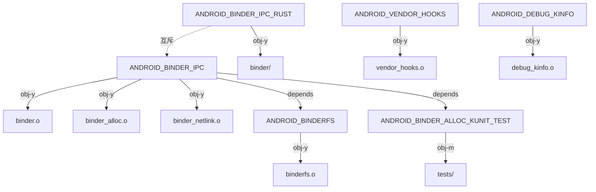

# drivers/android/ 目錄總覽

## 概要

`drivers/android/` 是 Android Common Kernel (ACK) 中所有 Android 專屬核心驅動程式的集中存放位置。此目錄包含 Android 平台運作所必需的核心元件，均為 Android 專屬（非上游 Linux）程式碼。整個目錄在 Linux 主線核心中不存在。

## 目錄結構

| 檔案/目錄 | 行數 | 用途 |
|-----------|------|------|
| `Kconfig` | 122 | 8 個 CONFIG 選項定義 |
| `Makefile` | 9 | 編譯規則：根據 CONFIG 選項條件編譯 |
| `binder.c` | 7,374 | Binder IPC 驅動（C 版本） |
| `binder_alloc.c` | 1,410 | Binder 緩衝區記憶體分配器 |
| `binder_alloc.h` | 190 | 分配器標頭檔 |
| `binder_internal.h` | 637 | Binder 內部資料結構定義 |
| `binder_netlink.c` | 32 | Binder Generic Netlink 介面（自動產生） |
| `binder_netlink.h` | — | Netlink 標頭檔 |
| `binder_trace.h` | — | Binder ftrace 事件定義 |
| `binderfs.c` | 786 | Binderfs 虛擬檔案系統 |
| `dbitmap.h` | 169 | 動態 bitmap 資料結構（描述符 ID 分配最佳化） |
| `debug_kinfo.c` | 185 | 除錯核心資訊匯出供 bootloader 使用 |
| `debug_kinfo.h` | 69 | debug_kinfo 資料結構定義 |
| `vendor_hooks.c` | 93 | Vendor Hook tracepoint 匯出驅動 |
| `binder/` | 9,080 | **Rust 版 Binder 驅動**（14 個 .rs 檔 + 輔助 C/H 檔） |
| `tests/` | 572 | Binder 分配器 KUnit 測試 |
| **總計** | **~21,700** | |

## Kconfig 配置選項

| CONFIG 選項 | 類型 | 預設值 | 用途 |
|------------|------|--------|------|
| `ANDROID_BINDER_IPC` | bool | n | C 版 Binder IPC 驅動 |
| `ANDROID_BINDER_IPC_RUST` | bool | — | Rust 版 Binder IPC 驅動（互斥於 C 版） |
| `ANDROID_BINDERFS` | bool | n | Binderfs 虛擬檔案系統（依賴 C 版 Binder） |
| `ANDROID_BINDER_DEVICES` | string | "binder,hwbinder,vndbinder" | 預設 Binder 裝置名稱 |
| `ANDROID_BINDER_ALLOC_KUNIT_TEST` | tristate | KUNIT_ALL_TESTS | Binder 分配器 KUnit 測試 |
| `ANDROID_VENDOR_HOOKS` | bool | — | Vendor Hook 框架（依賴 TRACEPOINTS） |
| `ANDROID_DEBUG_KINFO` | bool | — | 核心除錯資訊供 bootloader（依賴 KALLSYMS） |
| `ANDROID_KABI_RESERVE` | bool | y | KABI 保留填充（64 位元架構） |
| `ANDROID_VENDOR_OEM_DATA` | bool | y | Vendor/OEM 資料填充 |

注意：`ANDROID_BINDER_IPC` 與 `ANDROID_BINDER_IPC_RUST` 互斥（`depends on !ANDROID_BINDER_IPC`），系統只能選擇其一。Rust 版本額外需要 `CONFIG_RUST`。

## 元件分類

### 1. Binder IPC 子系統（佔 ~96% 程式碼量）

Binder 是 Android 最核心的 IPC 機制，`drivers/android/` 中絕大部分程式碼都與 Binder 相關：

- **C 版 Binder**（`binder.c` + `binder_alloc.c` + `binderfs.c`）：9,570 行，成熟穩定的實作
- **Rust 版 Binder**（`binder/` 目錄）：9,080 行，2025 年新增的完整 Rust 重新實作
- **共用標頭檔**：`binder_internal.h`、`binder_alloc.h`、`dbitmap.h`、`binder_trace.h`
- **Netlink 介面**：`binder_netlink.c`（由 YNL 自動產生），提供 Generic Netlink multicast 報告
- **KUnit 測試**：`tests/binder_alloc_kunit.c`

Binder 提供三個邏輯裝置：`binder`（framework IPC）、`hwbinder`（HAL IPC）、`vndbinder`（vendor IPC），各有獨立的 context manager。

→ 詳見 [Binder](../entities/binder.md)、[Binderfs](../entities/binderfs.md)

### 2. Vendor Hook 匯出驅動

`vendor_hooks.c` 是 Android Vendor Hook 框架的核心匯出模組：
- 包含 29 個 hook 標頭檔的 `#include`
- 匯出約 50 個 `EXPORT_TRACEPOINT_SYMBOL_GPL` 符號
- 涵蓋子系統：cpuidle、cpufreq、sched（via trace/hooks/sched.h，78 個 hook）、UFS、cgroup、IOMMU、net、SELinux/AVC、remoteproc、timer 等

此檔案使用 `#define CREATE_TRACE_POINTS` 來產生 tracepoint 定義，然後透過 `EXPORT_TRACEPOINT_SYMBOL_GPL` 匯出給廠商模組使用。

→ 詳見 [Vendor Hooks](../concepts/vendor-hooks.md)、[Vendor Hooks Driver](../entities/vendor-hooks-driver.md)

### 3. Debug Kinfo 驅動

`debug_kinfo.c` 是 Google 設計的除錯輔助驅動：
- 透過 Device Tree reserved memory 機制，將核心關鍵資訊寫入保留記憶體區域
- 匯出資訊包含：kallsyms 實體位址、核心段佈局（_text, _stext, _etext, _end）、swapper_pg_dir、UTS_RELEASE、build_info
- 供 bootloader 在 crash dump 時進行 backtrace 符號解析
- 使用 `struct kernel_all_info` 封裝，含 magic number（0xCCEEDDFF）和 XOR checksum 驗證
- 相容設備樹節點：`google,debug-kinfo`

→ 詳見 [Debug Kinfo](../entities/debug-kinfo.md)

## 編譯依賴關係

## Android 輔助標頭檔（drivers/android/ 以外）

`drivers/android/` 的驅動程式依賴數個位於其他目錄的 Android 專屬標頭檔：

| 標頭檔 | 用途 |
|--------|------|
| `include/linux/android_kabi.h` | KABI 保留填充巨集（ANDROID_KABI_RESERVE / ANDROID_KABI_USE） |
| `include/linux/android_vendor.h` | Vendor/OEM 資料填充巨集（ANDROID_VENDOR_DATA） |
| `include/trace/hooks/*.h`（29 個） | Vendor Hook 宣告（DECLARE_HOOK / DECLARE_RESTRICTED_HOOK） |
| `include/uapi/linux/android/binder.h` | Binder UAPI（ioctl、資料結構、命令） |
| `include/uapi/linux/android/binderfs.h` | Binderfs UAPI |
| `include/uapi/linux/android/binder_netlink.h` | Binder Netlink UAPI |

### KABI 保留機制

`android_kabi.h` 定義了 ABI 穩定性保留巨集體系：
- `ANDROID_KABI_RESERVE(n)`：在結構中保留 `u64` 填充欄位
- `ANDROID_KABI_USE(n, _new)`：凍結後使用保留欄位替換新欄位（union + _Static_assert 確保大小不超）
- `ANDROID_KABI_REPLACE`：替換現有欄位為相容新類型
- `ANDROID_KABI_IGNORE`：新增但不計入版本化的欄位
- 靈感來自 RHEL/CentOS 的 `rh_kabi.h`

### Vendor/OEM 資料機制

`android_vendor.h` 定義：
- `ANDROID_VENDOR_DATA(n)`：在結構中保留 `u64` 供廠商模組使用
- `ANDROID_OEM_DATA(n)`：類似，供 OEM 使用
- 例如 `task_struct` 中有 96 bytes 的 vendor data

## 與其他子系統的關係

- **排程器**：透過 `trace/hooks/sched.h` 的 78 個 vendor hooks 緊密整合
- **記憶體管理**：`trace/hooks/mm.h`（3 hooks）+ `trace/hooks/vmscan.h`（1 hook）
- **安全**：`trace/hooks/selinux.h` + `trace/hooks/avc.h`（5 restricted hooks）
- **儲存**：`trace/hooks/ufshcd.h`（9 hooks）
- **Cgroup**：`trace/hooks/cgroup.h`（3 hooks）
- **IOMMU**：`trace/hooks/iommu.h`（3 hooks）

## 交叉參考

- [Binder](../entities/binder.md) — Binder IPC 完整分析
- [Binderfs](../entities/binderfs.md) — Binderfs 檔案系統
- [Debug Kinfo](../entities/debug-kinfo.md) — 除錯資訊匯出
- [Vendor Hooks](../concepts/vendor-hooks.md) — Vendor Hook 框架設計
- [Vendor Hooks Driver](../entities/vendor-hooks-driver.md) — 匯出驅動分析
- [GKI](../concepts/gki.md) — Generic Kernel Image 架構
- [Rust in Kernel](../concepts/rust-in-kernel.md) — Rust Binder 相關
- [KABI 穩定性](abi-stability.md) — ABI 保留與穩定性機制
- [Android 修補政策](android-patches-policy.md) — Android 修補分類
- [Vendor Hook 目錄](vendor-hook-catalogue.md) — 全部 hook 清單
