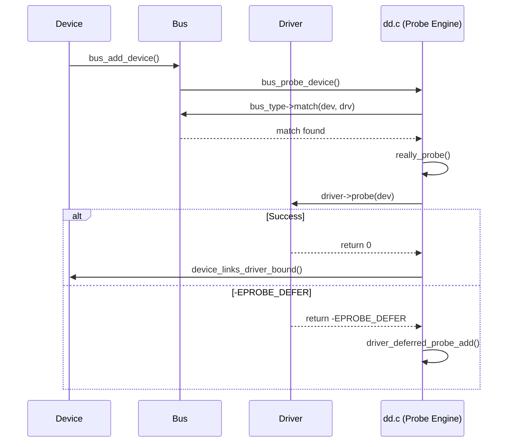

# Driver Model（裝置驅動模型）

## Overview

Linux 核心的 Driver Model 是一套統一的抽象框架，負責管理所有硬體裝置的發現、初始化、電源管理與生命週期。其設計理念是將**匯流排（Bus）、裝置（Device）、驅動程式（Driver）**三者解耦，透過匹配機制自動將驅動程式綁定到對應裝置，並提供統一的 sysfs 使用者空間介面。

核心實作位於 `drivers/base/`（~25,400 行 C 程式碼），標頭檔位於 `include/linux/device.h` 及 `include/linux/device/` 子目錄。

## Mechanism

### 三層架構

Driver Model 由三個核心抽象組成：

**Bus Type（匯流排類型）**：定義一類裝置的匹配規則與探測方法。每個 bus_type 提供 `match()` 回呼判斷裝置與驅動是否相容，以及 `probe()`/`remove()` 管理綁定生命週期。常見匯流排包括 platform、PCI、USB、I2C、SPI 等。透過 `bus_register()` @ `drivers/base/bus.c:893` 註冊，在 sysfs 中建立 `/sys/bus/<name>/` 目錄。

**Device（裝置）**：代表系統中的一個硬體或虛擬裝置，透過 `struct device` 嵌入在具體裝置結構中（如 `platform_device`、`pci_dev`）。裝置具有父子層級關係、所屬匯流排、資源管理（devres）、DMA 配置等。透過 `device_register()` @ `drivers/base/core.c:3768` 註冊。

**Driver（驅動程式）**：透過 `struct device_driver` 描述，提供 `probe()`、`remove()`、`shutdown()` 等回呼。透過 `driver_register()` @ `drivers/base/driver.c:225` 註冊到對應匯流排。

### 裝置-驅動綁定流程



核心探測邏輯在 `really_probe()` @ `drivers/base/dd.c:607`，執行步驟：
1. 呼叫 `pinctrl_bind_pins()` 設定 pin 控制
2. 設定 DMA 配置（`dma_configure()`）
3. 呼叫 `driver->probe()` 或 `bus->probe()`
4. 若返回 `-EPROBE_DEFER`，將裝置加入延遲探測佇列
5. 成功後呼叫 `device_links_driver_bound()` 更新依賴鏈

### Deferred Probing（延遲探測）

當驅動的依賴資源尚未就緒時（如 regulator、clock、GPIO），`probe()` 可返回 `-EPROBE_DEFER`。`dd.c` 維護兩個列表：

- `deferred_probe_pending_list`：等待重試的裝置
- `deferred_probe_active_list`：正在重試的裝置

工作佇列 `deferred_probe_work_func()` @ `dd.c:82` 負責將 pending 裝置移至 active 並逐一重試。每當有新驅動註冊或裝置綁定成功時，會觸發 `driver_deferred_probe_trigger()` 重新掃描佇列。

### fw_devlink（韌體裝置連結）

fw_devlink 機制從 Device Tree / ACPI 表中自動推導裝置間的 supplier-consumer 依賴關係，在裝置實際註冊前就建立 `fwnode_link`（@ `core.c:97`）。三種運作模式：

- **RPM 模式**（預設）：建立裝置連結並啟用 Runtime PM 管理
- **ON 模式**：嚴格裝置連結，不含 Runtime PM
- **Permissive 模式**：寬鬆模式，供相容性使用

當 supplier 裝置註冊時，`__fw_devlink_link_to_consumers()` @ `core.c:2200` 將 fwnode 連結轉換為實際的 `device_link`。若 supplier 缺少驅動，`fw_devlink_relax_link()` @ `core.c:1743` 會降級連結讓 consumer 得以繼續探測。

### Device Links（裝置連結）

`device_link_add()` @ `core.c:669` 建立裝置間的 supplier-consumer 運行時依賴：

- **DL_FLAG_PM_RUNTIME**：suspend/resume 排序遵循 supplier 先於 consumer
- **DL_FLAG_AUTOPROBE_CONSUMER**：supplier 就緒後自動觸發 consumer 探測
- **DL_FLAG_AUTOREMOVE_CONSUMER/SUPPLIER**：unbind 時自動移除連結
- **DL_FLAG_SYNC_STATE_ONLY**：僅延遲 supplier 的 `sync_state()` 回呼

連結生命週期狀態：DORMANT → AVAILABLE → CONSUMER_PROBE → ACTIVE → SUPPLIER_UNBIND。

### Device Resource Management（Devres）

`drivers/base/devres.c`（1,259 行）提供受管理的資源分配 API（`devm_*` 系列函式）。所有透過 `devm_kmalloc()`、`devm_ioremap()` 等分配的資源會在裝置 unbind 時自動釋放，避免驅動中常見的資源洩漏。內部透過 `devres_node` 追蹤每筆資源的釋放回呼。

### Component Framework（元件框架）

`drivers/base/component.c`（842 行）為聚合驅動（如 DRM 顯示控制器）提供子裝置組裝機制：

- 子裝置透過 `component_add()` 註冊為元件
- 聚合驅動透過 `component_match_add()` 定義所需元件列表
- `component_master_add_with_match()` 在所有元件就緒後觸發綁定

### Faux Bus（虛擬匯流排，2025 新增）

`drivers/base/faux.c` 提供輕量級的虛擬匯流排，適用於不需要實際硬體資源的裝置（如韌體下載器、簡單裝置包裝器）。透過 `faux_device_create()` 建立，使用永遠匹配的單一驅動。

### sysfs 拓撲

```
/sys/
├── bus/                    # 每個 bus_type 一個目錄
│   ├── platform/
│   │   ├── devices/        # 符號連結到 /sys/devices/ 下的裝置
│   │   └── drivers/        # 已註冊的驅動程式
│   ├── pci/
│   └── ...
├── class/                  # 每個 class 一個目錄
│   ├── block/
│   ├── input/
│   └── net/
└── devices/                # 裝置實體層級樹
    ├── system/             # 系統裝置（CPU、memory）
    └── platform/           # platform_device 裝置
```

## Usage Patterns

### Platform Driver（最常見模式）

platform_bus 是 Android/ARM SoC 上最常用的匯流排。匹配優先順序（`platform_match()` @ `platform.c:1376`）：
1. `driver_override`（強制綁定）
2. Device Tree `of_match_table`
3. ACPI `acpi_match_table`
4. `platform_device_id` 表
5. 裝置名稱字串比較

便利巨集：
- `module_platform_driver(drv)`：消除模組 init/exit 樣板程式碼
- `builtin_platform_driver(drv)`：內建驅動使用
- `platform_get_resource()` / `platform_get_irq()`：取得裝置資源

### Class 抽象

Class 提供高層次的裝置分類（如所有網路裝置，不論底層匯流排）。`class_register()` @ `class.c:178` 建立 `/sys/class/<name>/` 目錄。Class 管理 uevent 處理器、命名空間操作及裝置群組屬性。

### 初始化順序

`driver_init()` @ `init.c` 在開機早期執行，依序初始化：
1. 裝置子系統、匯流排子系統、Class 子系統
2. 韌體子系統、Hypervisor
3. Faux bus、OF（Device Tree）、platform_bus、auxiliary_bus
4. 拓撲裝置（memory、node、cpu、container）

## Android Relevance

### 最小化修改策略

Driver Framework 核心（core.c、bus.c、dd.c、driver.c、class.c）在 ACK 中**幾乎完全與上游 Linux 一致**，未發現 `ANDROID:` 標籤的修補。這反映了 GKI 的設計哲學——驅動框架屬於核心基礎設施，保持穩定以確保所有廠商模組的相容性。

### Vendor Hooks

`drivers/base/` 中僅有 2 個 Android vendor hooks，均位於 `arch_topology.c`：

- `trace_android_rvh_update_thermal_stats(cpu)` @ `arch_topology.c:203`：供廠商收集 CPU 頻率/溫度統計
- `trace_android_vh_update_topology_flags_workfn(NULL)` @ `arch_topology.c:229`：供廠商介入拓撲更新工作函式

### KMI 匯出符號

`drivers/base/` 共匯出約 149 個 `EXPORT_SYMBOL` / `EXPORT_SYMBOL_GPL` 符號，涵蓋裝置註冊/移除、匯流排/Class 管理、裝置連結、電源管理等。這些符號構成 GKI KMI 的重要組成部分，廠商模組依賴這些 API 進行裝置管理。

### 電源管理整合

`drivers/base/power/main.c`（2,376 行）維護 `dpm_list` 深度優先排序，確保 suspend/resume 遵循裝置依賴順序。Android 裝置的 SoC 拓撲複雜（多 domain、多 supplier），fw_devlink + device_link 的自動排序對正確的電源管理至關重要。

### 關鍵配置選項

| Kconfig | 預設 | 用途 |
|---------|------|------|
| `CONFIG_DEVTMPFS` | y | 自動管理 /dev 裝置節點 |
| `CONFIG_DEVTMPFS_MOUNT` | y | 掛載 rootfs 後自動掛載 devtmpfs |
| `CONFIG_AUXILIARY_BUS` | bool | 輔助匯流排（子功能驅動） |
| `CONFIG_DMA_SHARED_BUFFER` | n | DMA-BUF 共享框架 |
| `CONFIG_FW_DEVLINK_SYNC_STATE_TIMEOUT` | n | sync_state() 逾時降級 |

## Cross-References

- [struct device](../data-structures/device.md) — 核心裝置描述符
- [struct device_driver](../data-structures/device_driver.md) — 驅動描述符
- [struct bus_type](../data-structures/bus_type.md) — 匯流排類型描述符
- [Platform Bus](../entities/platform-bus.md) — Platform 匯流排實體分析
- [Module 系統](../concepts/module-system.md) — 模組載入與符號匯出
- [sysfs/procfs](../apis/sysfs-procfs.md) — sysfs 使用者空間介面
- [Vendor Hooks](../concepts/vendor-hooks.md) — 廠商 hook 框架
- [GKI](../concepts/gki.md) — Generic Kernel Image 架構
- [Driver Framework Subsystem](../subsystems/driver-framework.md) — 完整子系統分析
