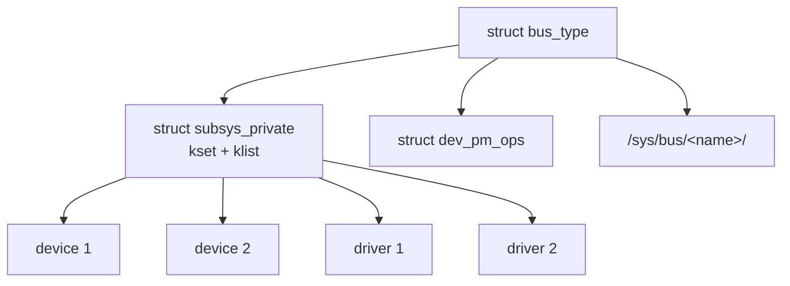

# `struct bus_type`

## Purpose

`struct bus_type` 代表核心中的一類匯流排（如 platform、PCI、USB、I2C、SPI），定義該匯流排上裝置與驅動的匹配策略、探測方法、電源管理操作和 DMA 配置。它是 Driver Model 三層架構的頂層，作為裝置與驅動之間的橋樑。定義於 `include/linux/device/bus.h`。

## Definition

```c
struct bus_type {
    const char              *name;          // 匯流排名稱（sysfs 目錄名）
    const char              *dev_name;      // 裝置預設名稱前綴
    const struct attribute_group **bus_groups;   // 匯流排 sysfs 屬性
    const struct attribute_group **dev_groups;   // 裝置 sysfs 屬性
    const struct attribute_group **drv_groups;   // 驅動 sysfs 屬性

    int  (*match)(struct device *dev, const struct device_driver *drv);
    int  (*uevent)(const struct device *dev, struct kobj_uevent_env *env);
    int  (*probe)(struct device *dev);
    void (*sync_state)(struct device *dev);
    void (*remove)(struct device *dev);
    void (*shutdown)(struct device *dev);

    int  (*online)(struct device *dev);
    int  (*offline)(struct device *dev);

    int  (*suspend)(struct device *dev, pm_message_t state);
    int  (*resume)(struct device *dev);

    int  (*num_vf)(struct device *dev);
    int  (*dma_configure)(struct device *dev);
    void (*dma_cleanup)(struct device *dev);

    const struct dev_pm_ops *pm;            // 匯流排層級 PM 操作

    bool need_parent_lock;                  // probe/remove 時鎖定父裝置

    struct subsys_private *p;               // 內部私有資料
};
```

## Field Groups

### 匹配與探測
`match()` 是最關鍵的回呼，判斷裝置與驅動是否相容。`probe()` 在匹配成功後呼叫（可選，若設定則覆蓋 driver->probe）。`sync_state()` 在所有 consumer 就緒後呼叫 supplier 驅動的 sync_state。

### 生命週期事件
`uevent()` 在裝置狀態變更時向使用者空間發送事件（供 udev 處理）。`remove()` / `shutdown()` 處理裝置移除和系統關機。`online()` / `offline()` 支援裝置的動態上下線（如記憶體熱插拔）。

### DMA 配置
`dma_configure()` 在探測前為裝置配置 DMA（IOMMU 映射、DMA mask）。`dma_cleanup()` 在移除後清理。

### 電源管理
`pm` 提供匯流排層級的 PM 回呼，與 driver 層級的 PM 配合形成分層 PM 架構。匯流排 PM 通常處理匯流排特定的電源切換（如 PCI D-state）。

### 內部狀態
`p` 指向 `subsys_private`（定義於 `base.h:42-60`），持有 kset、裝置/驅動 klist、通知鏈、drivers_autoprobe 旗標。bus 與 class 共用此結構。

## Lifecycle

1. **定義**：通常靜態定義（如 `platform_bus_type` @ `platform.c:1516`）
2. **註冊**：`bus_register()` @ `bus.c:893`
   - 分配 `subsys_private`
   - 建立 `/sys/bus/<name>/` kset
   - 建立 `devices/` 和 `drivers/` 子 kset
   - 初始化裝置/驅動 klist
   - 新增 sysfs 屬性（drivers_probe、drivers_autoprobe、uevent）
3. **運作**：裝置和驅動註冊/移除
4. **解註冊**：`bus_unregister()` 移除所有 sysfs 節點和內部狀態

## Key Operations

| 函式 | 位置 | 用途 |
|------|------|------|
| `bus_register()` | `bus.c:893` | 註冊匯流排類型 |
| `bus_unregister()` | `bus.c:985` | 解註冊匯流排 |
| `bus_add_device()` | `bus.c:515` | 將裝置加入匯流排 |
| `bus_probe_device()` | `bus.c:566` | 觸發裝置探測 |
| `bus_add_driver()` | `bus.c:626` | 將驅動加入匯流排 |
| `bus_for_each_dev()` | `bus.c` | 迭代匯流排上所有裝置 |
| `bus_for_each_drv()` | `bus.c` | 迭代匯流排上所有驅動 |
| `bus_find_device()` | `bus.c` | 查找特定裝置 |

## Relationships



### 主要匯流排實例

| 匯流排 | 定義位置 | 裝置數（典型 Android） |
|--------|----------|----------------------|
| `platform_bus_type` | `drivers/base/platform.c:1516` | 數百個 |
| `pci_bus_type` | `drivers/pci/pci-driver.c` | 依 SoC |
| `usb_bus_type` | `drivers/usb/core/driver.c` | 動態 |
| `i2c_bus_type` | `drivers/i2c/i2c-core-base.c` | 數十個 |
| `spi_bus_type` | `drivers/spi/spi.c` | 數十個 |
| `auxiliary_bus_type` | `drivers/base/auxiliary.c` | 少量 |
| `faux_bus_type` | `drivers/base/faux.c` | 少量 |

## Cross-References

- [`struct device`](device.md) — 匯流排上的裝置
- [`struct device_driver`](device_driver.md) — 匯流排上的驅動
- [Driver Model](../concepts/driver-model.md) — 驅動模型概念
- [Driver Framework](../subsystems/driver-framework.md) — 子系統完整分析
- [Platform Bus](../entities/platform-bus.md) — 最常用的匯流排實作
