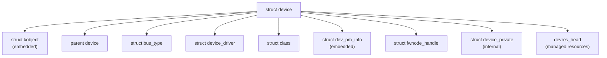

# `struct device`

## Purpose

`struct device` 是 Linux 核心驅動模型中最核心的資料結構，代表系統中的每一個裝置（實體或虛擬）。它不直接使用，而是嵌入在具體的裝置結構中（如 `platform_device`、`pci_dev`、`usb_device`），透過 `container_of()` 巨集取得外部結構。定義於 `include/linux/device.h:563-672`。

## Definition

```c
struct device {
    /* 身份與層級 */
    struct kobject          kobj;           // sysfs 節點
    struct device           *parent;        // 父裝置
    const char              *init_name;     // 初始名稱

    /* 匯流排與類型 */
    const struct device_type *type;         // 裝置類型（sysfs 群組）
    const struct bus_type   *bus;           // 所屬匯流排
    struct device_driver    *driver;        // 已綁定的驅動

    /* 平台與驅動資料 */
    void                    *platform_data; // 平台專用資料
    void                    *driver_data;   // 驅動私有資料

    /* 電源管理 */
    struct dev_pm_info      power;          // PM 狀態（runtime PM、wake 等）
    struct dev_pm_domain    *pm_domain;     // PM domain

    /* DMA */
    const struct dma_map_ops *dma_ops;      // DMA 操作函式
    u64                     *dma_mask;      // DMA 掩碼
    u64                     coherent_dma_mask;
    u64                     bus_dma_limit;
    struct device_dma_parameters *dma_parms;

    /* 資源管理 */
    spinlock_t              devres_lock;    // devres 保護鎖
    struct list_head        devres_head;    // managed resource 列表

    /* 韌體節點 */
    struct fwnode_handle    *fwnode;         // Device Tree / ACPI 節點

    /* NUMA */
    int                     numa_node;      // NUMA 節點 ID

    /* IOMMU */
    struct dev_iommu        *iommu;         // IOMMU 資料

    /* Class */
    struct class            *class;         // 所屬 class
    dev_t                   devt;           // 裝置號碼 (major:minor)

    /* 群組屬性 */
    const struct attribute_group **groups;   // sysfs 屬性群組

    /* 其他 */
    void (*release)(struct device *dev);     // 釋放回呼
    struct device_private   *p;              // 內部私有資料
};
```

## Field Groups

### 身份與層級
`kobj` 提供 sysfs 節點與引用計數。`parent` 形成裝置樹層級。`init_name` 在 `device_add()` 後被清除，之後透過 `dev_name()` 從 kobject 取得名稱。

### 匯流排與綁定
`bus` 指向所屬匯流排類型。`driver` 在成功 probe 後指向已綁定的驅動。`type` 提供裝置類型特定的 sysfs 屬性和 uevent 處理。

### 電源管理
`power` 嵌入 `dev_pm_info`，追蹤 runtime PM 狀態（RPM_ACTIVE/SUSPENDED/RESUMING/SUSPENDING）、wakeup 設定、PM QoS 約束等。`pm_domain` 指向電源域（如 GENPD），管理整個裝置群組的電源。

### DMA 配置
`dma_ops` 定義 DMA 映射操作。`dma_mask` 和 `coherent_dma_mask` 定義裝置可定址的 DMA 範圍。`bus_dma_limit` 限制匯流排層級的 DMA 範圍。

### 資源管理
`devres_lock` + `devres_head` 追蹤透過 `devm_*` API 分配的所有受管理資源。裝置 unbind 時自動釋放。

### 韌體節點
`fwnode` 是統一的韌體節點句柄，抽象 Device Tree 節點（`of_node`）和 ACPI 裝置。fw_devlink 透過此欄位建立裝置依賴。

## Lifecycle

1. **分配**：由匯流排特定的分配函式建立（如 `platform_device_alloc()`）
2. **初始化**：`device_initialize()` @ `core.c:3156` 設定 kobject、DMA、mutex、PM、devres
3. **註冊**：`device_add()` @ `core.c:3571` 加入 sysfs、bus、class，觸發探測
4. **綁定**：`really_probe()` @ `dd.c:607` 呼叫 driver->probe()
5. **運作**：裝置正常服務，runtime PM 管理電源狀態
6. **解綁**：`device_release_driver()` 呼叫 driver->remove()
7. **移除**：`device_del()` @ `core.c:3832` 從所有層級移除
8. **釋放**：`put_device()` 減少引用計數，歸零時呼叫 `release()` 回呼

## Key Operations

| 函式 | 位置 | 用途 |
|------|------|------|
| `device_initialize()` | `core.c:3156` | 初始化裝置結構 |
| `device_add()` | `core.c:3571` | 註冊裝置到核心 |
| `device_register()` | `core.c:3768` | initialize + add 組合 |
| `device_del()` | `core.c:3832` | 從核心移除裝置 |
| `device_unregister()` | `core.c:3884` | del + put_device 組合 |
| `get_device()` / `put_device()` | `core.c` | 引用計數管理 |
| `dev_set_name()` | `device.h:743` | 設定裝置名稱 |
| `dev_set_drvdata()` | `device.h:780` | 設定驅動私有資料 |
| `device_link_add()` | `core.c:669` | 建立裝置依賴 |

## Relationships



## Cross-References

- [`struct device_driver`](device_driver.md) — 與之綁定的驅動描述符
- [`struct bus_type`](bus_type.md) — 所屬匯流排類型
- [Driver Model](../concepts/driver-model.md) — 驅動模型概念
- [Driver Framework](../subsystems/driver-framework.md) — 子系統完整分析
- [Platform Bus](../entities/platform-bus.md) — 最常用的匯流排實作
- [sysfs/procfs](../apis/sysfs-procfs.md) — sysfs 使用者空間介面
