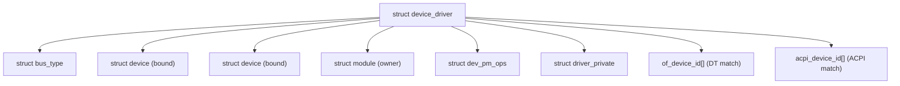

# `struct device_driver`

## Purpose

`struct device_driver` 是 Linux 核心驅動模型中驅動程式的基礎描述符。每個驅動透過此結構註冊到其所屬的匯流排，提供 `probe()`、`remove()` 等生命週期回呼。與 `struct device` 相同，它通常嵌入在匯流排特定的驅動結構中（如 `platform_driver`、`pci_driver`）。定義於 `include/linux/device/driver.h`。

## Definition

```c
struct device_driver {
    const char              *name;          // 驅動名稱（用於 sysfs 和匹配）
    const struct bus_type   *bus;           // 所屬匯流排

    struct module           *owner;         // 擁有此驅動的模組
    const char              *mod_name;      // 模組名稱（內建驅動用）

    bool suppress_bind_attrs;               // 隱藏 sysfs bind/unbind 屬性
    enum probe_type probe_type;             // 同步/非同步探測策略

    const struct of_device_id   *of_match_table;    // Device Tree 匹配表
    const struct acpi_device_id *acpi_match_table;  // ACPI 匹配表

    int  (*probe)(struct device *dev);      // 裝置綁定回呼
    void (*sync_state)(struct device *dev); // 所有 consumer 就緒後回呼
    int  (*remove)(struct device *dev);     // 裝置解綁回呼
    void (*shutdown)(struct device *dev);   // 系統關機回呼
    int  (*suspend)(struct device *dev, pm_message_t state);  // 舊式 suspend
    int  (*resume)(struct device *dev);     // 舊式 resume

    const struct attribute_group **groups;  // 驅動 sysfs 屬性群組
    const struct attribute_group **dev_groups; // 裝置實例屬性群組

    const struct dev_pm_ops *pm;            // 電源管理操作（推薦方式）
    void (*coredump)(struct device *dev);   // coredump 回呼

    struct driver_private *p;               // 內部私有資料
};
```

## Field Groups

### 身份與歸屬
`name` 用於 sysfs 節點名稱和裝置名稱匹配（最低優先順序）。`bus` 指向所屬匯流排。`owner` 用於模組引用計數，防止驅動模組在使用中被卸載。

### 匹配表
`of_match_table` 提供 Device Tree compatible 字串匹配。`acpi_match_table` 提供 ACPI HID/CID 匹配。匹配優先順序：driver_override → OF → ACPI → ID table → name。

### 生命週期回呼
`probe()` 在匹配成功後呼叫，負責初始化硬體和分配資源。`remove()` 在解綁時呼叫。`sync_state()` 在所有 consumer 裝置都已綁定驅動後呼叫（與 fw_devlink 配合）。`shutdown()` 在系統關機/重啟時呼叫。

### 探測策略
`probe_type` 控制探測行為：`PROBE_DEFAULT_STRATEGY`（由 bus 決定）、`PROBE_PREFER_ASYNCHRONOUS`（背景探測）、`PROBE_FORCE_SYNCHRONOUS`（同步探測）。

### 電源管理
`pm` 指向 `dev_pm_ops` 結構，包含 `suspend()`/`resume()`（系統 PM）和 `runtime_suspend()`/`runtime_resume()`（runtime PM）回呼。這是推薦的 PM 方式，取代舊式 `suspend`/`resume` 函式指標。

## Lifecycle

1. **定義**：驅動通常靜態定義，使用 `module_platform_driver()` 等巨集
2. **註冊**：`driver_register()` @ `driver.c:225`
   - 檢查 `bus->p` 是否存在
   - 呼叫 `bus_add_driver()` 加入匯流排驅動列表
   - 建立 sysfs 節點 `/sys/bus/<bus>/drivers/<name>/`
   - 若 `bus->p->drivers_autoprobe` 為真，觸發裝置匹配
3. **綁定**：bus 的 match 回呼找到相容裝置後，`really_probe()` 呼叫 `probe()`
4. **運作**：驅動服務已綁定的裝置
5. **解註冊**：`driver_unregister()` 解綁所有裝置並從 bus 移除

## Key Operations

| 函式 | 位置 | 用途 |
|------|------|------|
| `driver_register()` | `driver.c:225` | 註冊驅動到匯流排 |
| `driver_unregister()` | `driver.c:265` | 從匯流排移除驅動 |
| `driver_set_override()` | `driver.c:48` | 設定/清除強制綁定 |
| `driver_find()` | `driver.c` | 在匯流排上查找驅動 |
| `driver_for_each_device()` | `driver.c` | 迭代驅動的裝置列表 |

## Relationships



## Cross-References

- [`struct device`](device.md) — 驅動所綁定的裝置
- [`struct bus_type`](bus_type.md) — 驅動所屬匯流排
- [Driver Model](../concepts/driver-model.md) — 驅動模型概念
- [Driver Framework](../subsystems/driver-framework.md) — 子系統完整分析
- [Module 系統](../concepts/module-system.md) — 模組載入與 EXPORT_SYMBOL
