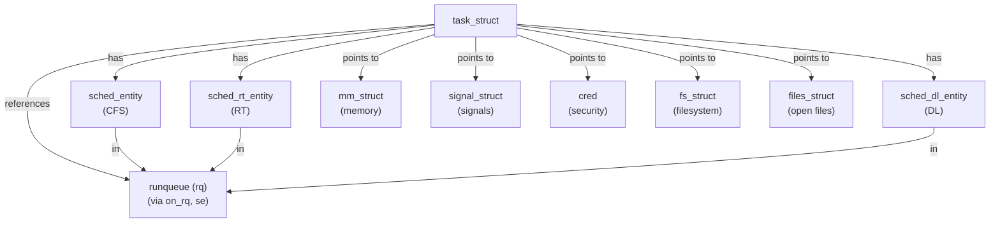

# `struct task_struct`

## Purpose

`struct task_struct` 是 Linux 核心中代表單一行程（process）或執行緒（thread）的核心資料結構。每當建立新行程或執行緒時，核心會配置一個 `task_struct` 實例來追蹤並管理該任務的完整生命週期。本結構維護排程狀態、排程相關資訊、記憶體管理、訊號處理、憑證管理、效能計數、鎖定狀態，以及眾多其他資源。

ACK（Android Common Kernel）在通用 Linux 核心的基礎上加入 Android 特定擴充，包括 vendor hooks 與 OEM 資料區，用以支援裝置廠商的客製化功能。

## Where It Is Defined

**完整定義**只有一處：`common/include/linux/sched.h:821`（ACK `common-android-mainline`，Linux 6.19-rc8）。這是整棵 source tree 中唯一寫出 `struct task_struct { ... };` 主體的位置。

**Forward declaration**（`struct task_struct;`）則遍布各處 header —— 在 `common/include/` 底下至少 50 個檔案使用前向宣告，用意是避免循環 include，或避免把 `sched.h` 這支巨型 header 從 API 介面拉進來：

- 排程相關子 header：`include/linux/sched/task.h`、`include/linux/sched/rt.h`、`include/linux/sched/debug.h`、`include/linux/sched/autogroup.h`、`include/linux/sched/jobctl.h`
- 鎖 / 等待 / 同步：`include/linux/wait.h`、`include/linux/swait.h`、`include/linux/lockdep.h`、`include/linux/preempt.h`、`include/linux/futex.h`、`include/linux/irqflags.h`、`include/linux/debug_locks.h`
- 訊號 / 權能 / IPC：`include/linux/signal.h`、`include/linux/capability.h`、`include/linux/sem.h`、`include/linux/shm.h`、`include/linux/posix-timers.h`
- 檔案與 I/O：`include/linux/file.h`、`include/linux/fdtable.h`、`include/linux/iocontext.h`
- 除錯 / 追蹤 / 效能：`include/linux/perf_event.h`、`include/linux/stacktrace.h`、`include/linux/latencytop.h`、`include/linux/kgdb.h`、`include/linux/kcov.h`、`include/linux/profile.h`、`include/linux/crash_core.h`
- Sanitizer：`include/linux/kasan.h`、`include/linux/kmsan.h`
- 其他：`include/linux/oom.h`、`include/linux/rcutree.h`、`include/linux/proc_ns.h`、`include/linux/nsfs.h`、`include/linux/regset.h`、`include/linux/resource.h`、`include/linux/smpboot.h`、`include/linux/cpuhotplug.h`、`include/linux/bpf-cgroup.h`、`include/linux/amd-iommu.h`、`include/linux/nospec.h`、`include/linux/string_helpers.h`
- 架構抽象層：`include/asm-generic/syscall.h`、`include/asm-generic/mmu_context.h`
- **Android vendor hooks**：`include/trace/hooks/sched.h`、`include/trace/hooks/signal.h`、`include/trace/hooks/sys.h`、`include/trace/hooks/fpsimd.h`、`include/trace/hooks/mpam.h`

若呼叫端只需要 `struct task_struct *` 這樣的指標型別（不存取任何欄位），就用 forward declaration 即可；只有真正要 dereference 欄位、使用 `sizeof`、或 embed 此結構時，才 include `<linux/sched.h>` 以取得完整定義。這是核心控制 `sched.h` include fan-out 的標準手法——`sched.h` 本身已達數千行，若每個 header 都直接拉進來，編譯時間會爆炸。

## Definition

```c
struct task_struct {
	struct thread_info thread_info;         // 執行緒資訊（若 CONFIG_THREAD_INFO_IN_TASK）
	unsigned int __state;                   // 任務狀態（TASK_RUNNING、TASK_INTERRUPTIBLE 等）
	unsigned int saved_state;               // 為 spinlock sleeper 保存的狀態

	/* randomized_struct_fields_start */
	void *stack;                            // 核心堆疊指標
	refcount_t usage;                       // 參考計數
	unsigned int flags;                     // 行程旗標（PF_*）
	unsigned int ptrace;                    // ptrace 相關旗標

	int on_cpu;                             // 當前執行的 CPU（若正在執行）
	struct __call_single_node wake_entry;   // 喚醒列表條目
	int recent_used_cpu;                    // 最近使用的 CPU
	int wake_cpu;                           // 被喚醒時的目標 CPU
	int on_rq;                              // 是否在執行佇列（runqueue）上

	int prio;                               // 動態優先級（0-139）
	int static_prio;                        // 靜態優先級
	int normal_prio;                        // 經即時優先級調整後的優先級
	unsigned int rt_priority;               // 即時優先級（0-99）

	struct sched_entity se;                 // CFS 排程實體
	struct sched_rt_entity rt;              // RT 排程實體
	struct sched_dl_entity dl;              // Deadline 排程實體
	struct sched_dl_entity *dl_server;      // DL server 指標
	const struct sched_class *sched_class;  // 排程類別指標（fair、rt、dl 等）

	unsigned int policy;                    // 排程策略
	int nr_cpus_allowed;                    // 允許的 CPU 數
	const cpumask_t *cpus_ptr;              // CPU 遮罩指標
	cpumask_t *user_cpus_ptr;               // 使用者設定的 CPU 遮罩
	cpumask_t cpus_mask;                    // CPU 親和性遮罩

	pid_t pid;                              // 行程 ID
	pid_t tgid;                             // 執行緒群組 ID

	struct task_struct __rcu *real_parent;  // 實際父行程
	struct task_struct __rcu *parent;       // 接收 signal 的父行程
	struct list_head children;              // 子行程列表
	struct list_head sibling;               // 兄弟行程列表節點
	struct task_struct *group_leader;       // 執行緒群組領導者

	struct list_head tasks;                 // 全域行程鏈結
	struct mm_struct *mm;                   // 使用者空間記憶體管理
	struct mm_struct *active_mm;            // 活躍的 mm（核心執行緒使用）

	int exit_state;                         // 退出狀態（EXIT_ZOMBIE、EXIT_DEAD）
	int exit_code;                          // 行程退出碼
	int exit_signal;                        // 送給父行程的訊號

	u64 utime;                              // user mode CPU 時間
	u64 stime;                              // kernel mode CPU 時間
	u64 gtime;                              // guest OS 時間

	struct signal_struct *signal;           // 訊號處理（所有執行緒共用）
	struct sighand_struct __rcu *sighand;   // 訊號處理常式
	sigset_t blocked;                       // 被阻擋的訊號
	sigset_t pending;                       // 待處理的訊號

	const struct cred __rcu *real_cred;     // 實際憑證（COW）
	const struct cred __rcu *cred;          // 有效憑證（COW）

	char comm[TASK_COMM_LEN];               // 行程名稱（執行檔名，16 bytes）
	struct fs_struct *fs;                   // 檔案系統資訊
	struct files_struct *files;             // 已開啟的檔案描述符表

	struct nsproxy *nsproxy;                // namespace proxy

	/* 排程統計與計數 */
	unsigned long nvcsw;                    // 自願上下文切換次數
	unsigned long nivcsw;                   // 非自願上下文切換次數
	u64 start_time;                         // 行程起始時間（單調時間，ns）
	u64 start_boottime;                     // 開機時間計起的時間
	unsigned long min_flt;                  // 次要 page fault 次數（soft）
	unsigned long maj_flt;                  // 主要 page fault 次數（hard）

	/* 除錯與追蹤 */
	unsigned long ptrace_message;           // ptrace 訊息
	struct perf_event_context *perf_event_ctxp; // perf event context
	struct task_delay_info *delays;         // task delay 資訊（若 CONFIG_TASK_DELAY_ACCT）

	/* 同步與鎖定 */
	spinlock_t alloc_lock;                  // 保護 mm、files、fs、tty
	raw_spinlock_t pi_lock;                 // 優先級繼承保護鎖
	struct wake_q_node wake_q;              // 喚醒佇列節點
	struct mutex *blocked_on;               // 被阻擋於其上的 mutex

	/* RCU 與 IPC */
	struct list_head ptraced;               // 被此任務追蹤的 task 列表
	struct list_head ptrace_entry;          // 在父行程 ptraced 列表中的節點
	struct robust_list_head __user *robust_list; // robust mutex 列表

	ANDROID_VENDOR_DATA_ARRAY(1, 6);        // Android vendor 資料（6 × u64）
	ANDROID_OEM_DATA_ARRAY(1, 6);           // Android OEM 資料（6 × u64）

	struct thread_struct thread;            // 架構特定的執行緒狀態

	/* randomized_struct_fields_end */
} __attribute__((aligned(64)));
```

## Field Groups

### 狀態與旗標（State and Flags）
- **__state**：任務可執行狀態（TASK_RUNNING、TASK_INTERRUPTIBLE、TASK_UNINTERRUPTIBLE 等）
- **saved_state**：供 spinlock sleeper 保存的狀態
- **flags**：行程旗標（PF_KTHREAD、PF_IO_WORKER 等）
- **exit_state**：退出狀態（EXIT_DEAD、EXIT_ZOMBIE）

### 排程與 CPU 親和性（Scheduling and CPU Affinity）
- **prio, static_prio, normal_prio, rt_priority**：各種優先級表示
- **sched_entity (se)**：CFS（公平排程）實體，追蹤執行時間與 vruntime
- **sched_rt_entity (rt)**：即時排程實體
- **sched_dl_entity (dl)**：deadline 排程實體
- **sched_class**：指向當前活躍的排程類別（fair_sched_class、rt_sched_class、dl_sched_class）
- **on_cpu**：是否正在某個 CPU 上執行
- **on_rq**：是否在任何執行佇列上
- **cpus_mask, cpus_ptr**：CPU 親和性遮罩
- **wake_cpu, recent_used_cpu**：最近使用的 CPU 資訊

### 行程身分與親緣關係（Process Identity and Relations）
- **pid, tgid**：行程 ID 與執行緒群組 ID
- **real_parent, parent**：父行程指標（實際父 vs 接收 signal 的父）
- **group_leader**：執行緒群組的領導者
- **children, sibling**：兄弟行程鏈結
- **comm**：行程命令名稱（16 bytes，通常為執行檔名）

### 記憶體管理（Memory Management）
- **mm**：指向使用者位址空間的 mm_struct
- **active_mm**：對於核心執行緒，參考最後執行的使用者行程之 mm_struct
- **stack**：核心堆疊虛擬位址
- **thread**：架構特定的執行緒狀態（暫存器、FPU 狀態等）

### 檔案系統與 I/O（File System and I/O）
- **fs**：檔案系統資訊（當前工作目錄、根目錄、umask）
- **files**：已開啟的檔案描述符表（files_struct）
- **nsproxy**：namespace（PID、mount、network、IPC、UTS）

### 訊號與憑證（Signals and Credentials）
- **signal**：指向 signal_struct，所有執行緒共用
- **sighand**：訊號處理常式（sighand_struct）
- **blocked**：被阻擋的訊號遮罩
- **pending**：待處理訊號
- **real_cred**：實際憑證（real uid/gid 等）
- **cred**：有效憑證（可被 LSM 修改）

### 效能與記帳（Performance and Accounting）
- **utime, stime, gtime**：CPU 時間（user mode、kernel mode、guest）
- **nvcsw, nivcsw**：自願與非自願上下文切換計數
- **start_time**：行程建立時間
- **min_flt, maj_flt**：次要與主要 page fault 計數
- **sched_info**：排程統計資料

### 追蹤與除錯（Tracing and Debugging）
- **ptraced**：被此 task 以 ptrace() 追蹤的任務列表
- **ptrace_entry**：在父行程 ptraced 列表中的節點
- **perf_event_ctxp**：perf event context
- **delays**：task delay accounting（I/O、記憶體、CPU）
- **ptrace_message**：ptrace 訊息

### 同步原語（Synchronization Primitives）
- **alloc_lock**：保護 mm、files、fs、tty、keyring
- **pi_lock**：優先級繼承與死結偵測
- **wake_q**：喚醒佇列節點（批次喚醒）
- **blocked_on**：目前被阻擋於其上的 mutex

### RCU（Read-Copy-Update）
- **rcu_node_entry**：RCU 阻擋節點列表條目
- **rcu_tasks_holdout_list**：RCU tasks 等待列表

### Android 專屬（Android Specific）
- **ANDROID_VENDOR_DATA_ARRAY(1, 6)**：6 個 u64 的 vendor 資料空間
- **ANDROID_OEM_DATA_ARRAY(1, 6)**：6 個 u64 的 OEM 資料空間

## Lifecycle

### 建立（Creation）
1. 行程建立由 `fork()`、`clone()` 或 `execve()` 系統呼叫觸發
2. 核心呼叫 `copy_process()`（kernel/fork.c:1979），其中：
   - 呼叫 `dup_task_struct()` 複製父行程的 task_struct
   - 透過 `alloc_task_struct_node()` 配置新的 task_struct（kernel/fork.c:188）
   - 使用 kmem_cache_alloc_node(task_struct_cachep, GFP_KERNEL, node)
   - 初始化排程實體（sched_entity、rt、dl）
   - 設定行程狀態、優先級、CPU 親和性
   - 關聯記憶體管理結構（mm_struct）
   - 複製檔案描述符與檔案系統資訊
   - 為 vendor 模組呼叫 android_vh_dup_task_struct() hook

3. 新任務透過 `wake_up_new_task()` 被喚醒並加入執行佇列

### 使用（Usage）
- 任務在其整個生命週期內持有參考計數（usage）
- 排程器頻繁存取排程實體以做出排程決策
- Signal 處理器使用 signal 與 sighand 欄位
- 記憶體管理器存取 mm 與 active_mm
- 追蹤與效能工具讀取統計欄位

### 銷毀（Destruction）
1. 行程透過 `do_exit()` 或被訊號終止而開始離開
2. 將 exit_state 設為 EXIT_ZOMBIE
3. 向父行程送出 SIGCHLD 訊號
4. 父行程呼叫 `wait()` 或 `waitpid()` 收集 exit status
5. 最後呼叫 `free_task()`（kernel/fork.c:534）釋放資源：
   - 呼叫 `trace_android_vh_free_task()` hook 讓 vendor 進行清理
   - 釋放 RCU 資源與 ftrace 資料
   - 釋放架構特定資源
   - 呼叫 `free_task_struct()` 將記憶體歸還給 kmem_cache
6. task_struct 透過 delayed_free_task() 以 RCU grace period 延遲釋放

## Key Operations

### 行程建立
- **copy_process()**（kernel/fork.c:1979）：複製父行程、建立新 task_struct
- **dup_task_struct()**（kernel/fork.c:916）：複製 task_struct 及其 embed 的欄位
- **arch_dup_task_struct()**（kernel/fork.c:901）：架構特定的複製動作

### 排程相關
- **set_task_cpu()**：更改任務的 CPU 親和性
- **set_cpus_allowed_ptr()**（kernel/sched/core.c）：設定 CPU 遮罩
- **set_user_nice()**：調整優先級
- **sched_setattr()**：設定排程屬性（策略、優先級）
- **select_task_rq()**：為被喚醒的任務選擇 CPU

### 狀態管理
- **set_task_state() / __set_task_state()**：更改任務狀態
- **set_current_state()**：設定當前任務的狀態
- **wake_up_process()**：喚醒被阻擋的任務
- **try_to_wake_up()**（kernel/sched/core.c）：嘗試將任務從 sleep 喚醒

### 退出與清理
- **do_exit()**：行程退出的主函式
- **free_task()**（kernel/fork.c:534）：釋放 task_struct 與資源
- **__put_task_struct()**：遞減參考計數
- **delayed_free_task()**（kernel/fork.c:1928）：RCU 延遲釋放

### 訊號處理
- **send_signal()**：向任務發送訊號
- **force_sig()**：強制傳遞訊號
- **sig_ignored()**：檢查訊號是否被忽略

### 效能與追蹤
- **update_curr()**：更新 vruntime 與統計
- **task_sched_runtime()**：取得任務累計 CPU 時間
- **trace_sched_wakeup()**：追蹤任務喚醒事件

## Relationships

### 嵌入的子結構
- **thread_info**：執行緒資訊（若 CONFIG_THREAD_INFO_IN_TASK）
- **sched_entity**：CFS 排程實體
- **sched_rt_entity**：即時排程實體
- **sched_dl_entity**：deadline 排程實體
- **thread**：架構特定的執行緒狀態（x86_thread_struct、arm_thread_struct 等）

### 指向其他結構的指標
- **mm_struct**（mm、active_mm）：虛擬位址空間
- **signal_struct**（signal）：執行緒群組的訊號處理
- **sighand_struct**（sighand）：訊號處理常式與遮罩
- **cred**（real_cred、cred）：安全憑證
- **fs_struct**（fs）：檔案系統資訊
- **files_struct**（files）：已開啟檔案表
- **nsproxy**（nsproxy）：namespace
- **task_group**（sched_task_group）：排程群組
- **pid**（thread_pid）：PID 物件
- **perf_event_context**：perf event context

### 鏈結關係
```
全域 init_task → tasks → [task_struct 雙向鏈結]

行程樹：
  parent / real_parent ← task_struct → children / sibling
         ↑
    group_leader（在執行緒中）

追蹤：
  ptraced ← 被追蹤的任務
  ptrace_entry ← 位於 parent->ptraced 中
```



## Android-Specific Changes

### Vendor Hooks
ACK 在 task_struct 相關的操作中加入多個 vendor hook，允許廠商模組擴充與客製化排程與行程管理：

1. **android_vh_dup_task_struct()**（trace/hooks/sched.h:314）
   - 在 dup_task_struct() 之後被呼叫（kernel/fork.c:1014）
   - 讓 vendor 為新任務初始化客製資料

2. **android_vh_free_task()**（trace/hooks/sched.h:244）
   - 在 free_task() 中被呼叫（kernel/fork.c:543）
   - 讓 vendor 清理 task 專屬的資源

3. **android_rvh_sched_fork()**（trace/hooks/sched.h:147）
   - 在任務建立期間的排程初始化時被呼叫
   - 允許調整新任務的排程參數

4. 其他與排程相關的 hook：
   - android_rvh_select_task_rq_fair / rt：選擇喚醒 CPU
   - android_rvh_try_to_wake_up：任務喚醒攔截
   - android_rvh_sched_setaffinity：CPU 親和性設定

### Vendor 資料區（Vendor Data Areas）
```c
ANDROID_VENDOR_DATA_ARRAY(1, 6);  // android_vendor_data1[6]（48 bytes）
ANDROID_OEM_DATA_ARRAY(1, 6);     // android_oem_data1[6]（48 bytes）
```

- 為廠商模組保留 96 bytes 的 u64 陣列
- 當 CONFIG_ANDROID_VENDOR_OEM_DATA 啟用時存在
- 讓廠商儲存行程專屬的擴充資料而無需修改核心原始碼
- 透過 android_init_vendor_data() 與 android_init_oem_data() 初始化

### 架構對齊（Architecture Alignment）
- 對齊到 64 bytes 邊界：`__attribute__((aligned(64)))`
- 對應現代 CPU 的 L1 cache line 大小做最佳化
- 減少多核心系統上的 false sharing

## Cross-References

- [排程子系統](../subsystems/scheduler.md) —— 排程與任務管理
- [記憶體管理](../subsystems/memory-management.md) —— mm_struct 與虛擬位址空間
- [RCU 同步](../concepts/rcu.md) —— Read-Copy-Update
- [Binder IPC](../entities/binder.md) —— Android IPC（使用 task_struct）
- [Vendor Hooks](../concepts/vendor-hooks.md) —— 廠商擴充點
- [ABI 穩定性機制](../android/abi-stability.md) —— ANDROID_VENDOR_DATA / ANDROID_OEM_DATA 巨集
