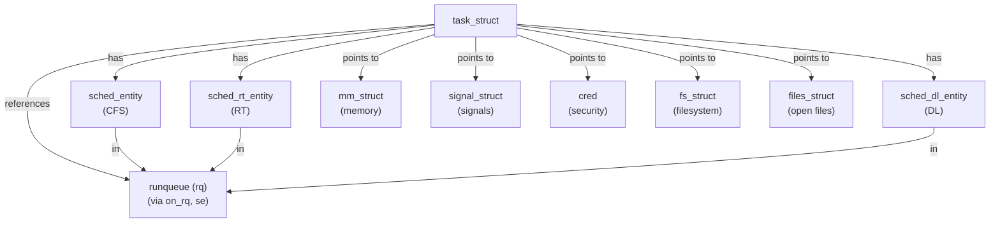

# `struct task_struct`

## Purpose

`struct task_struct` 是 Linux 内核中代表单个进程或线程的核心数据结构。每当创建新进程或线程时,内核会分配一个 `task_struct` 实例来追踪和管理该任务的完整生命周期。本结构维护进程状态、调度相关信息、内存管理、信号处理、凭证管理、性能计数、锁定状态和众多其他资源的管理。

ACK(Android Common Kernel) 在通用 Linux 内核的基础上添加了 Android 特定的扩展,包括供应商钩子和 OEM 数据区域,以支持设备厂商的定制化功能。

## Definition

```c
struct task_struct {
	struct thread_info thread_info;         // 线程信息(如果 CONFIG_THREAD_INFO_IN_TASK)
	unsigned int __state;                   // 任务状态 (TASK_RUNNING, TASK_INTERRUPTIBLE, etc.)
	unsigned int saved_state;               // 自旋锁睡眠器保存的状态

	/* randomized_struct_fields_start */
	void *stack;                            // 内核栈指针
	refcount_t usage;                       // 引用计数
	unsigned int flags;                     // 进程标志 (PF_*)
	unsigned int ptrace;                    // ptrace 相关标志

	int on_cpu;                             // 当前运行的 CPU (如果运行中)
	struct __call_single_node wake_entry;   // 唤醒列表条目
	int recent_used_cpu;                    // 最近使用的 CPU
	int wake_cpu;                           // 被唤醒时的目标 CPU
	int on_rq;                              // 是否在运行队列上

	int prio;                               // 动态优先级 (0-139)
	int static_prio;                        // 静态优先级
	int normal_prio;                        // 实时优先级调整后的优先级
	unsigned int rt_priority;               // 实时优先级 (0-99)

	struct sched_entity se;                 // 公平调度实体
	struct sched_rt_entity rt;              // 实时调度实体
	struct sched_dl_entity dl;              // 截止期限调度实体
	struct sched_dl_entity *dl_server;      // DL 服务器指针
	const struct sched_class *sched_class;  // 调度类指针 (fair, rt, dl, etc.)

	unsigned int policy;                    // 调度策略
	int nr_cpus_allowed;                    // 允许的 CPU 数
	const cpumask_t *cpus_ptr;              // CPU 掩码指针
	cpumask_t *user_cpus_ptr;               // 用户设置的 CPU 掩码
	cpumask_t cpus_mask;                    // CPU 亲和力掩码

	pid_t pid;                              // 进程 ID
	pid_t tgid;                             // 线程组 ID

	struct task_struct __rcu *real_parent;  // 实际父进程
	struct task_struct __rcu *parent;       // 信号接收方父进程
	struct list_head children;              // 子进程列表
	struct list_head sibling;               // 兄弟进程列表节点
	struct task_struct *group_leader;       // 线程组领导者

	struct list_head tasks;                 // 全局进程链表
	struct mm_struct *mm;                   // 用户空间内存管理
	struct mm_struct *active_mm;            // 活跃的 MM(用于内核线程)

	int exit_state;                         // 退出状态 (EXIT_ZOMBIE, EXIT_DEAD)
	int exit_code;                          // 进程退出代码
	int exit_signal;                        // 向父进程发送的信号

	u64 utime;                              // 用户态运行时间
	u64 stime;                              // 内核态运行时间
	u64 gtime;                              // 来宾操作系统时间

	struct signal_struct *signal;           // 信号处理(所有线程共享)
	struct sighand_struct __rcu *sighand;   // 信号处理程序
	sigset_t blocked;                       // 被阻止的信号
	sigset_t pending;                       // 待处理信号

	const struct cred __rcu *real_cred;     // 实际凭证(COW)
	const struct cred __rcu *cred;          // 有效凭证(COW)

	char comm[TASK_COMM_LEN];               // 进程名称(文件名,16 字节)
	struct fs_struct *fs;                   // 文件系统信息
	struct files_struct *files;             // 打开文件描述符表

	struct nsproxy *nsproxy;                // 命名空间代理

	/* 调度统计和计数 */
	unsigned long nvcsw;                    // 自愿上下文切换次数
	unsigned long nivcsw;                   // 非自愿上下文切换次数
	u64 start_time;                         // 进程启动时间(单调时间,纳秒)
	u64 start_boottime;                     // 启动时间(启动时间)
	unsigned long min_flt;                  // 次缺页数(软页错)
	unsigned long maj_flt;                  // 主缺页数(硬页错)

	/* 调试与追踪 */
	unsigned long ptrace_message;           // ptrace 消息
	struct perf_event_context *perf_event_ctxp; // 性能事件上下文
	struct task_delay_info *delays;         // 任务延迟信息(如果 CONFIG_TASK_DELAY_ACCT)

	/* 同步与锁定 */
	spinlock_t alloc_lock;                  // 保护 mm, files, fs, tty
	raw_spinlock_t pi_lock;                 // 优先级继承保护锁
	struct wake_q_node wake_q;              // 唤醒队列节点
	struct mutex *blocked_on;               // 阻止的互斥锁

	/* RCU 和 IPC */
	struct list_head ptraced;               // 被此任务追踪的任务列表
	struct list_head ptrace_entry;          // 在父进程的追踪列表中的条目
	struct robust_list_head __user *robust_list; // 健壮的互斥锁列表

	ANDROID_VENDOR_DATA_ARRAY(1, 6);        // Android 供应商数据(6 x u64)
	ANDROID_OEM_DATA_ARRAY(1, 6);           // Android OEM 数据(6 x u64)

	struct thread_struct thread;            // 架构特定的线程状态

	/* randomized_struct_fields_end */
} __attribute__((aligned(64)));
```

## Field Groups

### 状态与标志 (State and Flags)
- **__state**: 任务可运行状态 (TASK_RUNNING, TASK_INTERRUPTIBLE, TASK_UNINTERRUPTIBLE, etc.)
- **saved_state**: 用于自旋锁睡眠器的保存状态
- **flags**: 进程标志 (PF_KTHREAD, PF_IO_WORKER, etc.)
- **exit_state**: 退出状态 (EXIT_DEAD, EXIT_ZOMBIE)

### 调度与 CPU 亲和力 (Scheduling and CPU Affinity)
- **prio, static_prio, normal_prio, rt_priority**: 各种优先级表示
- **sched_entity (se)**: CFS(公平调度)实体,追踪运行时间和 vruntime
- **sched_rt_entity (rt)**: 实时调度实体
- **sched_dl_entity (dl)**: 截止期限调度实体
- **sched_class**: 指向活跃调度类的指针(fair_sched_class, rt_sched_class, dl_sched_class)
- **on_cpu**: CPU 上运行的指示
- **on_rq**: 是否在任何运行队列上
- **cpus_mask, cpus_ptr**: CPU 亲和力掩码
- **wake_cpu, recent_used_cpu**: 最近使用的 CPU 信息

### 进程身份与亲缘关系 (Process Identity and Relations)
- **pid, tgid**: 进程 ID 和线程组 ID
- **real_parent, parent**: 父进程指针(实际和信号接收方)
- **group_leader**: 线程组的领导者
- **children, sibling**: 兄弟进程链表
- **comm**: 进程命令名称(16 字节,通常是可执行文件名)

### 内存管理 (Memory Management)
- **mm**: 指向用户空间地址空间的 mm_struct 指针
- **active_mm**: 对于内核线程,引用最后运行的用户进程的 mm_struct
- **stack**: 内核栈虚拟地址
- **thread**: 架构特定的线程状态(寄存器, FPU 状态等)

### 文件系统与 I/O (File System and I/O)
- **fs**: 文件系统信息(当前工作目录, 根目录, umask)
- **files**: 打开的文件描述符表(file_struct)
- **nsproxy**: 命名空间(PID, mount, network, IPC, UTS)

### 信号与凭证 (Signals and Credentials)
- **signal**: 指向信号处理(signal_struct),所有线程共享
- **sighand**: 信号处理程序(sighand_struct)
- **blocked**: 被阻止的信号掩码
- **pending**: 待处理信号
- **real_cred**: 实际凭证(file:uid, file:gid 等)
- **cred**: 有效凭证(可被 LSM 修改)

### 性能与计数 (Performance and Accounting)
- **utime, stime, gtime**: CPU 时间(用户态、内核态、来宾)
- **nvcsw, nivcsw**: 自愿和非自愿上下文切换计数
- **start_time**: 进程创建时间
- **min_flt, maj_flt**: 次缺页和主缺页计数
- **sched_info**: 调度统计数据

### 追踪与调试 (Tracing and Debugging)
- **ptraced**: 被此任务 ptrace() 追踪的任务列表
- **ptrace_entry**: 在父进程的追踪列表中的条目
- **perf_event_ctxp**: 性能事件上下文
- **delays**: 任务延迟账户(I/O, 内存, CPU)
- **ptrace_message**: ptrace 消息

### 同步原语 (Synchronization Primitives)
- **alloc_lock**: 保护 mm, files, fs, tty, keyrings
- **pi_lock**: 优先级继承和死锁检测
- **wake_q**: 唤醒队列节点(批量唤醒)
- **blocked_on**: 当前阻止的互斥锁

### RCU (Read-Copy-Update)
- **rcu_node_entry**: RCU 阻塞节点列表条目
- **rcu_tasks_holdout_list**: RCU 任务等待列表

### Android 特定 (Android Specific)
- **ANDROID_VENDOR_DATA_ARRAY(1, 6)**: 6 个 u64 的供应商数据空间
- **ANDROID_OEM_DATA_ARRAY(1, 6)**: 6 个 u64 的 OEM 数据空间

## Lifecycle

### 创建 (Creation)
1. 进程创建通过 `fork()`, `clone()`, 或 `execve()` 系统调用触发
2. 内核调用 `copy_process()` (kernel/fork.c:1979),该函数:
   - 调用 `dup_task_struct()` 复制父进程的 task_struct
   - 通过 `alloc_task_struct_node()` 分配新的 task_struct (kernel/fork.c:188)
   - 使用 kmem_cache_alloc_node(task_struct_cachep, GFP_KERNEL, node)
   - 初始化调度实体(sched_entity, rt, dl)
   - 设置进程状态、优先级、CPU 亲和力
   - 关联内存管理结构(mm_struct)
   - 复制文件描述符和文件系统信息
   - 为供应商模块调用 android_vh_dup_task_struct() 钩子

3. 新任务通过 `wake_up_new_task()` 被唤醒并加入运行队列

### 使用 (Usage)
- 任务在其整个生命周期内持有引用计数(usage)
- 调度器经常访问调度实体以做出调度决策
- 信号处理器使用 signal 和 sighand 字段
- 内存管理器访问 mm 和 active_mm
- 追踪和性能工具读取统计字段

### 销毁 (Destruction)
1. 进程通过 `do_exit()` 或被信号终止开始退出
2. 设置 exit_state 为 EXIT_ZOMBIE
3. 向父进程发送 SIGCHLD 信号
4. 父进程调用 `wait()` 或 `waitpid()` 收集退出状态
5. 最终调用 `free_task()` (kernel/fork.c:534) 释放资源:
   - 调用 `trace_android_vh_free_task()` 钩子供应商清理
   - 释放 RCU 资源和 ftrace 数据
   - 释放架构特定资源
   - 调用 `free_task_struct()` 将内存返回到 kmem_cache
6. task_struct 通过 delayed_free_task() 使用 RCU 宽限期延迟释放

## Key Operations

### 进程创建
- **copy_process()** (kernel/fork.c:1979): 复制父进程,创建新 task_struct
- **dup_task_struct()** (kernel/fork.c:916): 复制 task_struct 及其嵌入字段
- **arch_dup_task_struct()** (kernel/fork.c:901): 架构特定的复制操作

### 调度相关
- **set_task_cpu()**: 更改任务的 CPU 亲和力
- **set_cpus_allowed_ptr()** (kernel/sched/core.c): 设置 CPU 掩码
- **set_user_nice()**: 改变优先级
- **sched_setattr()**: 设置调度属性(策略、优先级)
- **select_task_rq()**: 为唤醒的任务选择 CPU

### 状态管理
- **set_task_state()**/__set_task_state(): 更改任务状态
- **set_current_state()**: 设置当前任务的状态
- **wake_up_process()**: 唤醒被阻塞的任务
- **try_to_wake_up()** (kernel/sched/core.c): 尝试从 sleep 中唤醒任务

### 退出与清理
- **do_exit()**: 进程退出的主函数
- **free_task()** (kernel/fork.c:534): 释放 task_struct 和资源
- **__put_task_struct()**: 递减引用计数
- **delayed_free_task()** (kernel/fork.c:1928): RCU 延迟释放

### 信号处理
- **send_signal()**: 向任务发送信号
- **force_sig()**: 强制传递信号
- **sig_ignored()**: 检查信号是否被忽略

### 性能与追踪
- **update_curr()**: 更新 vruntime 和统计
- **task_sched_runtime()**: 获取任务总 CPU 时间
- **trace_sched_wakeup()**: 追踪任务唤醒事件

## Relationships

### 嵌入的子结构
- **thread_info**: 线程信息(如果 CONFIG_THREAD_INFO_IN_TASK)
- **sched_entity**: CFS 调度实体
- **sched_rt_entity**: 实时调度实体
- **sched_dl_entity**: 截止期限调度实体
- **thread**: 架构特定的线程状态(x86_thread_struct, arm_thread_struct 等)

### 指向其他结构的指针
- **mm_struct** (mm, active_mm): 虚拟地址空间
- **signal_struct** (signal): 线程组信号处理
- **sighand_struct** (sighand): 信号处理程序和掩码
- **cred** (real_cred, cred): 安全凭证
- **fs_struct** (fs): 文件系统信息
- **files_struct** (files): 打开的文件表
- **nsproxy** (nsproxy): 命名空间
- **task_group** (sched_task_group): 调度组
- **pid** (thread_pid): PID 对象
- **perf_event_context**: 性能事件上下文

### 链表关系
```
全局 init_task → tasks → [task_struct 双向链表]

进程树:
  parent/real_parent ← task_struct → children/sibling
         ↑
    group_leader (在线程中)

追踪:
  ptraced ← 被追踪的任务
  ptrace_entry ← 在 parent->ptraced 中
```



## Android-Specific Changes

### 供应商钩子 (Vendor Hooks)
ACK 在 task_struct 相关操作中引入多个供应商钩子,允许厂商模块扩展和定制调度与进程管理:

1. **android_vh_dup_task_struct()** (trace/hooks/sched.h:314)
   - 在 dup_task_struct() 后调用 (kernel/fork.c:1014)
   - 允许供应商初始化新任务的定制数据

2. **android_vh_free_task()** (trace/hooks/sched.h:244)
   - 在 free_task() 中调用 (kernel/fork.c:543)
   - 允许供应商清理任务特定的资源

3. **android_rvh_sched_fork()** (trace/hooks/sched.h:147)
   - 在任务创建期间的调度初始化中调用
   - 允许调整新任务的调度参数

4. 其他与调度相关的钩子
   - android_rvh_select_task_rq_fair/rt: 选择唤醒 CPU
   - android_rvh_try_to_wake_up: 任务唤醒拦截
   - android_rvh_sched_setaffinity: CPU 亲和力设置

### 供应商数据区域 (Vendor Data Areas)
```c
ANDROID_VENDOR_DATA_ARRAY(1, 6);  // android_vendor_data1[6] (48 字节)
ANDROID_OEM_DATA_ARRAY(1, 6);     // android_oem_data1[6] (48 字节)
```

- 为厂商模块保留 96 字节的 u64 数组
- 当 CONFIG_ANDROID_VENDOR_OEM_DATA 启用时存在
- 允许厂商存储进程特定的扩展数据而无需修改内核源码
- 初始化通过 android_init_vendor_data() 和 android_init_oem_data()

### 架构对齐 (Architecture Alignment)
- 对齐到 64 字节边界: `__attribute__((aligned(64)))`
- 优化了现代 CPU 的 L1 缓存行大小
- 减少了 false sharing 在多核系统中的影响

## Cross-References

- [调度子系统](../subsystems/scheduler.md) - 调度和任务管理
- [信号处理概念](../concepts/signals.md) - 信号处理机制
- [内存管理](../subsystems/memory.md) - mm_struct 和虚拟地址空间
- [RCU 同步](../concepts/rcu.md) - 读-拷贝-更新
- [Binder IPC](../subsystems/binder.md) - Android IPC(使用 task_struct)
- [Android 供应商钩子](../concepts/vendor_hooks.md) - 供应商扩展点
