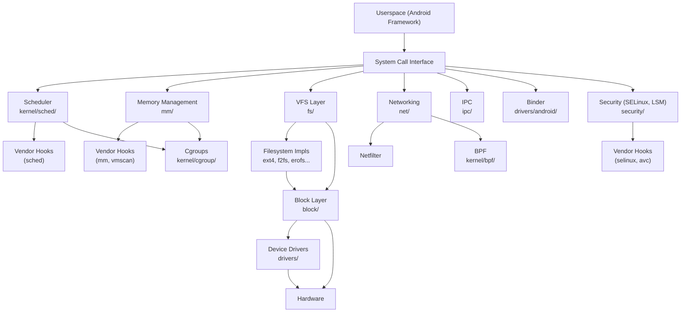

# Android Common Kernel — Architecture Overview

## Identity

This is the **Android Common Kernel (ACK)**, branch `common-android-mainline`, based on **Linux 6.19-rc8** (codename "Baby Opossum Posse"). The ACK is the upstream kernel for all Android devices — OEMs build their device kernels from this base. It closely tracks mainline Linux and adds a thin layer of Android-specific functionality.

## Top-Level Directory Map

| Directory | Role | Source Files (`.c`+`.h`) |
|-----------|------|--------------------------|
| `kernel/` | Core kernel: scheduling, signals, locking, cgroups, BPF, tracing | ~609 |
| `mm/` | Memory management: page allocator, slab, VMAs, swap, OOM | ~193 |
| `fs/` | Filesystems: VFS layer + 50+ filesystem implementations | ~2,101 |
| `net/` | Networking: TCP/IP stack, sockets, netfilter, BPF networking | ~1,814 |
| `drivers/` | Device drivers: 148 subsystem directories | Majority of codebase |
| `drivers/android/` | Android-specific drivers: Binder IPC, vendor hooks, debug_kinfo | ~20 |
| `block/` | Block I/O layer: request queues, schedulers, partitions | ~95 |
| `security/` | Security frameworks: LSM, SELinux, AppArmor, capabilities | ~258 |
| `io_uring/` | Async I/O framework | ~76 |
| `ipc/` | System V IPC: shared memory, semaphores, message queues | Small |
| `init/` | Kernel boot and init process | ~13 |
| `arch/` | Architecture-specific code (arm64, x86, riscv, etc.) | Large |
| `include/` | Kernel headers: UAPI, internal APIs, trace hooks | ~26,402 `.h` files |
| `rust/` | Rust language support for in-kernel Rust modules | Growing |
| `crypto/` | Cryptographic algorithms and framework | Medium |
| `sound/` | ALSA sound subsystem | Medium |
| `tools/` | Userspace tools: perf, BPF, selftests | Large |
| `scripts/` | Build scripts, checkpatch, Kconfig tools | Medium |
| `samples/` | Example kernel code | Small |
| `Documentation/` | Kernel documentation (RST/text) | Large |

## Android-Specific Layers

The ACK's key differentiator from mainline Linux is the **Generic Kernel Image (GKI)** architecture, which separates the kernel into:

```
┌─────────────────────────────────────────────┐
│           Vendor Kernel Modules              │  ← OEM/SoC-specific
│  (loaded at boot, use stable KMI + hooks)    │
├─────────────────────────────────────────────┤
│         GKI Kernel Image (boot.img)          │  ← Shared across devices
│  ┌─────────────────────────────────────────┐ │
│  │  Upstream Linux + Android patches       │ │
│  │  ┌───────────────┐ ┌─────────────────┐ │ │
│  │  │ Binder IPC     │ │ Vendor Hooks    │ │ │
│  │  │ (7,374 LOC)    │ │ (30+ hook hdrs) │ │ │
│  │  └───────────────┘ └─────────────────┘ │ │
│  │  ┌───────────────┐ ┌─────────────────┐ │ │
│  │  │ debug_kinfo    │ │ BinderFS        │ │ │
│  │  └───────────────┘ └─────────────────┘ │ │
│  └─────────────────────────────────────────┘ │
├─────────────────────────────────────────────┤
│              Hardware (SoC)                   │
└─────────────────────────────────────────────┘
```

### Key Android Components

1. **Binder** (`drivers/android/binder.c`, 7,374 LOC) — The core Android IPC mechanism. Enables cross-process communication for all Android services. Includes a Rust implementation under `drivers/android/binder/`.

2. **BinderFS** (`drivers/android/binderfs.c`) — Filesystem interface for dynamically creating Binder device nodes.

3. **Vendor Hooks** (`include/trace/hooks/`, `drivers/android/vendor_hooks.c`) — A framework of ~30+ hook points across subsystems (scheduler, memory, security, etc.) that allows vendor modules to modify kernel behaviour without patching the kernel image. Hook headers include: `sched.h`, `mm.h`, `net.h`, `cpufreq.h`, `selinux.h`, `signal.h`, `iommu.h`, `vmscan.h`, and more.

4. **debug_kinfo** (`drivers/android/debug_kinfo.c`) — Exposes kernel debug information for crash analysis tools.

5. **Binder Netlink** (`drivers/android/binder_netlink.c`) — Netlink interface for Binder event notifications.

## Build System

The ACK uses two build systems:

- **Kleaf / Bazel** (`BUILD.bazel`, `bazel/`, `modules.bzl`) — The modern build system. Uses Bazel rules to build the kernel and modules.
- **Legacy build configs** (`build.config.*`) — Shell-based build configuration files, being deprecated in favour of Bazel.

Key build configurations:
- `arch/arm64/configs/gki_defconfig` — The canonical ARM64 GKI kernel config
- `arch/x86/configs/gki_defconfig` — x86_64 GKI config
- Various `.fragment` files for specific boards (db845c, rockpi4, amlogic)

## Supported Architectures

Primary: `arm64` (the dominant Android architecture), `x86_64`
Also present: `arm`, `riscv`, `mips`, `alpha`, `arc`, `csky`, `hexagon`, `loongarch`, `m68k`, `microblaze`, `nios2`, `openrisc`, `parisc`, `powerpc`, `s390`, `sh`, `sparc`, `um`, `xtensa`

## Patch Classification

All patches in the ACK follow a tagging convention in commit messages:
- `UPSTREAM:` — Cherry-picked from mainline Linux
- `BACKPORT:` — Backported from a newer mainline version, with modifications
- `FROMGIT:` — Cherry-picked from a maintainer tree, not yet in mainline
- `FROMLIST:` — From a mailing list patch, not yet accepted
- `ANDROID:` — Android-specific, not intended for upstream

## Subsystem Relationship Map



## What's Next

See [CLAUDE.md](CLAUDE.md) §6 for the recommended exploration order. The suggested starting points are:

1. GKI architecture and build system
2. Android-specific drivers (Binder, vendor hooks)
3. Scheduler
4. Memory management
5. IPC subsystem
