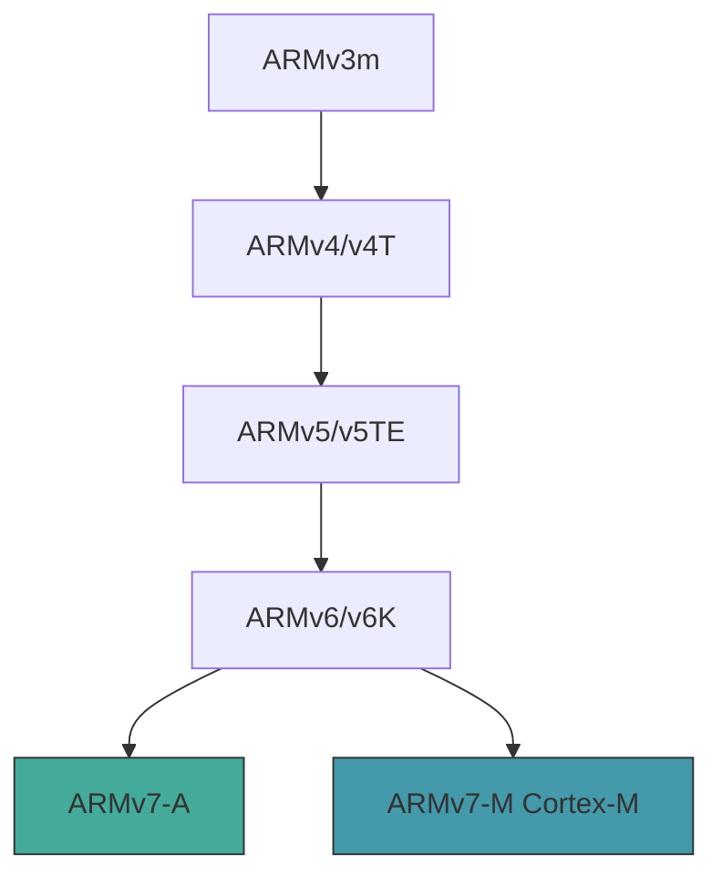

# ARM (32-bit) 架構支援

> `arch/arm/` — 4,559 個檔案、145 個子目錄
> 涵蓋 ARMv3m 至 ARMv7-M 全系列 32 位元處理器
> 55 個 SoC/平台目錄、76 個 defconfig、2,771 個 Device Tree 檔案

## 目的

ARM 32 位元架構移植是 Linux 核心歷史最悠久、平台覆蓋最廣的架構之一。`arch/arm/` 為所有 32 位元 ARM 處理器提供核心啟動、記憶體管理、中斷處理、浮點運算、加密加速等底層支援。雖然 Android 已全面轉向 ARM64，但 ARM32 程式碼仍是理解 ARM 生態系歷史演進與相容性設計的重要基礎。

## Evidence Snapshot

| Claim | Source anchor |
|-------|---------------|
| ARM32 architecture config 由 `config ARM` 啟用，預設為 y | `common/arch/arm/Kconfig:1-4` |
| ARM32 支援多種核心基礎能力：DMA、FORTIFY、KCOV、membarrier、strict kernel/module RWX 等 | `common/arch/arm/Kconfig:13-31` |
| ARM32 已宣告支援 CFI、per-VMA lock、lockref/cmpxchg 等現代核心能力 | `common/arch/arm/Kconfig:40-48` |
| ARM32 仍包含傳統相容性與多平台支援選項，如 `CLONE_BACKWARDS`、`GENERIC_ARCH_TOPOLOGY`、SMP/IRQ 基礎設施 | `common/arch/arm/Kconfig:51-80` |

## 目錄結構

| 目錄 | 檔案數 | 角色 |
|------|--------|------|
| `boot/` | — | 啟動映像生成（zImage/uImage/bootpImage）與 Device Tree 原始檔 |
| `configs/` | 76 | 平台 defconfig（multi_v7_defconfig 為預設） |
| `kernel/` | 90 | 核心功能：異常處理、系統呼叫入口、SMP、CPU 初始化 |
| `mm/` | 109 | 記憶體管理：TLB、Cache、頁面分配、虛擬記憶體 |
| `lib/` | 54 | 底層函式庫：bitops、字串操作、校驗和、延遲迴圈 |
| `crypto/` | 16 | 加密加速：AES-CE、GHASH、NEON 優化實現 |
| `vfp/` | 9 | Vector Floating Point 協處理器支援 |
| `nwfpe/` | 26 | NetWinder 浮點模擬 |
| `vdso/` | 9 | Virtual Dynamic Shared Object（快速系統呼叫） |
| `include/asm/` | 187 | 架構特定標頭檔 |
| `xen/` | 9 | Xen 虛擬化客戶端支援 |
| `probes/` | 11 | Kprobes 核心探測基礎設施 |
| `common/` | 18 | 共用功能（big-little switcher、韌體、L2 快取） |
| `tools/` | 7 | 開發除錯工具 |
| `mach-*/` | 55 個目錄 | SoC/平台特定實現 |
| `boot/dts/` | 2,771 | Device Tree 原始檔（.dts + .dtsi） |

## 架構設計

### CPU 世代支援

ARM32 移植支援從 ARMv3m 到 ARMv7-M 的完整 CPU 系列，透過 Kconfig 選項選擇：

具體 CPU 實現包括：ARM7、ARM8、ARM9 系列（920T/926T/940T/946E）、Cortex-A5 至 A17、FA526、StrongARM、XScale、Feroceon。

### 平台架構（mach-* 目錄）

55 個 `mach-*` 目錄支援不同 SoC 家族：

| SoC 家族 | 目錄 | 廠商 |
|----------|------|------|
| Qualcomm | `mach-qcom` | 高通 |
| Exynos/S3C | `mach-exynos`, `mach-s3c`, `mach-s5pv210` | 三星 |
| Tegra | `mach-tegra` | NVIDIA |
| i.MX | `mach-imx`, `mach-mxs` | NXP/Freescale |
| OMAP | `mach-omap1`, `mach-omap2` | Texas Instruments |
| BCM | `mach-bcm` | Broadcom |
| MVEBU/Orion | `mach-mvebu`, `mach-orion5x` | Marvell |
| SoCFPGA | `mach-socfpga` | Intel |
| SHMobile | `mach-shmobile` | Renesas |
| Rockchip | `mach-rockchip` | 瑞芯微 |
| Sunxi | `mach-sunxi` | 全志 |
| MediaTek | `mach-mediatek` | 聯發科 |
| Versatile/Vexpress | `mach-versatile`, `mach-vexpress` | ARM 參考平台 |

### 記憶體管理特性

- **MMU 與 NoMMU 雙模式**：透過 `Kconfig-nommu` 支援無 MMU 的嵌入式應用
- **LPAE（Large Physical Address Extension）**：支援超過 4GB 實體記憶體，使用 `multi_v7_lpae_defconfig`
- **Domain-based 存取控制**：ARM32 特有的記憶體域機制
- **PAN（Privileged Access Never）**：使用者空間存取控制

### 安全特性

Kconfig 中啟用的安全機制包括：Stack Protector（全域與 per-task）、KASAN（核心位址消毒器）、KCOV（程式碼覆蓋率）、CFI（控制流完整性）、UBSAN（未定義行為消毒器）、嚴格核心 RWX 強制執行、硬體斷點、效能事件（PMU）。

### 加密子系統

`crypto/` 目錄提供硬體加速的密碼學實現：

- **AES-CE**：ARM Cryptography Extensions 硬體加速 AES
- **GHASH-CE**：Galois Hash 加密擴展實現
- **NEON 優化**：利用 NEON SIMD 向量指令加速

### 構建系統

- **預設目標**：`multi_v7_defconfig`（ARMv7 多平台）
- **映像格式**：zImage（壓縮）、Image（未壓縮）、xipImage、bootpImage、uImage
- **壓縮演算法**：gzip、LZ4、LZMA、LZO、XZ
- **指令集**：支援 Thumb 與 Thumb-2
- **位元組序**：Big-endian 與 Little-endian 變體
- **XIP 核心**：支援 eXecute In Place 直接執行

文字偏移量（text offset）針對特定平台可自定：Realtek、SA1100、QCOM、Meson、Axxia 各有特殊處理 @ `arch/arm/Makefile`。

## 關鍵程式碼路徑

1. **啟動流程**：`arch/arm/boot/` 生成壓縮核心映像，解壓後跳至 `arch/arm/kernel/head.S` 進行早期初始化（CPU 模式設定、MMU 啟用、Device Tree 解析）
2. **異常處理**：`arch/arm/kernel/entry-armv.S` 定義低階異常向量表，處理 IRQ、FIQ、Data Abort、Prefetch Abort、SVC（系統呼叫）等
3. **上下文切換**：`arch/arm/kernel/` 中的排程器相關程式碼處理暫存器保存/恢復與 TLB 刷新
4. **VFP 上下文**：`arch/arm/vfp/` 處理浮點協處理器的惰性上下文切換

## Android 特定變更

ARM32 目錄中**無直接的 Android 特定配置**。Device Tree 檔案中包含部分 Google 硬體參考（Chromebook/Chromecast 裝置樹），但這些屬於上游 Linux 貢獻，非 Android 修改。

Android 早期裝置（Android 1.0 至 Android 7.x）主要使用 ARM32 核心。自 Android 8.0 起 Google 推動 64 位元轉型，ARM32 逐漸淡出 Android 生態。目前 GKI 僅支援 ARM64 和 x86_64，不再提供 ARM32 的 GKI defconfig。

## Vendor Hooks

ARM32 架構中無 Android vendor hooks。

## 配置

### 關鍵 Kconfig 選項

| 選項 | 說明 |
|------|------|
| `CONFIG_ARM_LPAE` | Large Physical Address Extension（>4GB RAM） |
| `CONFIG_THUMB2_KERNEL` | Thumb-2 指令集核心 |
| `CONFIG_VDSO` | Virtual Dynamic Shared Object |
| `CONFIG_XIP_KERNEL` | Execute In Place 核心 |
| `CONFIG_ARM_UNWIND` | 堆疊展開支援 |
| `CONFIG_STACKPROTECTOR_PER_TASK` | Per-task 堆疊保護 |
| `CONFIG_AEABI` | ARM EABI ABI 相容 |
| `CONFIG_OABI_COMPAT` | 舊 ABI 相容 |
| `CONFIG_ARM_DMA_USE_IOMMU` | DMA IOMMU 使用 |

### 代表性 defconfig

- `multi_v7_defconfig` — ARMv7 多平台（預設）
- `multi_v7_lpae_defconfig` — 合併 multi_v7 與 LPAE 支援
- `bcm2835_defconfig` — Raspberry Pi
- `exynos_defconfig` — Samsung Exynos
- `imx_v6_v7_defconfig` — NXP i.MX
- `omap2plus_defconfig` — TI OMAP

## 交叉參考

- [ARM64 架構](arch-arm64.md) — 64 位元後繼架構，GKI 主要目標
- [RISC-V 架構](arch-riscv.md) — 新興開放架構
- [GKI](../concepts/gki.md) — Generic Kernel Image（僅支援 ARM64/x86_64）
- [Kconfig 與 Build 系統](../concepts/kconfig-and-build.md) — defconfig 與構建機制
- [Driver Framework](driver-framework.md) — 裝置驅動框架（Platform Bus 為 ARM SoC 基石）
