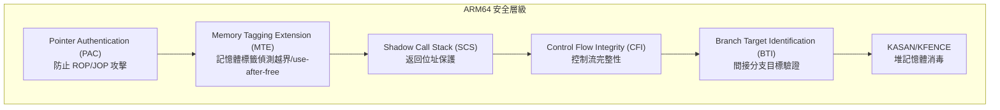

# ARM64 (AArch64) 架構支援

> `arch/arm64/` — 3,489 個檔案、38 MB
> GKI 主要目標架構（`gki_defconfig` 於此目錄下）
> 40+ SoC 平台、2,907 個 Device Tree 檔案
> Google 工程師在 KVM、加密、啟動程式碼等方面有大量貢獻

## 目的

ARM64（AArch64）是 Android Common Kernel 的**主要目標架構**。所有現代 Android 裝置均使用 ARM64 處理器，GKI（Generic Kernel Image）的核心配置 `gki_defconfig` 即位於 `arch/arm64/configs/`。此架構移植提供 64 位元 ARM 處理器的完整核心支援，包括先進的安全機制（PAC、MTE、SCS、CFI）、完整的 KVM 虛擬化、NEON/SVE 向量加速，以及 40+ 個 SoC 廠商的平台支援。

## Evidence Snapshot

| Claim | Source anchor |
|-------|---------------|
| ARM64 architecture config 由 `config ARM64` 啟用，並選取 ACPI、memory hotplug、THP migration、debug 和 DMA 等核心能力 | `common/arch/arm64/Kconfig:1-29` |
| ARM64 宣告支援 strict kernel/module RWX、syscall wrapper、membarrier、set_memory 等安全/記憶體能力 | `common/arch/arm64/Kconfig:32-58` |
| ARM64 Makefile 針對 FPU/NEON、Rust target、ABI、unwind tables 設定架構特定編譯旗標 | `common/arch/arm64/Makefile:36-66` |
| PAC/BTI 相關 branch protection 由 ARM64 Makefile 依 CONFIG 設定 C/Rust 編譯旗標 | `common/arch/arm64/Makefile:78-90` |
| GKI arm64 defconfig 啟用 Rust、SCS、CFI、module signature/protection 與 Android Binder/Vendor Hooks/Debug Kinfo | `common/arch/arm64/configs/gki_defconfig:54-113`, `common/arch/arm64/configs/gki_defconfig:630-634` |

## 目錄結構

| 目錄 | 檔案數 | 角色 |
|------|--------|------|
| `kernel/` | 120+ | 核心功能：異常處理、CPU 特徵偵測、SMP、FP/SIMD、KVM |
| `mm/` | 29 | 記憶體管理：MMU、Page Fault、Cache、MTE、KASAN |
| `boot/dts/` | 2,907 | Device Tree：40+ 廠商的裝置描述 |
| `crypto/` | 40 | 加密加速：AES-CE、SM3/SM4、GHASH、NHPoly1305 |
| `configs/` | 9 | 核心配置：gki_defconfig（691 行）、defconfig（1,869 行） |
| `include/asm/` | 197 | 架構標頭檔：原子操作、記憶體屏障、KVM 介面 |
| `kvm/` | 39 | KVM 完整虛擬機器管理器（含 pKVM 保護模式） |
| `lib/` | 29 | 效能關鍵函式：memcpy、memset、copy_from_user |
| `net/` | — | 網路堆疊架構特定部分 |
| `xen/` | — | Xen 客戶端支援 |
| `hyperv/` | — | Hyper-V 支援 |
| `tools/` | 7 | 系統呼叫表、系統暫存器資料庫 |
| `vdso/` | — | Virtual DSO（時鐘、亂數生成） |

## 架構設計

### GKI 配置（gki_defconfig）

`arch/arm64/configs/gki_defconfig`（691 行）是 Android 通用核心映像的核心配置，啟用的關鍵 Android 功能：

| 配置選項 | 用途 |
|----------|------|
| `CONFIG_ANDROID_BINDER_IPC=y` | Binder IPC 通訊機制 |
| `CONFIG_ANDROID_BINDERFS=y` | Binder 動態裝置檔案系統 |
| `CONFIG_ANDROID_VENDOR_HOOKS=y` | 廠商 Hook 框架 |
| `CONFIG_ANDROID_DEBUG_KINFO=y` | 核心除錯資訊匯出 |
| `CONFIG_ZRAM_ANDROID_IOCTL=y` | ZRAM Android 專用 ioctl |
| `CONFIG_GKI_HACKS_TO_FIX=y` | GKI 隱藏配置集合 |

其他 GKI 配置片段（fragment）支援特定硬體平台：

- `db845c_gki.fragment`（10,784 行）— Qualcomm Snapdragon 845
- `amlogic_gki.fragment`（2,645 行）— Amlogic SoC
- `rockpi4_gki.fragment`（1,713 行）— Rockchip RK3399
- `microdroid_defconfig`（181 行）— Microdroid 最小化虛擬機器
- `crashdump_defconfig`（78 行）— Crash Dump 專用

### 安全機制

ARM64 架構整合了多層現代安全特性：

- **PAC（Pointer Authentication Code）**：`include/asm/asm_pointer_auth.h` — 對函式返回地址和資料指標進行密碼學簽署驗證
- **MTE（Memory Tagging Extension）**：`mm/mte.c` — 硬體級記憶體標籤，偵測堆越界與 use-after-free
- **SCS（Shadow Call Stack）**：`include/asm/shadow_call_stack.h` — 獨立的影子呼叫堆疊保護返回地址
- **CFI（Control Flow Integrity）**：透過 LLVM 編譯器實現間接呼叫驗證
- **BTI（Branch Target Identification）**：ARMv8.5-A 分支目標標識指令

### KVM 虛擬化

`kvm/` 目錄（39 個檔案）提供完整的 Type-2 虛擬機器管理器：

- **核心 VM 管理**：`main.c`、`vm.c`、`vmid.c`
- **vCPU 管理**：`vcpu.c`、`vcpu_exit.c`、`vcpu_insn.c`
- **浮點/向量**：`vcpu_fp.c` — FP/SIMD 上下文虛擬化
- **SBI 實現**：多個 `vcpu_sbi_*.c` 模組
- **分頁**：`mmu.c`、`gstage.c`（Guest Stage 頁表）
- **pKVM（Protected KVM）**：受保護的虛擬化模式，用於 Android Virtualization Framework（AVF）

Google 工程師（Quentin Perret、Sebastian Ene、Marc Zyngier、Ard Biesheuvel、Peter Collingbourne）在 KVM 和早期啟動程式碼方面有大量貢獻。

### 加密子系統

40 個檔案（380KB），提供硬體加速的密碼學實現：

| 演算法 | 實現方式 | 說明 |
|--------|----------|------|
| AES | CE 加速、NEON、多種模式 | 主要對稱加密 |
| SM3 | CE 與 NEON | 中國加密標準（雜湊） |
| SM4 | CCM/GCM/ECB 模式 | 中國加密標準（分組） |
| GHASH | Crypto Extensions | Galois Hash |
| NHPoly1305 | — | Adiantum 雜湊函式 |

檔案命名慣例：`*-ce-*` 為 Crypto Extensions 硬體加速，`*-neon-*` 為 NEON 向量加速，`*-glue.c` 為整合包裝。多個加密檔案版權歸屬 Google LLC（2018-2024）。

### 記憶體管理

`mm/` 目錄（29 個檔案，300KB）的關鍵元件：

- `mmu.c`（60KB）— MMU 操作與頁表管理，ARM64 最大的 MM 檔案
- `fault.c`（28KB）— Page Fault 處理
- `contpte.c`（19KB）— Contiguous PTE 優化，提升 TLB 效率
- `mte.c` — Memory Tagging Extension 支援
- `kasan_init.c` — KASAN 初始化
- `hugetlbpage.c` — Huge Page 支援
- `cache.S` — Cache 操作（組合語言）

### CPU 特徵偵測

`kernel/cpufeature.c`（144KB）是 ARM64 最大的核心檔案之一，負責在啟動時偵測 CPU 支援的硬體特性（PAC、MTE、SVE、SME 等），並透過 alternative patching 在執行期動態啟用對應的指令路徑。

### 效能關鍵函式庫

`lib/` 目錄（29 個檔案，184KB）包含高度優化的組合語言實現：

- `memcpy.S`、`memset.S`、`strlen.S` — 核心記憶體/字串操作
- `copy_from_user.S`、`copy_to_user.S` — 安全的使用者空間複製
- `insn.c`（39KB）— 指令解碼與分析
- `xor-neon.c` — NEON 加速 XOR 運算

### 平台支援

`Kconfig.platforms`（11,285 bytes）列出 40+ 廠商平台：

| 分類 | 平台 |
|------|------|
| 行動/Android 核心 | Qualcomm (QCOM)、MediaTek、Samsung Exynos |
| SoC 廠商 | Broadcom (BCM)、Marvell、HiSilicon、Amlogic |
| 消費性 | Apple Silicon、Rockchip、Allwinner |
| 工業/嵌入式 | Renesas、TI K3、Microchip |
| 參考平台 | ARM FVP/Juno |
| 其他 | Intel、AMD、NVIDIA、Xilinx |

Device Tree 覆蓋 2,907 個檔案（32MB），橫跨所有支援的廠商。

## 關鍵程式碼路徑

1. **系統呼叫入口**：使用者空間觸發 `svc` 指令 → `el0_svc`（`kernel/entry.S`）→ 系統呼叫表派發 → 返回使用者空間。ARM64 使用 `el0_svc_handler` 處理 64 位元系統呼叫，`el0_svc_compat_handler` 處理 32 位元相容呼叫。
2. **CPU 特徵初始化**：`cpufeature.c` 在啟動階段掃描 ID 暫存器 → 建立 capability 清單 → 執行 alternative patching → 啟用安全特性（PAC/MTE/BTI）
3. **KVM 進入/離開**：`kvm/` 中的 `vcpu_enter_guest` → 切換 EL2 → 執行客戶端 → 異常返回 → `vcpu_exit` 處理
4. **FP/SIMD 上下文切換**：`kernel/fpsimd.c` 實現惰性保存/恢復策略，僅在必要時保存 FP/SIMD/SVE 暫存器

## Android 特定變更

ARM64 是 Android GKI 的**主要目標架構**，Android 特定修改集中在：

1. **gki_defconfig**：啟用 Binder IPC、Vendor Hooks、Debug Kinfo、ZRAM Android ioctl 等 Android 核心功能
2. **GKI Fragment Configs**：針對 Qualcomm 845、Amlogic、RockPi4 等平台的大型配置片段
3. **Microdroid**：最小化 defconfig（181 行），用於 Android Virtualization Framework 中的輕量級 VM
4. **GKI_HACKS_TO_FIX**：`arch/arm64/Kconfig` 中的 `CONFIG_GKI_HACKS_TO_FIX` 控制 DMA_OPS 選擇，確保 GKI 模組相容
5. **加密程式碼**：多個 `crypto/` 檔案由 Google LLC 貢獻（2018-2024），支援 Android 裝置的硬體加密需求
6. **KVM/pKVM**：Google 工程師主導的受保護虛擬化，為 Android Virtualization Framework 提供基礎

### GKI 支援的頁面大小

GKI defconfig 支援三種頁面大小變體（透過 defconfig fragment 疊加）：4K、16K、64K。

## Vendor Hooks

ARM64 架構層級本身不包含 Android vendor hooks。Vendor hooks 存在於更高層級的子系統（排程器、記憶體管理、安全等），詳見 [Vendor Hook 完整目錄](../android/vendor-hook-catalogue.md)。

## 配置

### gki_defconfig 關鍵配置（691 行）

| 配置 | 行號（約） | 用途 |
|------|-----------|------|
| `CONFIG_MODULES=y` | 100 | 模組支援 |
| `CONFIG_MODVERSIONS=y` | 102 | 符號版本追蹤 |
| `CONFIG_MODULE_SIG=y` | 105 | 模組簽署 |
| `CONFIG_MODULE_SIG_PROTECT=y` | 106 | GKI 符號保護 |
| `CONFIG_GKI_HACKS_TO_FIX=y` | 113 | 隱藏配置集合 |
| `CONFIG_ANDROID_BINDER_IPC=y` | 630 | Binder IPC |
| `CONFIG_ANDROID_VENDOR_HOOKS=y` | 633 | Vendor Hook |
| `CONFIG_ANDROID_DEBUG_KINFO=y` | — | 除錯資訊匯出 |
| `CONFIG_SHADOW_CALL_STACK=y` | — | 影子呼叫堆疊 |
| `CONFIG_CFI_CLANG=y` | — | 控制流完整性 |

### 構建目標

- `Image` / `Image.lz4` — 未壓縮/壓縮核心映像
- `vmlinuz.efi` — EFI 啟動映像
- `image.fit` — FIT 格式映像
- VDSO — 使用者空間快速系統呼叫介面

### 系統呼叫支援

`tools/` 目錄提供系統呼叫表管理：

- `syscall_32.tbl`（19,567 bytes）— 32 位元 ARM EABI 系統呼叫（相容模式）
- `syscall_64.tbl` — 連結至通用 64 位元系統呼叫表
- `sysreg`（76KB）— ARM64 系統暫存器資料庫
- `cpucaps` — CPU capability 名稱清單

## 檔案統計

| 類別 | 數量 | 大小 |
|------|------|------|
| 總檔案 | 3,489 | 38 MB |
| Device Tree | 2,907 | 32 MB |
| 核心檔案 | 120 | ~15 MB |
| Include 標頭 | 197 | ~1.4 MB |
| 加密檔案 | 40 | ~380 KB |
| gki_defconfig 選項 | 691 行 | — |
| 完整 defconfig 選項 | 1,869 行 | — |

## 交叉參考

- [ARM (32-bit) 架構](arch-arm.md) — 32 位元前代架構
- [RISC-V 架構](arch-riscv.md) — 新興開放架構
- [GKI](../concepts/gki.md) — Generic Kernel Image 架構（ARM64 為主要目標）
- [Kconfig 與 Build 系統](../concepts/kconfig-and-build.md) — gki_defconfig 與 Kleaf 構建
- [Module 系統](../concepts/module-system.md) — GKI 模組符號保護
- [Security](../subsystems/security.md) — LSM 與核心安全強化
- [系統呼叫](../apis/syscalls.md) — ARM64 471 個 syscall
