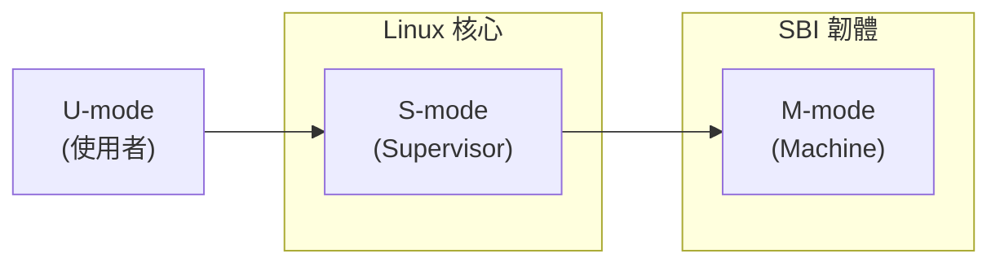

# RISC-V 架構支援

> `arch/riscv/` — 564 個檔案、19 個頂層子目錄
> 支援 RV32IM（32 位元）與 RV64IM（64 位元）
> 17 個 SoC/平台家族、70+ 個 Device Tree 檔案
> 20+ 個 ISA 擴展配置選項（V 向量、Zba/Zbb/Zbc 位元操作等）

## 目的

RISC-V 是一個開放標準指令集架構（ISA），由 UC Berkeley 發起，目前由 RISC-V International 維護。`arch/riscv/` 提供 Linux 核心對 RISC-V 處理器的完整支援，涵蓋 32/64 位元模式、MMU/NoMMU 配置、KVM 虛擬化、向量擴展加密加速等。雖然 RISC-V 尚未成為 Android GKI 的官方支援架構，但作為一個快速成長的開放生態系，它是 ARM 之外最具潛力的 Android 硬體平台候選。

## Evidence Snapshot

| Claim | Source anchor |
|-------|---------------|
| RISC-V Kconfig 同時定義 32-bit 與 64-bit 基礎開關 | `common/arch/riscv/Kconfig:7-14` |
| RISC-V 支援 ACPI、memory hotplug、THP migration、debug WX、FORTIFY、KCOV 等現代核心能力 | `common/arch/riscv/Kconfig:15-39` |
| RISC-V 宣告 strict kernel/module RWX、syscall wrapper、VDSO arch data、atomic RMW 等架構能力 | `common/arch/riscv/Kconfig:51-64` |
| RISC-V Kconfig 明確選取 CFI、LTO、Shadow Call Stack、sched multi-core、per-VMA lock 等可選能力 | `common/arch/riscv/Kconfig:65-78` |

## 目錄結構

| 目錄 | 檔案數 | 角色 |
|------|--------|------|
| `kernel/` | 144 | 核心功能：入口/啟動、CPU 特徵偵測、FPU、向量、SMP |
| `boot/` | 125 | 啟動載入器與 Device Tree（70+ 個 .dts/.dtsi） |
| `include/` | 182 | 架構標頭檔（asm/ 與 uapi/asm/） |
| `kvm/` | 33 | KVM 完整虛擬機器管理器（含 AIA 中斷架構） |
| `mm/` | 16 | 記憶體管理：MMU、Page Fault、Cache、TLB |
| `lib/` | 16 | 效能關鍵函式：memcpy、memset、strcmp |
| `crypto/` | 13 | 向量加密擴展（ZVK 家族） |
| `errata/` | 10 | CPU 勘誤修正（Andes、SiFive、T-HEAD、StarFive） |
| `configs/` | — | defconfig 配置檔 |
| `net/` | 5 | 網路架構特定部分 |
| `purgatory/` | 5 | Kexec 執行環境 |
| `tools/` | — | 開發工具 |

## 架構設計

### ISA 模組化擴展

RISC-V 最大的特色是**模組化 ISA 設計**。核心基礎指令集（RV32I/RV64I）非常精簡，所有額外功能透過標準化擴展提供。`arch/riscv/Makefile` 動態組合 march 字串：

基礎為 `rv32ima`（32 位元）或 `rv64ima`（64 位元），根據 Kconfig 選項動態附加擴展：C（壓縮指令）、V（向量）、FD（浮點）、Zacas、Zabha 等。

### 支援的 ISA 擴展（20+ 配置選項）

**標準擴展：**

| 擴展 | Kconfig | 說明 |
|------|---------|------|
| C | `RISCV_ISA_C` | 壓縮指令（16 位元編碼） |
| V | `RISCV_ISA_V` | 向量擴展（SIMD） |
| Zba/Zbb/Zbc | `RISCV_ISA_ZB*` | 位元操作擴展 |
| Zabha | `RISCV_ISA_ZABHA` | 原子 byte/halfword 操作 |
| Zacas | `RISCV_ISA_ZACAS` | 原子 compare-and-swap |
| Zbkb | `RISCV_ISA_ZBKB` | 加密用位元操作 |
| Zawrs | `RISCV_ISA_ZAWRS` | 原子等待/喚醒指令 |

**Supervisor 擴展：**

| 擴展 | 說明 |
|------|------|
| Svnapot | 自然對齊冪次頁面大小 |
| Svpbmt | 頁面記憶體類型 |
| Svrsw60t59b | 軟體 dirty 追蹤（支援即時遷移） |
| Supm | 使用者空間指標遮罩 |

**Cache Block 操作：**

| 擴展 | 說明 |
|------|------|
| Zicbom | Cache Block 管理操作 |
| Zicboz | Cache Block 清零 |
| Zicbop | Cache Block 預取 |

**廠商擴展：**

- Andes（安謀科技）
- MIPS — 含 P8700 PAUSE 指令支援
- SiFive — SiFive 專屬擴展
- T-HEAD（平頭哥）— 含 xtheadvector 與 CPU 勘誤修正

### 執行模式

- **M-mode（Machine Mode）**：最高特權級，SBI（Supervisor Binary Interface）韌體運行於此
- **S-mode（Supervisor Mode）**：Linux 核心運行於此，透過 SBI 呼叫與韌體互動
- **U-mode（User Mode）**：使用者空間應用程式

核心支援 NoMMU 配置（用於 Canaan K210 等嵌入式處理器）。

### SoC/平台支援

17 個 SoC/平台家族：

| 平台 | SoC | 應用場景 |
|------|-----|----------|
| Andes AX45MP | SiFive AX45MP 核心 | 嵌入式 |
| Canaan Kendryte | K210（NoMMU）、K230（MMU） | AIoT |
| ESWIN EIC7700 | — | AI/ML 加速 |
| Microchip PolarFire | — | 工業/嵌入式 |
| Renesas RZ/Five | — | 工業自動化 |
| SiFive | FU740/U74 | 高效能核心 |
| Sophgo | SG2000/SG2042 | 多核心處理器 |
| SpacemiT K1 | — | 通用 |
| StarFive | JH7100/JH7110 | BeagleV 開發板 |
| Sunxi D1/D1s | Allwinner | 消費性 IoT |
| T-HEAD C9xx | — | 消費性 SoC |
| Tenstorrent | Blackhole P100/P150 | AI 加速卡 |
| QEMU Virt | — | 虛擬機器 |

### KVM 虛擬化

`kvm/` 目錄（33 個檔案）提供完整的 RISC-V KVM 虛擬化：

- **核心管理**：`main.c`、`vm.c`、`vmid.c`
- **vCPU**：`vcpu.c`、`vcpu_exit.c`、`vcpu_insn.c`、`vcpu_fp.c`、`vcpu_vector.c`
- **SBI 實現**：8 個模組（base、HSM、PMU、forwarding 等）
- **分頁**：`mmu.c`、`gstage.c`（Guest Stage 頁表）、`tlb.c`
- **中斷**：AIA（Advanced Interrupt Architecture）— `aia.c`、`aia_aplic.c`、`aia_imsic.c`
- **效能**：`vcpu_pmu.c`（PMU 虛擬化）
- **非架構功能**：`nacl.c`

### 加密子系統

13 個檔案，利用 RISC-V 向量加密擴展（ZVK 家族）：

| 演算法 | 檔案 | 擴展需求 |
|--------|------|----------|
| AES | `aes-riscv64-zvkned*.S` | Zvkned、Zvkb、Zvbb、Zvkg |
| GHASH | `ghash-riscv64-zvkg.S` | Zvkg |
| SM3 | `sm3-riscv64-zvksh-zvkb.S` | Zvksh、Zvkb |
| SM4 | `sm4-riscv64-zvksed-zvkb.S` | Zvksed、Zvkb |

### 記憶體管理

`mm/` 目錄（16 個檔案）的關鍵元件：

- `init.c`（50KB）— 記憶體初始化，RISC-V MM 最大的檔案
- `context.c` — TLB/記憶體上下文管理
- `fault.c` — Page Fault 處理
- `cacheflush.c`、`cache-ops.c` — Cache 操作
- `tlbflush.c` — TLB 刷新
- `kasan_init.c` — KASAN 初始化
- `hugetlbpage.c` — Huge Page 支援
- `dma-noncoherent.c` — 非一致性 DMA 支援（許多 RISC-V SoC 為非一致性快取）

支援 SV48 四級頁表、Transparent Hugepage、記憶體熱插拔、NUMA 感知分配。

### CPU 勘誤修正

`errata/` 目錄（10 個檔案）使用 runtime alternative patching 修正已知 CPU 錯誤：

- **Andes** — Andes AX45MP 核心勘誤
- **SiFive** — SiFive 核心勘誤
- **T-HEAD** — T-HEAD C9xx 系列勘誤（含 xtheadvector 相關）
- **StarFive** — StarFive JH 系列勘誤

### 效能關鍵函式庫

`lib/` 目錄（16 個檔案）：

- `memcpy.S`、`memmove.S`、`memset.S`、`clear_page.S` — 記憶體操作
- `strcmp.S`、`strlen.S`、`strncmp.S` — 字串操作
- `uaccess.S`、`uaccess_vector.S` — 使用者空間存取（含向量加速版本）
- `csum.c` — 校驗和計算
- `riscv_v_helpers.c` — 向量擴展輔助函式

## 關鍵程式碼路徑

1. **啟動流程**：`kernel/head.S` → 早期初始化（設定 CSR 暫存器、啟用 MMU）→ `setup.c` 系統配置 → 通用核心 `start_kernel`
2. **系統呼叫入口**：`kernel/entry.S` 處理 ecall 指令，透過系統呼叫表派發
3. **CPU 特徵偵測**：`kernel/cpufeature.c` 讀取 CSR 暫存器與 Device Tree，偵測 ISA 擴展，執行 alternative patching
4. **向量上下文切換**：`kernel/vector.c` + `vec-copy-unaligned.S` 處理向量暫存器的惰性保存/恢復
5. **KVM 客戶端進入**：`kvm/vcpu.c` → 切換至 VS-mode → 執行客戶端 → `vcpu_exit.c` 處理異常返回

## Android 特定變更

RISC-V 架構中**無 Android 特定修改**。搜尋 "android"、"ANDROID"、"Google" 僅找到通用 Linux 核心功能的引用（CFI 實現中的 LLVM 連結、廠商擴展的 GitHub 引用等），均非 Android 特定。

**RISC-V 與 Android 的現況：**

- GKI 目前不提供 RISC-V 的 `gki_defconfig`
- 無 Android Binder、Vendor Hooks 或 Debug Kinfo 的架構特定配置
- 部分 SoC 廠商（如 T-HEAD、Sophgo）正在推動 RISC-V Android 支援
- RISC-V Android 移植主要在 AOSP 實驗分支中進行，尚未整合至主線 ACK

## Vendor Hooks

RISC-V 架構中無 Android vendor hooks。

## 配置

### 關鍵 Kconfig 選項

| 選項 | 說明 |
|------|------|
| `CONFIG_ARCH_RV32I` / `CONFIG_ARCH_RV64I` | 32/64 位元基礎 ISA |
| `CONFIG_RISCV_ISA_C` | 壓縮指令擴展 |
| `CONFIG_RISCV_ISA_V` | 向量擴展 |
| `CONFIG_RISCV_ISA_ZBB` | 位元操作擴展 |
| `CONFIG_RISCV_SBI` | Supervisor Binary Interface |
| `CONFIG_EFI` | UEFI 韌體支援 |
| `CONFIG_KVM` | KVM 虛擬化（模組化） |
| `CONFIG_RISCV_ISA_SVNAPOT` | 自然對齊頁面大小 |
| `CONFIG_RISCV_ISA_SVPBMT` | 頁面記憶體類型 |
| `CONFIG_CFI_CLANG` | 控制流完整性 |
| `CONFIG_SHADOW_CALL_STACK` | 影子呼叫堆疊 |

### 構建目標

- `Image` — 未壓縮核心映像
- `Image.gz`/`.bz2`/`.lz4`/`.lzma`/`.lzo`/`.zst`/`.xz` — 各種壓縮格式
- `vmlinuz.efi` — EFI 啟動映像
- `xipImage` — Execute-in-Place 映像
- `loader.bin` — Canaan K210 專用 M-mode 載入器

### 構建配置細節

- 動態 ABI 選擇：32 位元 `ilp32` 或 64 位元 `lp64`
- Linker relaxation 控制（LTO 和 SCS 需停用）
- Code model 選擇：medlow 或 medany
- 工具鏈相容性檢查（LLVM 與 GNU binutils）

## 檔案統計

| 類別 | 數量 |
|------|------|
| 總檔案 | 564 |
| C 原始碼 | ~250 |
| 組合語言 | ~80 |
| Device Tree | ~70 |
| 標頭檔 | ~182 |
| 配置檔 | 6 |
| Makefile | 30+ |

## 與 ARM64 的比較

| 面向 | ARM64 | RISC-V |
|------|-------|--------|
| 總檔案數 | 3,489 | 564 |
| Device Tree | 2,907 | ~70 |
| SoC 平台 | 40+ | 17 |
| GKI 支援 | 是（主要目標） | 否 |
| ISA 設計 | 固定（擴展由 ARM 控制） | 模組化（開放標準） |
| 安全特性 | PAC/MTE/SCS/BTI | SCS/CFI（MTE 尚無） |
| 向量擴展 | NEON（固定 128 位元）+ SVE | V 擴展（可變長度） |
| 虛擬化 | KVM + pKVM | KVM（AIA 中斷架構） |
| 加密加速 | CE（ARM 專屬指令） | ZVK（向量加密擴展） |
| 生態成熟度 | 非常成熟 | 快速成長中 |

## 交叉參考

- [ARM64 架構](arch-arm64.md) — GKI 主要目標架構
- [ARM (32-bit) 架構](arch-arm.md) — 32 位元 ARM 架構
- [GKI](../concepts/gki.md) — Generic Kernel Image 架構
- [Kconfig 與 Build 系統](../concepts/kconfig-and-build.md) — defconfig 與構建機制
