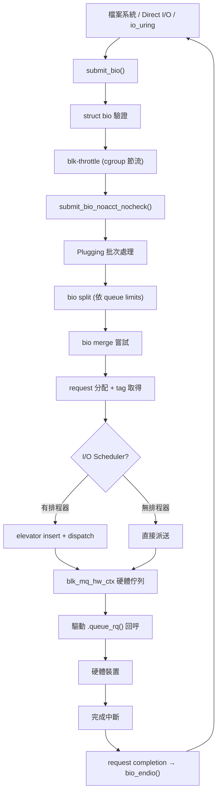

# Block Layer（區塊層）

## Purpose

Block Layer 是 Linux 核心中負責管理所有區塊裝置 I/O 的子系統。它在檔案系統（或使用者空間直接 I/O）與底層硬體驅動程式之間提供統一的抽象層，負責 I/O 請求的提交、合併、排程、派送與完成。在 Android Common Kernel (ACK) 中，block layer 幾乎與上游 Linux 完全一致，僅有少量 Android 特定修改（主要在 inline encryption 與 DM default key 方面）。

## Directory Map

block layer 的核心程式碼位於 `block/` 目錄，總計約 **64,528 行**（80+ 檔案）。

| 檔案 | 行數 | 用途 |
|------|------|------|
| `blk-core.c` | 1,289 | 核心 I/O 提交路徑：`submit_bio()`、`submit_bio_noacct()`、plugging、I/O 計費 |
| `blk-mq.c` | 5,274 | Multi-Queue 核心：請求分配、派送、完成、queue freeze/quiesce |
| `bio.c` | 1,886 | `struct bio` 生命週期：分配、克隆、分割、完成 |
| `blk-merge.c` | 1,151 | I/O 合併邏輯：back merge、front merge、request merge |
| `blk-settings.c` | 1,062 | Queue limits 配置：max_sectors、max_segments、virt_boundary_mask |
| `blk-sysfs.c` | 1,016 | sysfs 介面：`/sys/block/<dev>/queue/` 屬性 |
| `blk-flush.c` | ~600 | Flush/FUA 狀態機：保證資料持久性 |
| `elevator.c` | 884 | I/O 排程器框架：註冊、選擇、切換 |
| `blk-mq-sched.c` | 705 | blk-mq 排程器整合層 |
| `blk-mq-tag.c` | ~500 | Tag 管理：sbitmap-based tag 分配 |
| `mq-deadline.c` | 1,058 | MQ Deadline I/O 排程器 |
| `kyber-iosched.c` | 1,056 | Kyber I/O 排程器（延遲導向） |
| `bfq-iosched.c` | 7,691 | BFQ I/O 排程器（頻寬公平、低延遲） |
| `bfq-wf2q.c` | 1,701 | BFQ 的 WF2Q+ 排程演算法 |
| `bfq-cgroup.c` | 1,440 | BFQ cgroup 整合 |
| `blk-throttle.c` | 1,849 | blkio cgroup 節流控制器（IOPS/BPS） |
| `blk-iocost.c` | 3,551 | iocost：基於成本模型的比例 I/O 控制 |
| `blk-iolatency.c` | 1,071 | iolatency：基於延遲的 I/O 保護 |
| `blk-wbt.c` | 951 | Writeback Throttling：基於 CoDel 的回寫節流 |
| `blk-rq-qos.c` | ~200 | Request QoS 框架（WBT、latency、iocost 插件介面） |
| `blk-cgroup.c` | 2,250 | Block cgroup 核心 |
| `blk-zoned.c` | 2,363 | Zoned Block Device 支援（ZAC/ZBC/ZNS） |
| `blk-crypto.c` | ~300 | Inline Encryption 核心 |
| `blk-crypto-fallback.c` | ~500 | Inline Encryption 軟體後備 |
| `blk-crypto-profile.c` | ~600 | Inline Encryption 硬體配置 |
| `genhd.c` | 1,584 | 通用磁碟管理：磁碟註冊、分割區 |
| `bdev.c` | 1,383 | Block device 開啟/關閉、inode 管理 |
| `fops.c` | 979 | Block device file_operations |
| `ioctl.c` | 963 | Block ioctl 處理 |
| `sed-opal.c` | 3,350 | Self-Encrypting Drive OPAL 協定 |
| `blk.h` | 733 | 內部共用標頭 |

## Architecture

Block layer 採用 **Multi-Queue (blk-mq)** 架構，這是自 Linux 3.13 以來取代舊版單一佇列的現代設計。



### 核心設計概念

**1. 三層佇列架構**

- **Software Queue (`blk_mq_ctx`)**：Per-CPU 軟體佇列，每個 CPU 有獨立的提交佇列，減少鎖競爭。結構定義於 `blk-mq.h:19`，包含 per-type 的 `rq_lists[]` 和 spinlock。
- **Hardware Queue (`blk_mq_hw_ctx`)**：對應硬體佇列或 MSI-X 中斷向量，定義於 `blk-mq.h:320`。包含 dispatch list、sbitmap ctx_map、排程器 sched_data。支援三種類型：`HCTX_TYPE_DEFAULT`、`HCTX_TYPE_READ`、`HCTX_TYPE_POLL`。
- **Request Queue (`request_queue`)**：Per-device 全域佇列，定義於 `blkdev.h:479`。持有所有 hw_ctx、elevator、queue_limits、blk-crypto profile 等。

**2. Plugging 機制**

`struct blk_plug` 允許呼叫者批次提交 I/O 請求（`blk-core.c:1124-1176`）。當 plug 積累超過 `BLK_MAX_REQUEST_COUNT`（32 個）或 `BLK_PLUG_FLUSH_SIZE`（128 KB）時自動刷出。Task 進入 sleep 時也會自動 flush plug，避免死鎖。

**3. Tag-based 請求管理**

每個 `struct request` 都需要一個 tag（整數索引），由 sbitmap 管理。Tag 分配是派送路徑中的關鍵資源控制點——tag 用完時會回壓 I/O 提交者。共享 tag 場景下使用公平分配策略：`depth / active_queues`（`blk-mq.h:403-436`）。

**4. Bio 與 Request**

- `struct bio`（`blk_types.h:210`）：表示一段連續磁碟區域的 I/O 操作，包含 `bi_bdev`（目標裝置）、`bi_opf`（操作碼+旗標）、`bi_iter`（sector/size 迭代器）、`bi_io_vec`（scatter-gather 頁面列表）。
- `struct request`（`blk-mq.h:103`）：由 block layer 管理的 I/O 請求，可由多個 bio 合併而成。包含 tag、deadline、hash node（用於排程器合併）、rb_node（用於排序）。

## Key Data Structures

- `struct bio` — I/O 傳輸的基本單元 @ `include/linux/blk_types.h:210`
- `struct request` — block layer 管理的請求 @ `include/linux/blk-mq.h:103`
- `struct request_queue` — Per-device 佇列 @ `include/linux/blkdev.h:479`
- `struct blk_mq_hw_ctx` — 硬體派送佇列上下文 @ `include/linux/blk-mq.h:320`
- `struct blk_mq_ctx` — Per-CPU 軟體佇列 @ `block/blk-mq.h:19`
- `struct blk_mq_ops` — 驅動回呼接口（queue_rq、complete、init_hctx 等）
- `struct blk_mq_tag_set` — 硬體佇列集配置（nr_hw_queues、queue_depth、ops 等）
- `struct elevator_type` / `struct elevator_queue` — I/O 排程器類型與實例
- `struct blk_flush_queue` — Flush 狀態機 @ `block/blk.h:34`
- `struct rq_qos` / `struct rq_qos_ops` — Request QoS 插件框架 @ `block/blk-rq-qos.h:27`

## Key Code Paths

### 1. I/O 提交路徑（Write）

1. 檔案系統呼叫 `submit_bio(bio)` @ `blk-core.c:911`
2. 設定 ioprio → `bio_set_ioprio()` @ `blk-core.c:890`
3. `submit_bio_noacct()` @ `blk-core.c:782` — 驗證 bio：
   - 檢查 REQ_NOWAIT 支援、read-only、end-of-device、分割區 remap
   - 依操作類型驗證（DISCARD 需要 max_discard_sectors、WRITE_ZEROES 需要 max_write_zeroes_sectors 等）
   - Flush/FUA 過濾（不支援寫入快取時自動移除）
4. `blk_throtl_bio()` @ `blk-core.c:877` — cgroup 節流檢查
5. `submit_bio_noacct_nocheck()` @ `blk-core.c:730` — cgroup 計費、trace、遞迴防護
6. `__submit_bio()` @ `blk-core.c:626` — 建立 plug、呼叫 `blk_mq_submit_bio()`
7. `blk_mq_submit_bio()` @ `blk-mq.c` — bio split → merge 嘗試 → request 分配 → 插入排程器或直接派送

### 2. blk-mq 派送路徑

1. `blk_mq_flush_plug_list()` @ `blk-core.c:2959` — unplug 時批次派送
2. 若無排程器且非 from_schedule：`blk_mq_dispatch_queue_requests()` @ `blk-mq.c:2880`
   - 若驅動實作 `queue_rqs()`：批次下發整個列表
   - 否則逐一透過 `blk_mq_issue_direct()` → `blk_mq_request_issue_directly()` → `__blk_mq_issue_directly()` 呼叫驅動 `queue_rq()`
3. 若有排程器：`blk_mq_dispatch_list()` @ `blk-mq.c:2901` → `elevator->type->ops.insert_requests()` 插入排程器，然後 `blk_mq_run_hw_queue()` 觸發排程器 dispatch

### 3. 完成路徑

1. 硬體中斷 → 驅動呼叫 `blk_mq_complete_request()`
2. 若支援 IPI softirq 完成：發送 IPI 到提交 CPU 的 `blk_cpu_done` llist
3. `blk_mq_end_request()` → `blk_update_request()` — 更新 bio 迭代器、I/O 統計
4. 逐一完成 bio chain：`bio_endio()` → `bi_end_io` 回呼

### 4. Queue Freeze / Quiesce

- **Freeze**（`blk_freeze_queue_start` @ `blk-mq.c:182`）：kill `q_usage_counter` percpu_ref，等待所有進行中 I/O 完成。用於佇列配置變更。
- **Quiesce**（`blk_mq_quiesce_queue` @ `blk-mq.c:299`）：設定 `QUEUE_FLAG_QUIESCED`，等待 RCU/SRCU grace period。阻止新的 dispatch 但不阻止提交。

### 5. Flush/FUA 狀態機

`blk_insert_flush()` @ `blk-flush.c` 管理需要持久性保證的 I/O：
- 純 flush（無資料）→ 合併為單一 flush request
- 資料 + FUA → 視硬體能力選擇：直接 FUA 或 pre-flush + 資料 + post-flush
- 使用雙 flush queue (`flush_queue[2]`) 實現 pipeline

## I/O Schedulers

ACK 提供三種 blk-mq I/O 排程器，均為可載入模組：

### MQ Deadline (`mq-deadline.c`, 1,058 行)

[upstream] 傳統 deadline 排程器的 blk-mq 適配版本。

- **核心思想**：為每個 I/O 設定過期時間，避免飢餓
- **資料結構**：每個優先級（RT/BE/IDLE）各有 per-direction 的 rb_tree（sector 排序）和 FIFO list（deadline 排序）@ `mq-deadline.c:73-105`
- **參數**：`read_expire` = 500ms、`write_expire` = 5s、`writes_starved` = 2（允許讀優先幾次後必須服務寫）、`fifo_batch` = 16、`prio_aging_expire` = 10s
- **Kconfig**：`CONFIG_MQ_IOSCHED_DEADLINE`，預設 `y`

### Kyber (`kyber-iosched.c`, 1,056 行)

[upstream] Facebook 開發的低開銷排程器，適用於高速裝置（NVMe）。

- **核心思想**：透過動態調整佇列深度來控制延遲目標
- **四個排程域**：READ (256 depth, 2ms 目標)、WRITE (128, 10ms)、DISCARD (64, 5s)、OTHER (16) @ `kyber-iosched.c:60-74`
- **同步保護**：保留 25% tag 給同步操作 (`KYBER_ASYNC_PERCENT = 75`) @ `kyber-iosched.c:49`
- **Kconfig**：`CONFIG_MQ_IOSCHED_KYBER`，預設 `y`

### BFQ (`bfq-iosched.c` + `bfq-wf2q.c` + `bfq-cgroup.c`, ~10,832 行)

[upstream] Budget Fair Queueing，提供頻寬公平保證和低延遲。

- **核心思想**：基於 B-WF2Q+（Worst-case Fair Weighted Fair Queueing）演算法的比例分配
- **per-ioprio-class 服務樹**：`bfq_service_tree` 使用 rb_tree 維護 active/idle entity @ `bfq-iosched.h:53`
- **三級優先**：RT > BE > IDLE，同級內按 weight 比例
- **支援多 actuator**：`BFQ_MAX_ACTUATORS = 8` @ `bfq-iosched.h:41`
- **cgroup 整合**：`CONFIG_BFQ_GROUP_IOSCHED`（預設 `y`）
- **Kconfig**：`CONFIG_IOSCHED_BFQ`

### 無排程器（none）

不使用排程器時，bio 直接分配 request 並透過 plug/unplug 批次派送到 hw queue。這是 NVMe 等高速裝置的常見配置。

## Request QoS 框架

`struct rq_qos`（`blk-rq-qos.h:27`）提供可插拔的 I/O QoS 機制，透過鏈式回呼（throttle → track → merge → issue → done）：

| QoS 模組 | ID | 用途 |
|-----------|-----|------|
| **WBT** (`blk-wbt.c`, 951 行) | `RQ_QOS_WBT` | Writeback Throttling：基於 CoDel 演算法動態節流回寫 I/O，減少對前景操作的影響。預設啟用（`CONFIG_BLK_WBT_MQ=y`） |
| **iolatency** (`blk-iolatency.c`, 1,071 行) | `RQ_QOS_LATENCY` | 維持 cgroup 的平均 I/O 延遲低於配置目標，節流延遲目標更高的 group |
| **iocost** (`blk-iocost.c`, 3,551 行) | `RQ_QOS_COST` | 基於裝置成本模型的比例 I/O 控制，用 weight 分配 I/O 容量 |

## Block Cgroup 控制器

`blk-cgroup.c`（2,250 行）提供 blkio (cgroup-v1) / io (cgroup-v2) 控制器：

- **blk-throttle**（`blk-throttle.c`, 1,849 行）：BPS/IOPS 限速，每個 cgroup-device 對可配置 `blkio.throttle.read_bps_device` 等
- **ioprio**（`blk-ioprio.c`）：per-cgroup I/O 優先級分配
- **iocost / iolatency**：見上方 QoS 框架

## Inline Encryption（blk-crypto）

`blk-crypto` 子系統（由 Google 開發，`blk-crypto.c` © 2019 Google LLC）讓 block layer 處理行內加密：

- **四種加密模式** @ `blk-crypto.c:21-50`：AES-256-XTS、AES-128-CBC-ESSIV、Adiantum、SM4-XTS
- **blk-crypto-profile**（`blk-crypto-profile.c`）：硬體 inline encryption 引擎的抽象配置
- **blk-crypto-fallback**（`blk-crypto-fallback.c`）：當硬體不支援時的 crypto API 軟體後備
- **sysfs**（`blk-crypto-sysfs.c`）：`/sys/block/<dev>/queue/crypto/` 暴露支援的模式
- **Kconfig**：`CONFIG_BLK_INLINE_ENCRYPTION`、`CONFIG_BLK_INLINE_ENCRYPTION_FALLBACK`

## Zoned Block Devices

`blk-zoned.c`（2,363 行）支援 ZAC/ZBC/ZNS 裝置：

- Zone write plugging：確保對 sequential write zone 的寫入按序到達裝置
- Zone append 操作：讓裝置選擇寫入位置，避免 host-side 寫指標追蹤的一致性問題
- Zone management BIO（reset/open/close/finish）
- **Kconfig**：`CONFIG_BLK_DEV_ZONED`

## Android-Specific Changes

Block layer 在 ACK 中的 Android 特定修改**極少**：

### 1. DM Default Key 整合

`bio.c:274` — `#if IS_ENABLED(CONFIG_DM_DEFAULT_KEY)` 在 bio_init 中初始化 `bi_skip_dm_default_key = false`。這是 Android 全盤加密（FBE/metadata encryption）的關鍵元件，允許 Device Mapper 為未加密 bio 套用預設加密金鑰。

`struct bio` 中新增欄位 @ `blk_types.h:264`：
```c
#if IS_ENABLED(CONFIG_DM_DEFAULT_KEY)
    bool bi_skip_dm_default_key;
#endif
```

### 2. TEST_MAPPING

`block/TEST_MAPPING` 包含 Android CTS/VTS 測試映射，確保 block layer 變更不會破壞 Android 測試套件。

### 3. 無 Vendor Hooks

**Block layer 沒有 Android vendor hooks。** 不存在 `include/trace/hooks/block.h`。這意味著 SoC 廠商無法透過 GKI vendor hook 框架修改 block layer 行為。相關的儲存擴展點在更低層：

- **UFSHCD hooks**（`include/trace/hooks/ufshcd.h`）：9 個 hook 用於 UFS 控制器層級的擴展（`android_vh_ufs_fill_prdt`、`android_vh_ufs_prepare_command` 等）
- **IOMMU hooks**（`include/trace/hooks/iommu.h`）：3 個 hook 用於 DMA 映射層級的擴展

## Configuration

### 核心配置選項

| Kconfig | 預設值 | 用途 |
|---------|--------|------|
| `CONFIG_BLOCK` | y | 啟用 block layer（EXPERT 才可關閉） |
| `CONFIG_BLK_DEV_WRITE_MOUNTED` | y | 允許寫入已掛載的 block device |
| `CONFIG_BLK_DEV_INTEGRITY` | - | T10/T13 Data Integrity 支援 |
| `CONFIG_BLK_DEV_THROTTLING` | - | blkio cgroup 節流（依賴 BLK_CGROUP） |
| `CONFIG_BLK_WBT` | - | Writeback Throttling |
| `CONFIG_BLK_WBT_MQ` | y | 預設啟用 WBT（依賴 BLK_WBT） |
| `CONFIG_BLK_CGROUP_IOLATENCY` | - | 延遲保護控制器 |
| `CONFIG_BLK_CGROUP_IOCOST` | - | 成本模型控制器 |
| `CONFIG_BLK_CGROUP_IOPRIO` | - | cgroup I/O 優先級 |
| `CONFIG_BLK_DEV_ZONED` | - | Zoned block device 支援 |
| `CONFIG_BLK_INLINE_ENCRYPTION` | - | Inline encryption 核心 |
| `CONFIG_BLK_INLINE_ENCRYPTION_FALLBACK` | - | Inline encryption 軟體後備 |
| `CONFIG_BLK_SED_OPAL` | - | Self-Encrypting Drive OPAL |
| `CONFIG_BLK_DEBUG_FS` | y | debugfs 除錯資訊 |
| `CONFIG_MQ_IOSCHED_DEADLINE` | y (tristate) | MQ Deadline 排程器 |
| `CONFIG_MQ_IOSCHED_KYBER` | y (tristate) | Kyber 排程器 |
| `CONFIG_IOSCHED_BFQ` | tristate | BFQ 排程器 |
| `CONFIG_BFQ_GROUP_IOSCHED` | y | BFQ cgroup 整合 |

### 重要內部常數

| 常數 | 值 | 位置 |
|------|-----|------|
| `BLK_DEF_MAX_SECTORS_CAP` | 4 MB (sectors) | `blk.h:23` |
| `BLK_MAX_TIMEOUT` | 5 * HZ | `blk.h:29` |
| `BLK_MAX_REQUEST_COUNT` | 32 | `blk.h:325` |
| `BLK_PLUG_FLUSH_SIZE` | 128 KB | `blk.h:326` |
| `BIO_INLINE_VECS` | 4 | `blk.h:111` |
| `BLKDEV_DEFAULT_RQ` | 128 | `blkdev.h` |
| `ALLOC_CACHE_MAX` | 256 | `bio.c:28` |

## 統計與除錯

- **sysfs**：`/sys/block/<dev>/queue/` — scheduler、nr_requests、max_sectors_kb 等
- **debugfs**：`/sys/kernel/debug/block/<dev>/` — 每 hctx 的 state、tags、dispatch 資訊
- **blktrace**：`CONFIG_BLK_DEV_IO_TRACE` — per-request trace events（`trace/events/block.h`）
- **I/O 統計**：`/proc/diskstats`、`/sys/block/<dev>/stat` — ios、sectors、io_ticks、in_flight（`blk-core.c:1019-1081`）

## Exported Symbols

Block layer 總計匯出約 **309 個符號**（跨 39 個檔案），其中關鍵匯出包括：

- `submit_bio` / `submit_bio_noacct` — I/O 提交入口
- `blk_mq_*` 系列 — MQ 操作（freeze/unfreeze、quiesce、complete、run_hw_queues 等）
- `bio_*` 系列 — bio 管理（alloc、clone、endio、add_page 等）
- `blk_queue_flag_set/clear` — 佇列旗標操作
- `blk_status_to_errno` / `errno_to_blk_status` — 錯誤碼轉換

## Cross-References

- [GKI](../concepts/gki.md) — Block layer 的 inline encryption 是 GKI 核心功能
- [Vendor Hooks](../concepts/vendor-hooks.md) — Block layer 無 vendor hooks，擴展在 UFSHCD 層
- [Locking Primitives](../concepts/locking-primitives.md) — spinlock（queue_lock）、mutex（elevator_lock）、percpu_ref（q_usage_counter）
- [BPF](../concepts/bpf.md) — `blk-core.c` 包含 `<linux/bpf.h>`，支援 block 相關 tracepoint
- [Memory Allocation](../concepts/memory-allocation.md) — bio slab、biovec slab、per-cpu bio cache
- [Tracing & ftrace](../concepts/tracing-and-ftrace.md) — `trace/events/block.h` 定義 block layer trace events
- [Filesystem Subsystem](filesystems.md) — 檔案系統透過 submit_bio 提交 I/O
