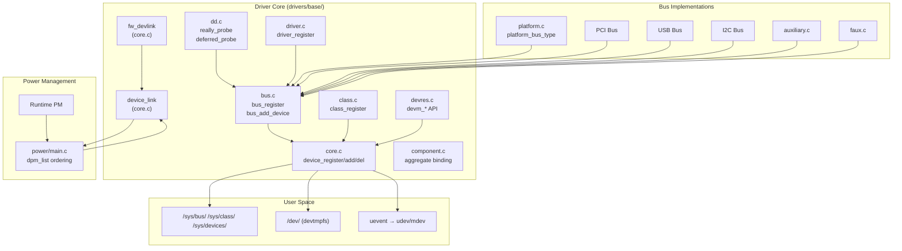

# Driver Framework（裝置驅動框架）

## Purpose

Driver Framework 是 Linux 核心的裝置管理基礎設施，實作統一的 Bus-Device-Driver 三層模型。它負責裝置發現、驅動匹配與綁定、電源管理排序、熱插拔事件、sysfs 拓撲管理，以及裝置間依賴關係追蹤。幾乎所有核心子系統的硬體互動都建立在此框架之上。

## Directory Map

| 路徑 | 行數 | 角色 |
|------|------|------|
| `core.c` | 5,352 | 裝置生命週期、fw_devlink、device_link、sysfs 屬性 |
| `bus.c` | 1,441 | 匯流排類型註冊、裝置/驅動列舉、通知鏈 |
| `dd.c` | 1,373 | 驅動探測引擎、延遲探測機制、非同步探測 |
| `platform.c` | 1,567 | Platform 匯流排實作（ARM/Android 最常用） |
| `property.c` | 1,482 | 統一裝置屬性 API（DT/ACPI/swnode） |
| `devres.c` | 1,259 | Managed resource（devm_*）框架 |
| `memory.c` | 1,250 | 記憶體熱插拔裝置管理 |
| `swnode.c` | 1,144 | Software node（無韌體節點的屬性描述） |
| `cacheinfo.c` | 1,047 | CPU 快取拓撲資訊 |
| `node.c` | 1,011 | NUMA 節點裝置管理 |
| `arch_topology.c` | 982 | CPU 拓撲/容量解析（含 Android vendor hooks） |
| `component.c` | 842 | 元件聚合框架（DRM 等） |
| `cpu.c` | 696 | CPU 裝置管理 |
| `class.c` | 654 | Class 抽象層（裝置功能分類） |
| `devtmpfs.c` | 515 | /dev 自動管理 |
| `auxiliary.c` | 508 | 輔助匯流排（子功能驅動） |
| `devcoredump.c` | 480 | 裝置 coredump 機制 |
| `driver.c` | 279 | 驅動註冊與裝置迭代 |
| `faux.c` | ~200 | Faux 虛擬匯流排（2025 新增） |
| `init.c` | 44 | 開機初始化順序 |
| `base.h` | 291 | 內部資料結構（subsys_private/driver_private/device_private） |
| `power/` | dir | 電源管理子目錄（main.c: 2,376 行） |
| `firmware_loader/` | dir | 韌體載入框架 |
| `regmap/` | dir | Register Map 抽象層 |
| `test/` | dir | KUnit 測試 |

**合計：~25,400 行 C + ~2,400 行電源管理 = ~27,800 行**

## Architecture



### 內部資料結構（base.h）

`base.h` 定義三個私有結構，是 Driver Core 內部運作的關鍵：

**`subsys_private`**（`base.h:42-60`）：匯流排/Class 的共用內部狀態。持有 `kset`（kobject 集合）、`klist` 裝置/驅動列表、通知鏈、以及回指 `bus_type` 或 `class` 的指標。bus 與 class 共用同一結構，透過 `bus` / `class` 指標區分。

**`driver_private`**（`base.h:79-86`）：驅動的內部狀態。持有 klist 節點（連結到所屬 bus 的驅動列表）、所屬 bus 的 klist 節點、以及回指 `device_driver` 的指標。

**`device_private`**（`base.h:122-136`）：裝置的內部狀態。持有子裝置 klist、連結到父/驅動/bus/class 的 klist 節點、延遲探測列表節點、以及非同步驅動指標。

## Key Data Structures

- [`struct device`](../data-structures/device.md) — 核心裝置描述符，嵌入於所有具體裝置結構
- [`struct device_driver`](../data-structures/device_driver.md) — 驅動描述符，定義 probe/remove 回呼
- [`struct bus_type`](../data-structures/bus_type.md) — 匯流排類型，定義 match/probe 策略
- `struct class` — 裝置功能分類（定義於 `include/linux/device/class.h`）
- `struct device_link` — 裝置間 supplier-consumer 依賴（定義於 `include/linux/device.h`）

## Key Code Paths

### 1. 裝置註冊（Device Registration）

```
device_register()                        @ core.c:3768
  → device_initialize()                  @ core.c:3156
      設定 kobject, DMA, mutex, PM, devres
  → device_add()                         @ core.c:3571
      → kobject_add() 建立 sysfs 節點
      → bus_add_device()                 @ bus.c:515
          加入 bus 的裝置列表，發送 BUS_NOTIFY_ADD_DEVICE
      → device_create_file() 建立屬性檔案
      → bus_probe_device()               @ bus.c:566
          觸發驅動匹配
```

### 2. 驅動探測（Driver Probing）

```
bus_probe_device()                       @ bus.c:566
  → device_initial_probe()              @ dd.c
      → __device_attach()               @ dd.c
          遍歷 bus 上所有驅動
          → bus_type->match(dev, drv)    匹配測試
          → __driver_probe_device()      @ dd.c:782
              → really_probe()           @ dd.c:607
                  → pinctrl_bind_pins()
                  → dma_configure()
                  → driver->probe(dev) 或 bus->probe(dev)
                  → 成功: device_links_driver_bound()
                  → -EPROBE_DEFER: driver_deferred_probe_add()
```

### 3. 延遲探測重試

```
driver_deferred_probe_trigger()          @ dd.c
  → 將 pending_list 移至 active_list
  → queue_work(deferred_probe_work)
      → deferred_probe_work_func()       @ dd.c:82
          對每個 active 裝置呼叫 bus_probe_device()
```

### 4. fw_devlink 連結建立

```
device_add()
  → fw_devlink_link_device()
      → 掃描韌體節點的 supplier 參照
      → fwnode_link → device_link_add()  @ core.c:669
          建立 supplier-consumer 依賴
          → 重排 dpm_list 確保 PM 順序正確
```

## Android-Specific Changes

### 修改程度：幾乎為零

ACK 中的 `drivers/base/` 核心檔案（core.c、bus.c、dd.c、driver.c、class.c、platform.c）**與上游 Linux 完全一致**，未發現 `ANDROID:` 標籤的修補。這是 GKI 的刻意設計——Driver Framework 作為所有廠商模組的基礎 API，必須保持與上游的嚴格一致性。

### 少量 topology hooks

僅在 `arch_topology.c`（CPU 拓撲，非核心驅動框架）中有 2 個 vendor hooks：
- `trace_android_rvh_update_thermal_stats(cpu)`：供廠商收集頻率/溫度統計
- `trace_android_vh_update_topology_flags_workfn(NULL)`：供廠商介入拓撲更新

## Vendor Hooks

| Hook | 檔案 | 類型 | 用途 |
|------|------|------|------|
| `android_rvh_update_thermal_stats` | `arch_topology.c:203` | restricted | CPU 頻率/溫度統計收集 |
| `android_vh_update_topology_flags_workfn` | `arch_topology.c:229` | normal | 拓撲更新工作函式介入 |

與其他子系統（如排程器 ~80 個 hooks）相比，Driver Framework 的 vendor hook 極少，反映其作為穩定基礎 API 的定位。

## Configuration

| Kconfig 選項 | 類型 | 預設 | 說明 |
|--------------|------|------|------|
| `DEVTMPFS` | bool | y | 在 /dev 維護裝置節點 |
| `DEVTMPFS_MOUNT` | bool | y | 自動掛載 devtmpfs |
| `DEVTMPFS_SAFE` | bool | n | 以 nosuid,noexec 掛載 |
| `AUXILIARY_BUS` | bool | - | 輔助匯流排支援 |
| `DMA_SHARED_BUFFER` | bool | n | DMA-BUF 框架 |
| `DEV_COREDUMP` | bool | auto | 裝置 coredump 支援 |
| `FW_DEVLINK_SYNC_STATE_TIMEOUT` | bool | n | sync_state() 逾時降級 |
| `GENERIC_ARCH_TOPOLOGY` | bool | - | 通用 CPU 拓撲解析 |
| `GENERIC_ARCH_NUMA` | bool | - | 通用 NUMA 支援 |
| `SOC_BUS` | bool | - | SoC 匯流排資訊 |
| `DEBUG_DRIVER` | bool | n | 驅動核心除錯訊息 |
| `DEBUG_DEVRES` | bool | n | devres 除錯訊息 |
| `DEBUG_TEST_DRIVER_REMOVE` | bool | n | 測試 remove 路徑 |

## Cross-References

- [Driver Model 概念](../concepts/driver-model.md) — 概念層級的驅動模型說明
- [`struct device`](../data-structures/device.md) — 核心裝置描述符
- [`struct device_driver`](../data-structures/device_driver.md) — 驅動描述符
- [`struct bus_type`](../data-structures/bus_type.md) — 匯流排類型描述符
- [Platform Bus](../entities/platform-bus.md) — Platform 匯流排詳細分析
- [Module 系統](../concepts/module-system.md) — 模組載入與 EXPORT_SYMBOL
- [sysfs/procfs](../apis/sysfs-procfs.md) — sysfs 使用者空間介面
- [GKI](../concepts/gki.md) — Generic Kernel Image 架構
- [Vendor Hooks](../concepts/vendor-hooks.md) — 廠商 hook 框架
- [Locking Primitives](../concepts/locking-primitives.md) — 核心鎖定原語
