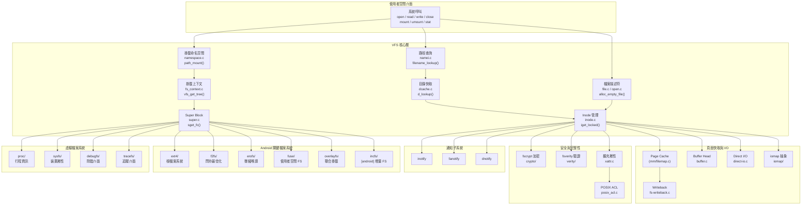

# 檔案系統子系統 (Filesystems)

## 目的

檔案系統子系統（`fs/`）是 Linux 核心中負責所有檔案 I/O 與儲存抽象的核心子系統。它透過虛擬檔案系統層（VFS）提供統一的 POSIX 介面，讓使用者空間程式能以相同的 `open()`/`read()`/`write()`/`close()` 系統呼叫存取各種不同的底層檔案系統實作。

在 ACK（Android Common Kernel）中，fs 子系統在 upstream Linux 基礎上增加了 Incremental FS（incfs）用於應用程式增量安裝、FUSE passthrough 最佳化用於取代 sdcardfs、fscrypt Android 相容模式、以及 `android_vh_check_file_open` vendor hook 供廠商擴充檔案開啟行為。

## 目錄地圖

`fs/` 目錄共包含約 **157 個項目**（含子目錄與核心檔案），核心 `.c` 檔案有 **71 個**，加上超過 **75 個子目錄**代表各別檔案系統實作。

| 檔案/目錄 | 行數 | 說明 |
|-----------|------|------|
| `namei.c` | 6,311 | 路徑名稱查詢與解析（VFS 核心） |
| `namespace.c` | ~5,000 | 掛載命名空間、掛載點管理、傳播 |
| `dcache.c` | 3,330 | 目錄快取（dcache）— 路徑查詢加速 |
| `inode.c` | 3,010 | Inode 快取與生命週期管理 |
| `super.c` | 2,269 | Super block 管理 — 掛載、檔案系統驅動 |
| `file.c` | 1,527 | 檔案描述符表管理 |
| `fs_context.c` | ~800 | 新式檔案系統掛載上下文 API |
| `buffer.c` | ~3,000 | 區塊 I/O 的 buffer head 管理 |
| `aio.c` | ~2,500 | 非同步 I/O |
| `eventpoll.c` | ~2,800 | epoll 實作 |
| `locks.c` | ~3,000 | 檔案鎖定（flock、fcntl、POSIX） |
| `libfs.c` | ~2,500 | 通用檔案系統函式庫 |
| `xattr.c` | ~1,600 | 擴充屬性（xattr）支援 |
| `pipe.c` | ~1,500 | 管道（pipe）實作 |
| `open.c` | ~1,500 | 檔案開啟系統呼叫（含 vendor hook） |
| `read_write.c` | ~1,500 | 讀寫操作、I/O 向量化 |
| `filesystems.c` | ~300 | 檔案系統類型註冊表 |
| `ext4/` | 54 檔 | Extended Filesystem v4（日誌、extent、加密） |
| `f2fs/` | 34 檔 | Flash-Friendly File System（閃存最佳化） |
| `erofs/` | 25 檔 | Enhanced Read-Only File System（壓縮唯讀） |
| `fuse/` | 26 檔 | Filesystem in Userspace（使用者空間檔案系統） |
| `overlayfs/` | 18 檔 | 聯合掛載檔案系統（A/B 分區更新） |
| `incfs/` | 21 檔 | [android] Incremental File System（增量安裝） |
| `proc/` | 38 檔 | procfs 虛擬檔案系統 |
| `sysfs/` | 10 檔 | sysfs 裝置屬性檔案系統 |
| `kernfs/` | 10 檔 | kernfs — proc/sysfs 共用基礎設施 |
| `crypto/` | 15 檔 | fscrypt 檔案級加密 |
| `verity/` | 13 檔 | fsverity Merkle tree 完整性驗證 |
| `notify/` | 14 檔 | inotify/fanotify/dnotify 事件通知 |

## 架構

檔案系統子系統採用分層架構，VFS 層作為統一抽象，各檔案系統透過操作結構體（ops struct）接入：



### 核心設計概念

**1. VFS 四大物件模型：** 整個 VFS 層圍繞四個核心資料結構建構 — `super_block`（代表已掛載的檔案系統）、`inode`（代表檔案中繼資料）、`dentry`（代表目錄項目 / 路徑分量）、`file`（代表已開啟的檔案描述符）。每個結構都有對應的操作結構體（`super_operations`、`inode_operations`、`dentry_operations`、`file_operations`），由各檔案系統實作填入具體函式指標。

**2. 目錄快取（dcache）：** `dcache.c` 維護全域的 dentry 雜湊表，快取路徑名稱到 inode 的映射。路徑查詢（`namei.c`）優先在 dcache 中搜尋，避免每次都需要到磁碟查找。負面 dentry（不存在的檔案名稱）也會被快取，減少重複查詢。

**3. 新式掛載 API（fs_context）：** Linux 5.x+ 引入 `fs_context` 取代舊式 `mount()` 系統呼叫的單一字串解析，提供結構化的參數傳遞與錯誤回報。`fsopen()`→`fsconfig()`→`fsmount()` 三階段 API 允許分步驟配置檔案系統。

**4. Page Cache 整合：** VFS 與記憶體管理子系統緊密整合，透過 `address_space` 結構體將檔案內容快取在記憶體中。`filemap_fault()` 處理檔案映射的缺頁異常，`writeback` 機制負責將髒頁寫回磁碟。

**5. fscrypt/fsverity 框架：** `fs/crypto/` 提供透明的檔案級加密，`fs/verity/` 提供基於 Merkle tree 的內容完整性驗證。兩者均透過 `super_block` 中的操作指標（`s_cop`、`s_vop`）與具體檔案系統對接。

**6. 檔案系統通知：** `fsnotify` 框架統一管理 inotify、fanotify、dnotify 三種事件通知機制，在 inode 和 super_block 層級追蹤監聽標記（mark），於檔案操作時觸發通知。

## 關鍵資料結構

- `struct super_block` @ `include/linux/fs/super_types.h` — 代表已掛載的檔案系統實例：`s_type`（檔案系統類型）、`s_op`（超級區塊操作）、`s_root`（根目錄 dentry）、`s_flags`（SB_RDONLY/SB_NOSUID 等）、`s_cop`（fscrypt 操作）、`s_vop`（fsverity 操作）
- `struct inode` @ `include/linux/fs.h:765` — 檔案中繼資料：`i_mode`、`i_uid/i_gid`、`i_size`、`i_op`（inode 操作）、`i_fop`（檔案操作）、`i_mapping`（address_space）、`i_ino`、`i_blocks`
- `struct dentry` @ `include/linux/dcache.h:92` — 目錄項目快取：`d_name`（名稱 + 雜湊）、`d_inode`、`d_parent`、`d_op`（dentry 操作）、`d_sb`、`d_children`、`d_lockref`
- `struct file` @ `include/linux/fs.h` — 已開啟的檔案描述符：`f_op`（檔案操作）、`f_path`（dentry + mount）、`f_inode`、`f_pos`（目前位移）、`f_flags`、`f_mode`
- `struct file_system_type` @ `include/linux/fs.h` — 檔案系統類型描述：`name`、`init_fs_context()`、`fs_flags`、`mount()`（舊式）
- `struct address_space` @ `include/linux/fs.h` — 頁面快取容器：`i_pages`（xarray）、`a_ops`（address_space 操作）、`nrpages`
- `struct mnt_namespace` @ `fs/mount.h` — 掛載命名空間：`root`（根掛載點）、`mounts`（rb-tree）、`nr_mounts`
- `struct mount` @ `fs/mount.h` — 掛載點實例：`mnt_mountpoint`（掛載點 dentry）、`mnt_devname`、`mnt_ns`

## 關鍵程式碼路徑

### 1. 檔案開啟（open 系統呼叫）

```
sys_openat()
  → do_sys_openat2() @ open.c
    → getname() — 複製使用者空間路徑字串
    → do_filp_open() @ namei.c
      → path_openat()
        → open_last_lookups() — 最終路徑分量查詢
          → lookup_open() — 在父目錄中查詢/建立 dentry
            → dcache.c: d_lookup() — dcache 快查
            → inode_operations->lookup() — 呼叫具體檔案系統
        → do_open() @ namei.c
          → vfs_open() — 開啟檔案
            → file_operations->open() — 呼叫具體檔案系統
            → trace_android_vh_check_file_open(f) — [android] vendor hook
    → fd_install() — 安裝 fd 到行程表
```

### 2. 路徑查詢（Path Lookup）

```
filename_lookup() @ namei.c
  → path_lookupat()
    → path_init() — 決定起始點（根目錄 / 工作目錄）
    → 迴圈遍歷路徑分量：
      → link_path_walk()
        → walk_component()
          → lookup_fast() — dcache 快速查詢
            → __d_lookup_rcu() — RCU 保護的無鎖查詢
          → 失敗 → lookup_slow()
            → __lookup_slow()
              → inode_operations->lookup() — 到具體檔案系統查詢
    → complete_walk() — 驗證最終 dentry
```

### 3. 掛載操作（mount）

```
sys_mount()
  → do_mount() @ namespace.c
    → path_mount()
      → do_new_mount()
        → fs_context_for_mount() — 建立掛載上下文
          → file_system_type->init_fs_context()
        → parse_monolithic_mount_data() — 解析掛載選項
        → vfs_get_tree() @ fs_context.c
          → fs_context->ops->get_tree() — 呼叫具體檔案系統
            → 通常呼叫 sget_fc() 取得/建立 super_block
            → fill_super() — 初始化超級區塊
        → do_new_mount_fc()
          → vfs_create_mount() — 建立 mount 結構
          → graft_tree() — 將 mount 接入命名空間
```

### 4. 讀取操作（read）

```
sys_read()
  → ksys_read() @ read_write.c
    → vfs_read()
      → 檢查權限、更新存取時間
      → file_operations->read_iter() — 呼叫具體檔案系統
        → 通常為 generic_file_read_iter()
          → filemap_read() @ mm/filemap.c
            → filemap_get_pages() — 從 page cache 取得頁面
            → 若未命中 → readahead 觸發磁碟讀取
            → copy_folio_to_iter() — 複製資料到使用者空間
```

### 5. 寫入操作（write）

```
sys_write()
  → ksys_write() @ read_write.c
    → vfs_write()
      → file_operations->write_iter()
        → 通常為 generic_file_write_iter()
          → generic_perform_write() @ mm/filemap.c
            → address_space_operations->write_begin()
            → 複製使用者資料到頁面
            → address_space_operations->write_end()
            → 標記頁面為髒頁（dirty）
          → 若為 O_SYNC：vfs_fsync_range()
    → writeback 子系統稍後回寫髒頁
```

## Android 特定變更

### 1. Vendor Hook

ACK 在 fs 子系統中定義了以下 vendor hook：

| Hook 名稱 | 類型 | 位置 | 用途 |
|-----------|------|------|------|
| `android_vh_check_file_open` | Normal | `fs/open.c:939` | 攔截檔案開啟操作進行額外安全/策略檢查 |

呼叫點在 `vfs_open()` 返回前觸發，允許廠商模組（如安全模組）對每次檔案開啟進行審計或攔截。

### 2. Incremental File System（incfs）

`fs/incfs/`（21 個檔案，作者：Eugene Zemtsov, Google LLC, 2018）是 Android 專屬的增量檔案系統，支援應用程式在安裝過程中按需載入資料區塊，無需完整下載 APK 即可開始使用。

核心元件：

- `main.c` — 模組初始化、檔案系統註冊
- `vfs.c`（~49KB）— VFS 整合層，掛載操作
- `data_mgmt.c`（~48KB）— 資料管理、區塊分配、完整性驗證
- `format.c` — incfs 格式處理
- `pseudo_files.c` — 虛擬檔案介面
- `verity.c` — fs-verity 整合
- `integrity.c` — 雜湊驗證與校驗

組態選項：`CONFIG_INCREMENTAL_FS`（依賴 `BLOCK`，不與 `FS_VERITY_BUILTIN_SIGNATURES` 相容）

### 3. FUSE Passthrough（Android 最佳化）

`fs/fuse/` 中包含多處 Android 特定最佳化：

- `iomode.c:54` — Android 使用情境要求同時以 passthrough 和非 passthrough 模式開啟檔案
- `backing.c:92,152` — Android 已在存取層級限制權限，不額外授予
- `file.c:2387` — 舊版 Android passthrough 對 mmap 的相容處理

這些修改使 FUSE 能高效替代已棄用的 sdcardfs，作為 Android 外部儲存的抽象層。

### 4. fscrypt Android 相容模式

`fs/crypto/keyring.c:782-788` 支援原始 Android flag，`fscrypt_private.h:525` 定義了 `android_compat` 布林欄位，確保向後相容舊版 Android 的加密金鑰衍生方式。

### 5. f2fs Android 調校

`fs/f2fs/file.c:3336` 包含針對 Android SQLite 行為的驗證邏輯，確保資料庫檔案的 atomic write 語意在 f2fs 上正確運作。

### 6. EROFS Android 使用情境

`fs/erofs/Kconfig:23,44` 明確提及 EROFS 適用於 Android 智慧型手機和 Android eng build，作為系統分區（system partition）和啟動映像的壓縮唯讀檔案系統。

## 子系統組件詳述

### VFS 核心層

#### 路徑查詢（`namei.c`，6,311 行）

路徑查詢是 VFS 最複雜的部分，負責將使用者空間的路徑字串（如 `/data/app/com.example/base.apk`）解析為對應的 dentry + inode。查詢分為兩個模式：

- **RCU walk**（快速路徑）：使用 RCU 讀取鎖和 seqcount 保護，不取得任何 spinlock，在 dcache 命中率高時極為高效
- **REF walk**（慢速路徑）：當 RCU walk 失敗（dentry 不在快取中、或遇到 symlink 需要追蹤），切換到取得引用計數的傳統查詢模式

符號連結追蹤深度限制為 40 層（`MAXSYMLINKS`），防止無限迴圈。

#### 目錄快取（`dcache.c`，3,330 行）

dcache 使用全域雜湊表 `dentry_hashtable` 索引所有活躍的 dentry，雜湊鍵由父 dentry 指標和名稱的雜湊值組成。LRU 回收策略在記憶體壓力下釋放不被引用的 dentry。

#### Super Block 管理（`super.c`，2,269 行）

管理所有已掛載檔案系統的超級區塊。`sget_fc()` 負責查找或建立 super_block，`deactivate_locked_super()` 在 umount 時釋放。freeze/thaw 機制（`sb_writers`）支援檔案系統快照。

### Android 關鍵檔案系統

#### ext4（`ext4/`，54 檔，~2.0MB）

Android 預設的根檔案系統，提供日誌（journaling via jbd2）、extent-based 區塊映射（`extents.c`，174KB）、多區塊分配（`mballoc.c`，207KB）、fast commit（`fast_commit.c`，69KB）、inline data、加密（fscrypt）和 verity 支援。

#### F2FS（`f2fs/`，34 檔，~1.4MB）

專為 NAND 閃存（UFS、eMMC）最佳化的日誌結構化檔案系統。核心特性包含段落管理（segment management，`segment.c`，155KB）、垃圾回收（GC）、資料壓縮（`compress.c`，50KB）、原子寫入（atomic write）、以及與 fscrypt/fsverity 的完整整合。Android 設備普遍使用 f2fs 作為 `/data` 分區的檔案系統。

#### EROFS（`erofs/`，25 檔，~308KB）

高壓縮率的唯讀檔案系統，支援多種解壓縮演算法（ZSTD、LZMA、deflate），適用於 Android 系統分區（`/system`）和啟動映像，以壓縮方式減少儲存空間佔用並加速啟動讀取。

#### FUSE（`fuse/`，26 檔，~560KB）

使用者空間檔案系統框架，在 Android 中用於取代 sdcardfs，作為外部儲存（`/sdcard`）的權限管理層。支援 passthrough 模式（`backing.c`）減少核心-使用者空間資料複製、virtio-fs（`virtio_fs.c`）用於虛擬化環境、以及 io_uring 加速（`dev_uring.c`）。

#### Overlayfs（`overlayfs/`，18 檔，~388KB）

聯合掛載檔案系統，將唯讀的 lower layer 和可寫的 upper layer 合併呈現。在 Android 中用於 A/B 無縫更新、動態分區 overlay、以及容器化隔離。支援 copy-on-write（`copy_up.c`）、whiteout（檔案刪除標記）、和 digest 驗證。

#### Incremental FS（`incfs/`，21 檔，Android 專屬）

Google 開發的增量載入檔案系統，允許 Android 在 APK 尚未完全下載時即開始安裝和執行應用程式。透過區塊級別的按需載入（lazy download）和 log 記錄追蹤存取模式，配合 fs-verity 確保內容完整性。

### 安全與完整性

#### fscrypt（`crypto/`，15 檔，~228KB）

檔案級加密框架，支援 AES-XTS（檔案內容）、AES-CBC-CTS（檔案名稱）等演算法。金鑰管理（`keyring.c`，39KB）支援主金鑰（master key）、per-file 衍生金鑰、硬體 inline 加密（`inline_crypt.c`）。Android 的 FBE（File-Based Encryption）即基於 fscrypt 實現。

支援的檔案系統：ext4、f2fs、ubifs、cephfs。

#### fsverity（`verity/`，13 檔，~92KB）

基於 Merkle tree 的檔案內容完整性驗證框架。啟用後，檔案變為唯讀，任何讀取操作都會自動驗證對應頁面的雜湊值。搭配簽章驗證（`CONFIG_FS_VERITY_BUILTIN_SIGNATURES`）可確保檔案來源可信，為 Android Verified Boot 鏈的一環。

支援的檔案系統：ext4、f2fs、btrfs。

### 通知子系統（`notify/`，14 檔，~96KB）

- **inotify** — 最常用的檔案監聽機制，監視 inode 上的建立/刪除/修改/移動事件
- **fanotify** — 進階通知，支援權限事件（允許/拒絕檔案存取）和全域檔案系統監聽
- **dnotify** — 目錄變更通知（舊式，已被 inotify 取代但仍保留）

### 虛擬檔案系統

#### procfs（`proc/`，38 檔，~540KB）

暴露核心狀態和行程資訊的虛擬檔案系統，如 `/proc/[pid]/status`、`/proc/meminfo`、`/proc/cpuinfo`。Android 系統大量使用 procfs 進行行程管理和系統監控。

#### sysfs（`sysfs/`，10 檔，~76KB）

裝置和驅動屬性的虛擬檔案系統，透過 `kernfs`（10 檔，~320KB）基礎設施實現。Android 的 HAL 層透過 sysfs 與核心裝置驅動互動。

## Vendor Hooks

| Hook 名稱 | 標頭檔 | 呼叫位置 | 參數 | 廠商可做的事 |
|-----------|--------|----------|------|-------------|
| `android_vh_check_file_open` | `include/trace/hooks/syscall_check.h` | `fs/open.c:939` | `struct file *f` | 對檔案開啟操作施加額外安全策略、審計記錄、或存取控制 |

## 配置選項

### 核心 Kconfig（`fs/Kconfig`）

| 配置選項 | 預設值 | 說明 |
|----------|--------|------|
| `CONFIG_EXT4_FS` | y | ext4 檔案系統（Android 根分區） |
| `CONFIG_F2FS_FS` | y | F2FS 閃存檔案系統（Android /data 分區） |
| `CONFIG_EROFS_FS` | y | EROFS 壓縮唯讀檔案系統（系統分區） |
| `CONFIG_FUSE_FS` | y | FUSE 使用者空間檔案系統（外部儲存） |
| `CONFIG_OVERLAY_FS` | y | Overlayfs 聯合掛載（A/B 更新） |
| `CONFIG_INCREMENTAL_FS` | y | [android] Incremental FS（增量安裝） |
| `CONFIG_FS_ENCRYPTION` | y | fscrypt 檔案級加密 |
| `CONFIG_FS_ENCRYPTION_INLINE_CRYPT` | 可選 | 硬體 inline 加密支援 |
| `CONFIG_FS_VERITY` | y | fsverity 內容完整性驗證 |
| `CONFIG_FS_VERITY_BUILTIN_SIGNATURES` | 可選 | 內建簽章驗證 |
| `CONFIG_PROC_FS` | y | procfs 虛擬檔案系統 |
| `CONFIG_SYSFS` | y | sysfs 裝置屬性檔案系統 |
| `CONFIG_KERNFS` | y | kernfs 基礎設施 |
| `CONFIG_TMPFS` | y | tmpfs（RAM 暫存） |
| `CONFIG_INOTIFY_USER` | y | inotify 使用者空間介面 |
| `CONFIG_FANOTIFY` | y | fanotify 進階通知 |
| `CONFIG_QUOTA` | 可選 | 磁碟配額 |
| `CONFIG_FHANDLE` | y | 檔案控制代碼 API |

### 各檔案系統子選項

- `CONFIG_EXT4_FS_POSIX_ACL` — ext4 POSIX ACL 支援
- `CONFIG_EXT4_FS_SECURITY` — ext4 安全標籤支援
- `CONFIG_F2FS_FS_COMPRESSION` — f2fs 資料壓縮
- `CONFIG_F2FS_FS_XATTR` — f2fs 擴充屬性
- `CONFIG_EROFS_FS_ZIP` — erofs 壓縮支援
- `CONFIG_EROFS_FS_ZIP_ZSTD` / `CONFIG_EROFS_FS_ZIP_LZMA` / `CONFIG_EROFS_FS_ZIP_DEFLATE` — erofs 解壓縮演算法

## VFS 操作結構體參考

### super_operations

```
alloc_inode()      — 分配 inode（通常為 filesystem-specific inode + embedded VFS inode）
destroy_inode()    — 銷毀 inode
write_inode()      — 將 inode 寫回磁碟
evict_inode()      — 清除 inode 資源（truncate、free blocks）
put_super()        — 釋放 super_block 資源
sync_fs()          — 同步整個檔案系統
freeze_super()     — 凍結檔案系統（快照前）
thaw_super()       — 解凍檔案系統
statfs()           — 取得檔案系統統計（空間、inode 數量）
remount_fs()       — 重新掛載（變更選項）
show_options()     — 顯示掛載選項（/proc/mounts）
```

### inode_operations

```
lookup()           — 在目錄中查詢檔案名稱
create()           — 建立新檔案
mkdir() / rmdir()  — 建立/刪除目錄
link() / unlink()  — 建立/刪除硬連結
symlink()          — 建立符號連結
rename()           — 重新命名/移動
permission()       — 檢查存取權限
getattr() / setattr() — 取得/設定檔案屬性
listxattr()        — 列出擴充屬性
get_acl() / set_acl() — 取得/設定 POSIX ACL
```

### file_operations

```
open() / release() — 開啟/關閉檔案
read_iter() / write_iter() — 讀取/寫入（使用 iov_iter）
mmap()             — 記憶體映射
ioctl()            — 裝置控制
fsync()            — 同步檔案資料到磁碟
poll()             — 事件輪詢（select/poll/epoll）
splice_read() / splice_write() — 零複製管道傳輸
readdir() / iterate_shared() — 讀取目錄內容
```

## 交叉參考

- [記憶體管理](../subsystems/memory-management.md) — Page cache、filemap、writeback 與 VFS 的緊密整合
- [鎖定原語](../concepts/locking-primitives.md) — VFS 使用的鎖（inode->i_rwsem、dentry->d_lockref、mmap_lock）
- [Vendor Hooks](../concepts/vendor-hooks.md) — Vendor hook 框架與 fs 相關 hook
- [GKI](../concepts/gki.md) — GKI 架構下的檔案系統模組配置
- [排程器](../subsystems/scheduler.md) — I/O 排程與檔案系統寫回的關聯
- [網路](../subsystems/networking.md) — 網路檔案系統（NFS、SMB、CEPH）的整合
