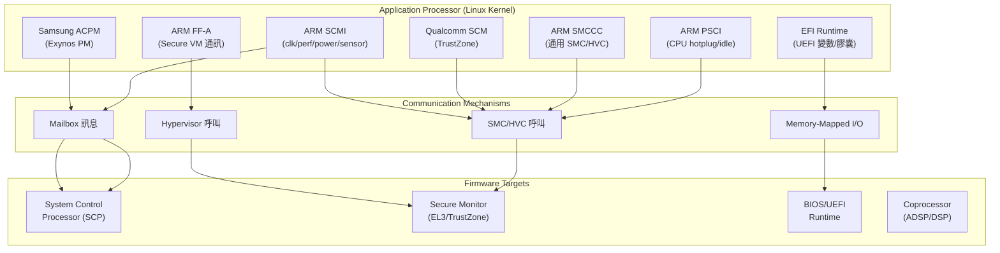

# Firmware Drivers 子系統

## Purpose

`drivers/firmware/` 是 Linux 核心中負責與平台韌體（firmware）通訊的子系統集合。它提供統一的介面讓作業系統能透過各種機制（SMC 呼叫、mailbox 訊息、記憶體映射 I/O）與 SoC 上的系統控制處理器（SCP）、安全監控器（Secure Monitor）、BIOS/UEFI 韌體進行互動。在 Android 裝置上，這些驅動是電源管理、時脈控制、CPU 熱插拔、安全區通訊的基礎。

整個子目錄包含 **201 個 .c/.h 檔案**，合計約 **99,851 行**程式碼（C: 94,997 + H: 4,854），涵蓋 **15 個子目錄**與 **21 個獨立原始碼檔案**。

## Evidence Snapshot

| Claim | Source anchor |
|-------|---------------|
| `drivers/firmware/` 是獨立 Firmware Drivers 選單 | `common/drivers/firmware/Kconfig:7` |
| ARM SCMI 是 firmware 子系統的一級子選單入口 | `common/drivers/firmware/Kconfig:9` |
| ARM SCPI 協定定位為 AP 與 SCP 之間的 power/clock/thermal 控制通道 | `common/drivers/firmware/Kconfig:11-29` |
| ARM SDEI 是 ARM64 firmware-to-OS exception callback 標準 | `common/drivers/firmware/Kconfig:31-37` |
| firmware memory map 與 DMI sysfs 是 firmware 資訊匯出到 userspace 的例子 | `common/drivers/firmware/Kconfig:60-88` |

## Directory Map

```
drivers/firmware/
├── Kconfig                  # 頂層配置選單 (302 行)
├── Makefile                 # 編譯規則 (41 行)
│
├── arm_scmi/                # ARM SCMI 協定 (31 檔, 19,481 行)
├── arm_ffa/                 # ARM FF-A 框架 (4 檔, 2,396 行)
├── psci/                    # ARM PSCI 電源控制 (2 檔, 1,332 行)
├── smccc/                   # ARM SMCCC 呼叫規範 (3 檔, 386 行)
├── arm_scpi.c               # ARM SCPI 舊協定 (1,058 行)
├── arm_sdei.c               # ARM SDEI 例外處理 (1,121 行)
│
├── qcom/                    # Qualcomm TrustZone/SCM (8 檔, 4,447 行)
├── samsung/                 # Samsung Exynos ACPM (6 檔, 1,111 行)
├── google/                  # Google Coreboot (12 檔, 2,359 行)
├── imx/                     # NXP i.MX SCU/DSP (9 檔, 1,494 行)
├── tegra/                   # NVIDIA Tegra BPMP (6 檔, 3,056 行)
├── broadcom/                # Broadcom NVRAM/SPROM (3 檔, 1,269 行)
├── meson/                   # Amlogic Meson SM (1 檔, 349 行)
├── microchip/               # Microchip PolarFire (1 檔, 467 行)
├── xilinx/                  # Xilinx Zynq (4 檔, 2,765 行)
├── cirrus/                  # Cirrus Logic DSP (15 檔, 20,709 行含測試)
│
├── efi/                     # EFI/UEFI 子系統 (75 檔, 17,024 行)
├── dmi_scan.c / dmi-id.c / dmi-sysfs.c  # DMI/SMBIOS (2,180 行)
├── edd.c                    # BIOS EDD (780 行)
├── memmap.c                 # 韌體記憶體映射 (419 行)
├── iscsi_ibft.c / iscsi_ibft_find.c  # iSCSI iBFT (1,009 行)
│
├── ti_sci.c / ti_sci.h      # TI SCI 協定 (5,628 行)
├── qemu_fw_cfg.c            # QEMU 韌體配置 (939 行)
├── raspberrypi.c            # Raspberry Pi 韌體 (415 行)
├── stratix10-svc.c / stratix10-rsu.c  # Intel Stratix10 (2,896 行)
├── mtk-adsp-ipc.c           # MediaTek ADSP IPC (141 行)
├── thead,th1520-aon.c       # T-Head TH1520 AON (250 行)
├── sysfb.c / sysfb_simplefb.c  # 系統 framebuffer (364 行)
├── trusted_foundations.c     # Trusted Foundations (184 行)
└── turris-mox-rwtm.c        # Turris Mox rWTM (516 行)
```

## Architecture

整個 firmware 子系統依據通訊機制可分為四大類：



### 通訊模式

drivers/firmware/ 的驅動程式使用四種主要的韌體通訊模式：

**SMC-based（同步安全監控呼叫）**：ARM PSCI、SMCCC、Qualcomm SCM、Meson SM、Tegra Trusted Foundations 都是透過 `arm_smccc_smc()` 或 `arm_smccc_hvc()` 進行同步呼叫。呼叫者觸發 CPU 例外進入 EL3（或 EL2），由安全監控韌體處理後返回。這是最直接但延遲最低的通訊方式。

**Mailbox-based（非同步訊息佇列）**：ARM SCMI、SCPI、Samsung ACPM、i.MX SCU、TI SCI、MediaTek ADSP IPC 都使用 mailbox 框架傳送結構化訊息。AP 將訊息寫入共享記憶體後通知 SCP，SCP 處理完畢後以中斷通知 AP。支援非同步操作和通知回調。

**Memory-mapped（直接記憶體存取）**：EFI runtime services、QEMU fw_cfg、Coreboot tables 透過 MMIO 區域直接讀寫韌體資料。通常用於啟動階段或虛擬化環境。

**Hypervisor-based（虛擬化框架）**：ARM FF-A 使用 hypervisor 進行安全世界與普通世界間的 VM 對 VM 通訊，支援記憶體共享和中斷路由。

## Key Data Structures

本子系統的關鍵資料結構分散於各驅動內部標頭，與核心的 `struct device`、`struct platform_device` 緊密整合：

- [`struct device`](../data-structures/device.md) — 所有 firmware 驅動的基礎裝置結構
- [`struct platform_device` / `struct platform_driver`](../entities/platform-bus.md) — 多數 firmware 驅動以 platform device 形式註冊
- `struct scmi_protocol_handle` — SCMI 協定操作句柄（`arm_scmi/driver.c`）
- `struct qcom_scm` — Qualcomm SCM 驅動狀態（`qcom/qcom_scm.c`）
- `struct exynos_acpm` — Samsung ACPM 驅動狀態（`samsung/exynos-acpm.c`）
- `struct ffa_drv_info` — FF-A 驅動全域資訊（`arm_ffa/driver.c`）

## Key Code Paths

### 1. ARM PSCI CPU Hotplug（所有 ARM64 Android 裝置）

CPU 熱插拔流程透過 PSCI 實現，是 Android 功耗管理的核心路徑：

1. 系統偵測到低負載 → `cpu_down()` 觸發
2. `psci_cpu_off()` @ `psci/psci.c` 將 `PSCI_FN_CPU_OFF` 封裝為 SMC 呼叫
3. `invoke_psci_fn()` 執行 `arm_smccc_smc()` 進入 EL3
4. 安全韌體關閉目標 CPU 的電源域
5. CPU 上線時 `psci_cpu_on()` 以類似路徑喚醒

### 2. ARM SCMI 時脈頻率調整

SCMI 驅動為 cpufreq/devfreq 框架提供時脈與效能控制：

1. cpufreq governor 決定新頻率 → 呼叫 SCMI perf 操作
2. `scmi_perf_level_set()` @ `arm_scmi/perf.c` 構建 SCMI 訊息
3. `do_xfer()` @ `arm_scmi/driver.c` 透過 mailbox 傳送至 SCP
4. SCP 調整 DVFS 電壓/頻率域後回覆 ACK
5. 驅動解析回覆、釋放傳輸資源

### 3. Qualcomm SCM TrustZone 呼叫

Qualcomm 裝置上的安全操作（加密金鑰、安全啟動驗證）：

1. 客戶端驅動呼叫 `qcom_scm_*()` API
2. `__scm_smc_call()` @ `qcom/qcom_scm-smc.c` 準備 SMC 暫存器參數
3. 進入 TrustZone 執行安全操作
4. QSEECOM 子系統可進一步與 Trusted Application 互動

### 4. Samsung ACPM 電源管理

Exynos SoC 上透過 ACPM 管理 PMIC 和 DVFS：

1. `exynos_acpm_send_cmd()` @ `samsung/exynos-acpm.c`
2. 訊息透過 mailbox 傳送至 Cortex-M 韌體
3. 支援 DVFS 頻率調整（`exynos-acpm-dvfs.c`）和 PMIC 暫存器操作（`exynos-acpm-pmic.c`）

## Android-Specific Changes

**此子系統完全是上游 Linux 程式碼，沒有 `ANDROID:` 補丁或 vendor hook。** 這是因為 firmware 介面的設計本身就是平台中立的 — SoC 廠商（Qualcomm、Samsung、MediaTek）在上游就已提交各自的 firmware 驅動，不需要 Android 特定的修改。

然而，以下元件對 Android 平台至關重要：

| 元件 | Android 重要性 | 用途 |
|------|---------------|------|
| ARM PSCI | **關鍵** | CPU 熱插拔、idle、系統掛起/恢復 |
| ARM SMCCC | **關鍵** | 所有安全監控呼叫的基礎 |
| ARM SCMI | **關鍵** | 現代 SoC 的電源/時脈/效能管理 |
| Qualcomm SCM | **關鍵** | Snapdragon TrustZone 操作 |
| Samsung ACPM | **重要** | Exynos 電源/PMIC 管理 |
| MediaTek ADSP IPC | **重要** | MTK 音訊 DSP 通訊 |
| ARM FFA | **中等** | 高階裝置虛擬化通訊 |
| ARM SDEI | **中等** | RAS 錯誤通知 |

## Vendor Hooks

此子系統中**沒有 Android vendor hooks**。firmware 驅動層的客製化需求由各 SoC 廠商直接在上游驅動中實現，或透過 Device Tree 配置差異化。

## Configuration

### 頂層 Kconfig 選項（`drivers/firmware/Kconfig`）

| 選項 | 類型 | 依賴 | 說明 |
|------|------|------|------|
| `ARM_SCPI_PROTOCOL` | tristate | ARM/ARM64 + MAILBOX | 舊版 SCP 通訊協定 |
| `ARM_SDE_INTERFACE` | bool | ARM64 | SDEI 例外處理 |
| `EDD` | tristate | X86 | BIOS 磁碟偵測 |
| `FIRMWARE_MEMMAP` | bool | (EXPERT) | 韌體記憶體映射匯出 |
| `DMIID` | bool | DMI | DMI 識別碼 sysfs |
| `DMI_SYSFS` | tristate | SYSFS + DMI | DMI 原始表 sysfs |
| `ISCSI_IBFT` | tristate | ACPI + SCSI | iSCSI 啟動表 |
| `RASPBERRYPI_FIRMWARE` | tristate | BCM2835_MBOX | RPi 韌體 |
| `FW_CFG_SYSFS` | tristate | 多架構 | QEMU fw_cfg |
| `INTEL_STRATIX10_SERVICE` | tristate | INTEL_SOCFPGA + ARM64 | Stratix10 服務層 |
| `INTEL_STRATIX10_RSU` | tristate | STRATIX10_SERVICE | 遠端系統更新 |
| `MTK_ADSP_IPC` | tristate | MTK_ADSP_MBOX | MediaTek ADSP IPC |
| `SYSFB_SIMPLEFB` | bool | X86/EFI | 通用 framebuffer |
| `TH1520_AON_PROTOCOL` | tristate | ARCH_THEAD + MAILBOX | T-Head AON 協定 |
| `TI_SCI_PROTOCOL` | tristate | TI_MESSAGE_MANAGER | TI 系統控制 |
| `TRUSTED_FOUNDATIONS` | bool | ARM + CPU_V7 | Tegra 安全監控 |
| `TURRIS_MOX_RWTM` | tristate | ARCH_MVEBU | Turris Mox 韌體 |

### 子目錄 Kconfig

各子目錄提供額外的配置選項（通過 `source` 引入），包括 ARM SCMI 的 10+ 個選項、EFI 的 20+ 個選項、Qualcomm 的 4 個選項等。詳見各元件的 source summary 頁面。

### GKI 配置

在 `gki_defconfig` 中，以下 firmware 選項通常啟用：`ARM_PSCI_FW`、`HAVE_ARM_SMCCC`、`ARM_SCMI_PROTOCOL`、`QCOM_SCM`、`ARM_FFA_TRANSPORT`。具體配置依 SoC 平台而異。

## Cross-References

- [Driver Model](../concepts/driver-model.md) — firmware 驅動的 bus-device-driver 架構
- [ARM64 架構](../subsystems/arch-arm64.md) — PSCI/SMCCC 在 ARM64 上的實現
- [Platform Bus](../entities/platform-bus.md) — 多數 firmware 驅動的掛載匯流排
- [Drivers 總覽](../subsystems/drivers-overview.md) — firmware 在整體驅動樹中的位置
- [中斷處理](../concepts/interrupt-handling.md) — SDEI、SCMI 通知的中斷機制
- [GKI](../concepts/gki.md) — firmware 驅動在 GKI 中的模組化策略

### 相關實體與分析

- [ARM SCMI](../entities/arm-scmi.md) — ARM 標準 AP↔SCP 協定實體頁
- [Google ACPM (Tensor GS101)](../entities/google-acpm.md) — Samsung/Google 自家 AP↔APM 協定
- [Qualcomm Firmware Stack](../entities/qualcomm-firmware-stack.md) — Snapdragon RPMh/AOSS/SPM/SCM/CPUCP 多層堆疊
- [AP↔SCP 韌體介面三方對照](../analyses/scmi-vs-google-acpm.md) — ARM SCMI vs ACPM vs Qualcomm RPMh/CPUCP 的三方比較分析

### Source Summaries

- [Kconfig](../sources/src-drivers-firmware-Kconfig.md)
- [ARM SCMI](../sources/src-drivers-firmware-arm-scmi.md)
- [Qualcomm SCM](../sources/src-drivers-firmware-qcom-scm.md)
- [Samsung ACPM](../sources/src-drivers-firmware-samsung-acpm.md)
- [Google Coreboot](../sources/src-drivers-firmware-google.md)
- [ARM PSCI/SMCCC/FFA](../sources/src-drivers-firmware-arm-psci.md)
- [EFI/UEFI](../sources/src-drivers-firmware-efi.md)
