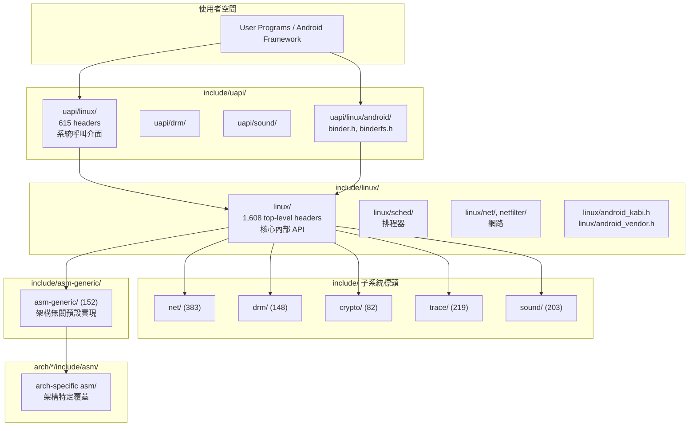

# Include Headers（核心標頭檔目錄）

## Purpose

`include/` 是 Linux 核心的**公共 API 定義中心**，包含所有子系統共用的資料結構、函式宣告、巨集定義與使用者空間介面。它是核心模組之間、核心與使用者空間之間的**契約層**——任何跨越編譯單元邊界的型別或介面都在此定義。在 ACK (Android Common Kernel) 中，此目錄還包含 Android 專屬的 KABI 保留機制、廠商 hook 框架，以及 Binder IPC 的使用者空間介面。

## Evidence Snapshot

| Claim | Source anchor |
|-------|---------------|
| Android KABI macros 用於 ABI freeze 前後保留/替換結構欄位，避免 KMI 擾動 | `common/include/linux/android_kabi.h:15-31`, `common/include/linux/android_kabi.h:89-102` |
| Vendor hook headers 建立在 trace hook 框架上，供 vendor modules hook/extend functionality | `common/include/trace/hooks/sched.h:7-15` |
| Scheduler vendor hook header 同時包含 restricted 與 unrestricted hook 宣告 | `common/include/trace/hooks/sched.h:13-32`, `common/include/trace/hooks/sched.h:88-95` |
| Binder UAPI header 是 Google Android Binder userspace/kernel 介面，定義 binder object type 與 ioctl 相關常數 | `common/include/uapi/linux/android/binder.h:1-39`, `common/include/uapi/linux/android/binder.h:50-80` |

## 統計總覽

| 指標 | 數值 |
|------|------|
| 總標頭檔 (`.h`) | **6,593** |
| 頂層子目錄 | **33** |
| `linux/` 標頭檔 | 2,789（核心內部 API，佔 42%） |
| `uapi/` 標頭檔 | 964（使用者空間 API，佔 15%） |
| `dt-bindings/` 標頭檔 | 1,122（Device Tree 綁定，佔 17%） |
| `trace/` 標頭檔 | 219（追蹤事件 + vendor hooks） |
| Android 專屬標頭 | ~35（android_kabi.h + android_vendor.h + 29 hook headers + 3 uapi/linux/android/） |
| `linux/` 子目錄 | 82 |

## Directory Map

### 核心 API 層

| 目錄 | 標頭數 | 角色 |
|------|--------|------|
| `linux/` | 2,789 | **核心內部 API**——所有子系統的型別、函式宣告、巨集。核心最大的標頭目錄，含 82 個子目錄 |
| `uapi/` | 964 | **使用者空間 API (UAPI)**——核心暴露給 userspace 的 ioctl、結構、常數。子目錄結構映射 `linux/` |
| `asm-generic/` | 152 | **架構無關組合語言介面**——提供通用的原子操作、位元操作、記憶體屏障等預設實現，各 `arch/*/include/asm/` 可覆蓋 |

### 子系統標頭

| 目錄 | 標頭數 | 角色 |
|------|--------|------|
| `net/` | 383 | 網路子系統——TCP/IP 協定、socket、netfilter、cfg80211 (WiFi)、bluetooth、SCTP、9P |
| `drm/` | 148 | DRM (Direct Rendering Manager)——GPU 驅動框架、KMS、GEM、TTM、atomic modesetting |
| `sound/` | 203 | ALSA 音訊子系統——PCM、control、AC97、ASoC codec 介面 |
| `media/` | 111 | V4L2/DVB 多媒體框架——視訊擷取、數位電視、CEC、camera pipeline |
| `crypto/` | 82 | 密碼學框架——AEAD、hash、skcipher、akcipher、compression 演算法 API |
| `scsi/` | 43 | SCSI 子系統——iSCSI、Fibre Channel、SAS、libiscsi |
| `rdma/` | 42 | RDMA/InfiniBand——IB verbs、CM、MAD、uVerbs |
| `acpi/` | 40 | ACPI 平台韌體介面——ACPICA 核心、bus、drivers、platform integration |

### 硬體平台標頭

| 目錄 | 標頭數 | 角色 |
|------|--------|------|
| `dt-bindings/` | 1,122 | **Device Tree 綁定巨集**——37 個子目錄（clock、gpio、interrupt-controller 等），定義 DT 屬性常數 |
| `soc/` | 74 | SoC 平台專屬——18 個 vendor 目錄（qcom、mediatek、amlogic、rockchip、tegra、imx 等） |
| `clocksource/` | 9 | 計時器硬體驅動介面——ARM arch timer、Hyper-V timer、RISC-V timer |
| `video/` | 48 | 顯示控制器——framebuffer、MIPI DSI、EDID、timing |
| `pcmcia/` | 7 | PCMCIA/CardBus 舊式擴充卡介面 |
| `hyperv/` | 5 | Microsoft Hyper-V 客機介面——GDK (Guest Development Kit) |

### 追蹤與診斷

| 目錄 | 標頭數 | 角色 |
|------|--------|------|
| `trace/events/` | 172 | **Trace Events**——每個核心子系統的 tracepoint 定義（block、sched、mm、net、ext4、f2fs 等） |
| `trace/hooks/` | 29 | **[android] Vendor Hooks**——Android GKI 廠商 hook 框架，29 個 hook 標頭檔，~141 個 hooks |
| `trace/stages/` | — | 啟動階段追蹤 |
| `kunit/` | 14 | KUnit 單元測試框架——test、assert、device mock、skbuff mock |
| `rv/` | 4 | Runtime Verification——自動機模型、DA monitor、LTL monitor |

### 儲存與 I/O

| 目錄 | 標頭數 | 角色 |
|------|--------|------|
| `ufs/` | 5 | UFS (Universal Flash Storage)——ufshcd 主控制器、UFSHCI spec 定義 |
| `target/` | 6 | SCSI Target (LIO)——iSCSI target、fabric、backend |
| `cxl/` | 4 | CXL (Compute Express Link)——mailbox、event、features、error injection |
| `memory/` | 1 | 記憶體控制器（Renesas RPC-IF） |

### 其他

| 目錄 | 標頭數 | 角色 |
|------|--------|------|
| `keys/` | 17 | 核心 keyring——asymmetric keys、encrypted keys、trusted keys (TPM/TEE/CAAM) |
| `kvm/` | 6 | KVM 虛擬化——ARM vGIC、arch timer、PSCI、PMU、hypercalls |
| `math-emu/` | 9 | 軟體浮點模擬——IEEE 754 single/double/quad precision |
| `vdso/` | 21 | vDSO (Virtual Dynamic Shared Object)——快速系統呼叫（gettime、getrandom）的共用實現 |
| `xen/` | 61 | Xen 虛擬化——hypercall 介面、event channel、grant table、ARM 整合 |
| `misc/` | 3 | 雜項——Altera FPGA、OpenCAPI (OCXl) |
| `ras/` | 1 | RAS (Reliability, Availability, Serviceability) 事件追蹤 |

## Architecture

### 標頭檔分層模型

### `linux/` 內部結構（82 個子目錄分類）

`linux/` 是最大的標頭目錄，其 82 個子目錄可依功能分為：

**核心子系統 API：**
`sched/`（排程器）、`net/`（網路內部）、`fs/`（檔案系統內部）、`io_uring/`（非同步 I/O）、`perf/`（效能計數器）

**匯流排與裝置框架：**
`bus/`（匯流排型別）、`device/`（裝置模型內部）、`usb/`（USB 子系統）、`spi/`（SPI）、`i3c/`（I3C）、`mmc/`（eMMC/SD）、`mtd/`（Flash 記憶體）、`phy/`（PHY transceiver）、`gpio/`（GPIO）、`input/`（輸入裝置）、`iio/`（Industrial I/O）

**記憶體與 DMA：**
`dma/`（DMA 引擎）、`dma-buf/`（DMA buffer sharing）、`memory/`（記憶體控制器）

**電源與時脈：**
`clk/`（時脈框架）、`regulator/`（電壓調節器）、`power/`（電源管理）、`pwrseq/`（電源序列）

**網路子框架：**
`netfilter/`、`netfilter_ipv4/`、`netfilter_ipv6/`、`netfilter_bridge/`、`netfilter_arp/`（Netfilter 各協定家族）、`can/`（CAN bus）

**安全與密鑰：**
`lsm/`（LSM 框架內部）

**硬體 vendor：**
`mlx4/`、`mlx5/`（Mellanox/NVIDIA 網路）、`qat/`（Intel QuickAssist）、`qed/`（Cavium/Marvell）、`habanalabs/`（Intel Gaudi AI）、`raspberrypi/`、`greybus/`

**序列化與同步：**
`atomic/`（原子操作內部）、`byteorder/`（位元組序）、`unaligned/`（非對齊存取）

**其他框架：**
`fpga/`（FPGA Manager）、`firmware/`（韌體載入）、`remoteproc/`（遠端處理器）、`rpmsg/`（遠端處理器訊息）、`mailbox/`（硬體信箱）、`pinctrl/`（腳位控制）、`extcon/`（外部連接器）、`mux/`（多工器）

## Android-Specific Changes

### 1. KABI 保留填充 (`linux/android_kabi.h`) [android]

定義 `ANDROID_KABI_RESERVE` 等巨集，在核心資料結構中預留 `u64` 填充欄位。當 KMI (Kernel Module Interface) 凍結後，這些保留欄位可透過 union 轉型來添加新欄位而不破壞 ABI。設計靈感來自 Red Hat 的 `rh_kabi.h`。

關鍵巨集：
- `ANDROID_KABI_RESERVE(n)` — 保留 1 個 `u64` 填充
- `ANDROID_KABI_USE(n, field)` — 使用保留欄位添加新 field
- `ANDROID_KABI_REPLACE(orig, new)` — union 替換同大小欄位

### 2. 廠商/OEM 資料填充 (`linux/android_vendor.h`) [android]

定義 `ANDROID_VENDOR_DATA(n)` 和 `ANDROID_OEM_DATA(n)` 巨集，在 `task_struct`、`mm_struct` 等核心結構中嵌入 `u64` 欄位，供廠商模組透過 vendor hooks 存取私有資料。需啟用 `CONFIG_ANDROID_VENDOR_OEM_DATA`。

### 3. Vendor Hooks 框架 (`trace/hooks/`) [android]

29 個標頭檔定義 ~141 個 vendor hooks，橫跨排程器、記憶體管理、安全、網路等子系統。使用 `DECLARE_HOOK` / `DECLARE_RESTRICTED_HOOK` 巨集，基於 tracepoint 基礎設施實現。

Hook 標頭分佈：

| 標頭檔 | 子系統 | 說明 |
|--------|--------|------|
| `sched.h` | 排程器 | 負載均衡、任務遷移、RT 排程（~60% 的 hooks） |
| `mm.h` | 記憶體 | 頁面分配、OOM、mmap |
| `vmscan.h` | 回收 | 頁面回收、LRU 操作 |
| `net.h` | 網路 | 封包處理 |
| `cpufreq.h` | CPU 頻率 | DVFS 策略 |
| `selinux.h` | SELinux | 安全策略決策 |
| `avc.h` | AVC | 存取向量快取 |
| `iommu.h` | IOMMU | DMA 映射 |
| `signal.h` | 信號 | 信號傳遞 |
| `cgroup.h` | Cgroup | 資源群組 |
| `fpsimd.h` | FPSIMD | 浮點/SIMD 上下文 |
| `gic.h` / `gic_v3.h` | 中斷 | ARM GIC 控制器 |
| `ufshcd.h` | 儲存 | UFS 主控制器 |
| `cpuidle.h` / `cpuidle_psci.h` | 省電 | CPU idle 狀態 |
| `pm_domain.h` | 電源 | 電源域管理 |
| `debug.h` | 除錯 | 核心除錯 |
| `printk.h` | 日誌 | 核心日誌 |
| `reboot.h` | 重啟 | 系統重啟 |
| `timer.h` | 計時 | 核心計時器 |
| `epoch.h` | 時間 | 系統時間 |
| `sys.h` | 系統 | 系統層級 |
| `remoteproc.h` | 遠端處理器 | coprocessor |
| `mpam.h` | MPAM | ARM 記憶體分區 |
| `wqlockup.h` | 工作佇列 | 鎖死偵測 |
| `syscall_check.h` | 系統呼叫 | 呼叫檢查 |
| `sysrqcrash.h` | SysRq | 緊急操作 |
| `vendor_hooks.h` | 通用 | Hook 基礎設施 |

### 4. Binder UAPI (`uapi/linux/android/`) [android]

三個使用者空間標頭定義 Binder IPC 介面：
- `binder.h` — ioctl 命令、交易結構（`binder_transaction_data`、`binder_write_read`）
- `binderfs.h` — Binderfs 裝置管理 ioctl
- `binder_netlink.h` — Generic Netlink 家族定義

### 5. USB ConfigFS Uevent (`linux/usb/android_configfs_uevent.h`) [android]

Android USB gadget 的 ConfigFS uevent 通知介面。

## Key Data Structures

`include/` 定義了幾乎所有核心資料結構。最重要的包括：

- [`task_struct`](../data-structures/task_struct.md) @ `linux/sched.h` — 行程描述符
- [`mm_struct`](../data-structures/mm_struct.md) @ `linux/mm_types.h` — 虛擬位址空間
- [`sk_buff`](../data-structures/sk_buff.md) @ `linux/skbuff.h` — 網路封包緩衝區
- [`inode`](../data-structures/inode.md) @ `linux/fs.h` — VFS inode
- [`page`/`folio`](../data-structures/page.md) @ `linux/mm_types.h` — 實體頁面描述符
- [`device`](../data-structures/device.md) @ `linux/device.h` — 裝置模型核心
- [`device_driver`](../data-structures/device_driver.md) @ `linux/device/driver.h` — 驅動描述符
- [`bus_type`](../data-structures/bus_type.md) @ `linux/device/bus.h` — 匯流排類型

## Key Code Paths

### UAPI 與內部標頭的分離

Linux 3.5+ 將使用者空間可見的定義從 `include/linux/` 分離到 `include/uapi/linux/`。`include/uapi/` 下的標頭透過 `make headers_install` 匯出給 userspace（如 Android 的 Bionic libc），而 `include/linux/` 下的標頭僅供核心內部使用。兩者透過 Kbuild 系統協調：`include/linux/foo.h` 通常 `#include <uapi/linux/foo.h>` 再添加核心專用欄位。

### asm-generic 回退機制

當特定架構（如 `arch/arm64/include/asm/`）未定義某個標頭時，build system 會自動回退到 `include/asm-generic/` 提供的預設實現。這透過 `include/asm-generic/Kbuild` 中的 mandatory/optional header 列表控制。

### Device Tree Bindings 常數

`include/dt-bindings/` 提供可在 `.dts` 和 C 程式碼中共用的常數定義（純 `#define` 巨集，無型別宣告）。例如 `dt-bindings/clock/qcom,gcc-sm8450.h` 定義 Qualcomm 時脈 ID，同時被 Device Tree 和時脈驅動使用。

### Trace Events 定義模式

`include/trace/events/*.h` 使用 `TRACE_EVENT()` 巨集定義 tracepoint。每個標頭通常被 `#include` 兩次——一次由 `<linux/tracepoint.h>` 提供宣告，一次由 `<trace/define_trace.h>` 產生實現程式碼。

## Vendor Hooks

所有 vendor hooks 的標頭定義在 `include/trace/hooks/`（29 個檔案）。這是 GKI 最核心的擴展機制——廠商模組不修改核心原始碼，而是透過註冊 hook callback 來自訂行為。詳見 [Vendor Hook 完整目錄](../android/vendor-hook-catalogue.md)。

## Configuration

標頭檔層級的關鍵 Kconfig 選項：

| 選項 | 預設 | 說明 |
|------|------|------|
| `CONFIG_ANDROID_VENDOR_OEM_DATA` | y (GKI) | 啟用 `ANDROID_VENDOR_DATA` / `ANDROID_OEM_DATA` 巨集 |
| `CONFIG_ANDROID_VENDOR_HOOKS` | y (GKI) | 啟用 vendor hook 基礎設施 |
| `CONFIG_ANDROID_KABI_RESERVE` | y (GKI) | 啟用 KABI 保留填充 |
| `CONFIG_DRM_HEADER_TEST` | n | 啟用 DRM 標頭編譯測試 |
| `CONFIG_UAPI_HEADER_TEST` | n | 啟用 UAPI 標頭獨立編譯測試 |

## Cross-References

- [Kernel Headers 組織概念](../concepts/kernel-headers-organization.md) — UAPI/internal 分層、asm-generic 回退、Kbuild 整合
- [Vendor Hooks 框架](../concepts/vendor-hooks.md) — Hook 註冊/呼叫機制詳解
- [GKI 架構](../concepts/gki.md) — Generic Kernel Image 與標頭的關係
- [ABI 穩定性](../android/abi-stability.md) — KABI 保留填充如何維護 KMI 穩定
- [Vendor Hook 目錄](../android/vendor-hook-catalogue.md) — 所有 ~141 個 hooks 的完整清單
- [Architecture Overview](../overview.md) — 核心架構總覽
