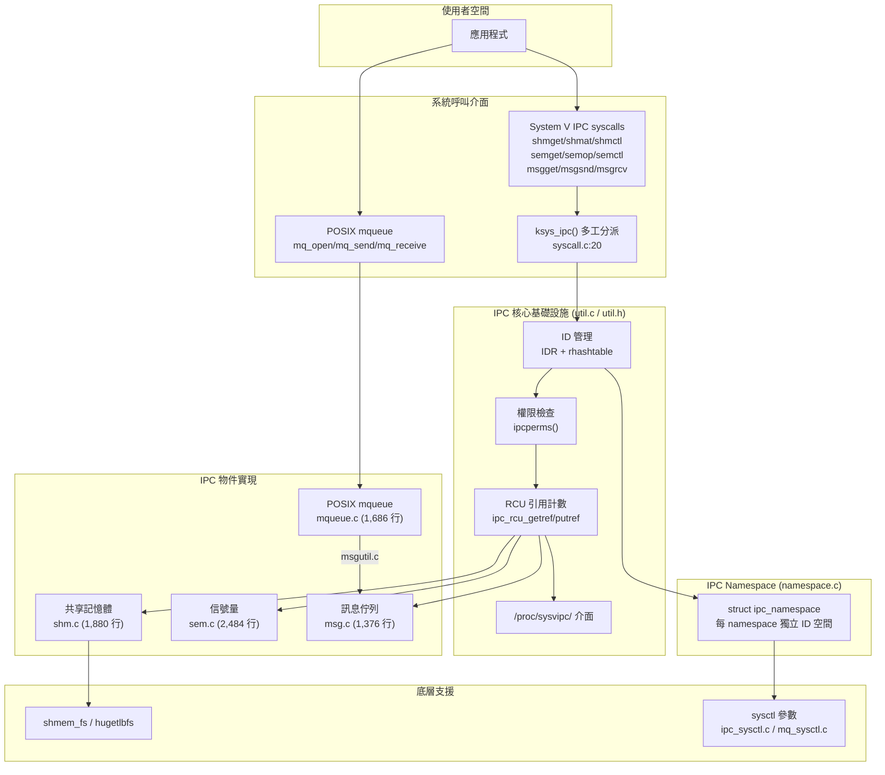

# IPC（行程間通訊）子系統

## 目錄

1. [目的](#目的)
2. [目錄地圖](#目錄地圖)
3. [架構總覽](#架構總覽)
4. [核心基礎設施](#核心基礎設施)
5. [共享記憶體 (SHM)](#共享記憶體-shm)
6. [信號量 (Semaphore)](#信號量-semaphore)
7. [訊息佇列 (Message Queue)](#訊息佇列-message-queue)
8. [POSIX 訊息佇列 (mqueue)](#posix-訊息佇列-mqueue)
9. [Namespace 隔離機制](#namespace-隔離機制)
10. [關鍵程式碼路徑](#關鍵程式碼路徑)
11. [Android 特定變更](#android-特定變更)
12. [配置選項](#配置選項)
13. [交叉參考](#交叉參考)

---

## 目的

IPC 子系統實現 POSIX 與 System V 的行程間通訊原語，提供三種核心機制：共享記憶體（Shared Memory）、信號量（Semaphore）與訊息佇列（Message Queue）。這些機制透過統一的 ID 管理、權限控制與 namespace 隔離框架運作，允許同一或不同 namespace 中的行程協調工作、傳遞資料及同步狀態。

---

## 目錄地圖

| 檔案 | 行數 | 說明 |
|------|------|------|
| `ipc/util.h` | 292 | 核心資料結構定義、內部 API 宣告 |
| `ipc/util.c` | 928 | IPC 通用工具：ID 分配/查詢、權限檢查、RCU 管理、`/proc/sysvipc/` |
| `ipc/shm.c` | 1,880 | System V 共享記憶體實現 |
| `ipc/sem.c` | 2,484 | System V 信號量實現（最大檔案） |
| `ipc/msg.c` | 1,376 | System V 訊息佇列實現 |
| `ipc/msgutil.c` | 192 | 訊息分配/複製工具（msg 與 mqueue 共用） |
| `ipc/mqueue.c` | 1,686 | POSIX 訊息佇列（mqueuefs 虛擬檔案系統） |
| `ipc/namespace.c` | 257 | IPC namespace 建立/複製/銷毀 |
| `ipc/syscall.c` | 211 | 舊式 multiplexed syscall 分派（`ksys_ipc`） |
| `ipc/ipc_sysctl.c` | 334 | IPC sysctl 參數註冊 |
| `ipc/mq_sysctl.c` | 167 | POSIX mqueue sysctl 參數註冊 |
| `ipc/compat.c` | 82 | 32 位元相容層（結構體轉換） |
| `ipc/Makefile` | 12 | 建置設定：依 Kconfig 條件編譯各模組 |
| **合計** | **9,889** | （不含 Makefile） |

**關鍵標頭檔：**

| 標頭檔 | 說明 |
|--------|------|
| `include/linux/ipc.h` | `struct kern_ipc_perm` 定義 |
| `include/linux/ipc_namespace.h` | `struct ipc_ids`、`struct ipc_namespace` 定義 |
| `include/linux/shm.h` | `struct shmid_kernel` 定義 |
| `include/linux/msg.h` | `struct msg_msg`、`struct msg_queue` 定義 |
| `include/uapi/linux/ipc.h` | 使用者空間 IPC 常數與結構 |

---

## 架構總覽



IPC 子系統採用三層架構：系統呼叫介面層提供使用者空間 API 與舊式多工分派相容性；核心基礎設施層透過 IDR（Radix Tree）和 rhashtable 管理 ID 分配與 key 查詢，結合 RCU 實現無鎖讀取路徑；物件實現層針對各 IPC 原語提供特化邏輯。所有物件透過 `struct ipc_namespace` 實現完整的容器隔離。

---

## 核心基礎設施

### 核心資料結構

#### `struct kern_ipc_perm` @ `include/linux/ipc.h:12`

所有 IPC 物件的基礎權限結構，嵌入在每個 SHM/SEM/MSG 物件的開頭：

```
kern_ipc_perm
├── lock           (spinlock_t)     — 每物件自旋鎖
├── deleted        (bool)           — 標記已刪除（IPC_RMID）
├── id             (int)            — 回傳給使用者空間的 IPC ID
├── key            (key_t)          — 使用者提供的 key
├── uid/gid        (kuid_t/kgid_t)  — 擁有者 UID/GID
├── cuid/cgid      (kuid_t/kgid_t)  — 建立者 UID/GID
├── mode           (umode_t)        — rwx 權限位元
├── seq            (unsigned long)   — 序號（防止 ID 重用攻擊）
├── security       (void *)         — LSM 安全上下文
├── khtnode        (rhash_head)     — key 雜湊表節點
├── rcu            (rcu_head)       — RCU 延遲釋放
└── refcount       (refcount_t)     — 引用計數
```

結構使用 `____cacheline_aligned_in_smp` 對齊以避免 SMP 偽共享，並使用 `__randomize_layout` 防止記憶體佈局攻擊。

#### `struct ipc_ids` @ `include/linux/ipc_namespace.h:18`

每種 IPC 類型（SEM/MSG/SHM）各有一個實例，管理該類型的 ID 空間：

```
ipc_ids
├── in_use         (int)            — 已分配 ID 數量
├── seq            (unsigned short)  — 全域序號計數器
├── rwsem          (rw_semaphore)   — 讀寫信號量保護表結構
├── ipcs_idr       (struct idr)     — ID Radix Tree（快速 ID→物件查詢）
├── max_idx        (int)            — 最高已分配索引（快取）
├── last_idx       (int)            — 最後分配索引（迴繞偵測）
├── next_id        (int)            — CONFIG_CHECKPOINT_RESTORE 用
└── key_ht         (rhashtable)     — key→物件 O(1) 雜湊查詢
```

#### `struct ipc_namespace` @ `include/linux/ipc_namespace.h:31`

每個 namespace 的完整 IPC 狀態，包含三個 `ipc_ids` 實例（`ids[IPC_SEM_IDS]`、`ids[IPC_MSG_IDS]`、`ids[IPC_SHM_IDS]`）以及各子系統的資源限制參數。

### ID 分配機制

IPC ID 是一個 31 位元的組合值，由索引（index）和序號（sequence number）兩部分組成：

**預設模式（15-bit 索引 + 16-bit 序號）：** 支援最多 32,768 個物件，序號空間 64,512 個值。透過 `ipcid_to_idx(id)` 與 `ipcid_to_seqx(id)` 拆分。

**擴展模式（24-bit 索引 + 7-bit 序號）：** 透過 `ipcmni_extend` 開機參數啟用，支援最多 16,777,216 個物件，序號空間 128 個值。

分配流程 `ipc_addid()` @ `ipc/util.c:278`：初始化 refcount → 檢查 namespace 限制 → `ipc_idr_alloc()` 使用循環分配（`idr_alloc_cyclic`）取得索引 → 若非 `IPC_PRIVATE` 則插入 rhashtable → 組合 `id = (seq << shift) + idx`。

序號在索引迴繞（wrap-around）時遞增，確保即使索引被重用，舊的 ID 已失效。

### 鎖定策略

IPC 子系統採用三層鎖定架層（由外到內）：

1. **RCU 讀取鎖** — 保護物件查詢路徑，允許無鎖讀取
2. **`ipc_ids.rwsem`** — 讀寫信號量保護 ID 表修改
3. **`kern_ipc_perm.lock`** — 每物件自旋鎖保護物件狀態

唯讀操作（INFO/STAT）只需 RCU + 物件自旋鎖；修改操作（SET/RMID）需取得 rwsem 寫者鎖；刪除操作標記 `deleted = true` 後透過 RCU 回呼延遲釋放，防止 use-after-free。

### 權限檢查

`ipcperms()` @ `ipc/util.c:553` 實現三級檢查：若 UID 匹配 cuid/uid 則使用使用者權限（bits 6-8）；若 GID 匹配 cgid/gid 則使用群組權限（bits 3-5）；否則使用其他權限（bits 0-2）。若權限不足，最後檢查 `CAP_IPC_OWNER` capability 作為覆寫。所有操作透過 `audit_ipc_obj()` 觸發 LSM 稽核。

---

## 共享記憶體 (SHM)

### 核心資料結構

#### `struct shmid_kernel` @ `ipc/shm.c:54`

```
shmid_kernel
├── shm_perm       (kern_ipc_perm)  — 基礎 IPC 權限（嵌入）
├── shm_file       (struct file *)  — VFS 檔案物件（shmem_fs 或 hugetlbfs）
├── shm_nattch     (unsigned long)  — 目前附加計數
├── shm_segsz      (unsigned long)  — 區段大小（位元組）
├── shm_atim/dtim/ctim (time64_t)   — 最後附加/分離/變更時間
├── shm_cprid      (struct pid *)   — 建立者 PID
├── shm_lprid      (struct pid *)   — 最後操作者 PID
├── shm_creator    (task_struct *)  — 建立者任務參考
├── shm_clist      (list_head)      — 每建立者連結串列（exit 時清理用）
└── ns             (ipc_namespace *) — 所屬 namespace
```

### 記憶體管理

共享記憶體透過核心的 shmem 虛擬檔案系統運作。`newseg()` @ `ipc/shm.c:702` 建立區段時，以 `shmem_kernel_file_setup()` 建立 shmem 檔案物件；若指定 `SHM_HUGETLB`，則使用 `hugetlb_file_setup()` 從 hugepage 池分配。記憶體分配使用 `GFP_KERNEL_ACCOUNT` 以支援 memcg 計量。

`do_shmat()` @ `ipc/shm.c:1519` 透過建立帶有 `shm_vm_ops` 的 VMA（虛擬記憶體區域）將區段映射到行程位址空間。`shm_open`/`shm_close` 回呼管理 `shm_nattch` 計數。

### IPC_RMID 延遲銷毀

`IPC_RMID` 標記區段的 `SHM_DEST` 旗標，但實際釋放推遲到 `shm_nattch` 降為 0。`exit_shm()` 在行程結束時遍歷 `shm_clist` 清理所有區段，並尊重 `shm_rmid_forced` sysctl 設定進行強制清理。

---

## 信號量 (Semaphore)

### 核心資料結構

#### `struct sem` @ `ipc/sem.c:95`

```
sem
├── semval         (int)            — 目前信號量值
├── sempid         (struct pid *)   — 最後修改者 PID
├── lock           (spinlock_t)     — 細粒度每信號量鎖
├── pending_alter  (list_head)      — 修改值的等待操作
└── pending_const  (list_head)      — 不修改值的等待操作（wait-for-zero）
```

#### `struct sem_array` @ `ipc/sem.c:114`

```
sem_array
├── sem_perm       (kern_ipc_perm)  — 基礎權限
├── sem_ctime      (time64_t)       — 變更時間
├── pending_alter  (list_head)      — 複合操作（跨多信號量）等待佇列
├── pending_const  (list_head)      — 複合 wait-for-zero 佇列
├── list_id        (list_head)      — undo 請求
├── sem_nsems      (int)            — 信號量數量
├── complex_count  (int)            — 待處理複合操作計數
├── use_global_lock (unsigned int)  — 鎖定升級計數器
└── sems[]         (struct sem)     — 彈性陣列成員
```

### 雙層鎖定策略

信號量子系統實現了精密的雙層鎖定以提高可擴展性：

**細粒度鎖定模式：** 當 `use_global_lock == 0` 且操作僅涉及單一信號量時，只鎖定 `sma->sems[i].lock`。這允許不同信號量的並發操作。每個 `struct sem` 使用 `____cacheline_aligned_in_smp` 避免偽共享。

**全域鎖定模式：** 當有複合操作（涉及多個信號量）或 wait-for-zero 操作時，`use_global_lock` 遞增，所有操作鎖定整個陣列的 `ipc_lock_object(&sma->sem_perm)`。`complexmode_enter()` 將各信號量佇列合併到全域佇列；`complexmode_tryleave()` 嘗試反向切換，使用 `USE_GLOBAL_LOCK_HYSTERESIS = 10` 避免頻繁切換。

### 原子操作：perform_atomic_semop

`perform_atomic_semop()` 使用兩遍驗證確保原子性：第一遍掃描所有操作，檢查 semval + sem_op 是否合法（不低於 0、不超過 SEMVMX=32767）；若任一操作無法執行則整體阻塞。第二遍執行所有操作並更新 semval 與 SEM_UNDO 調整值。

### Undo 機制

SEM_UNDO 旗標提供行程退出時的自動回復。`find_alloc_undo()` @ `ipc/sem.c:1906` 在首次帶 SEM_UNDO 的 semop 時懶惰分配 `struct sem_undo`，記錄每個信號量的調整值（`semadj[]`）。當行程結束時，`exit_sem()` 遍歷 undo 串列，對每個信號量套用反向操作（`semval += semadj[i]`），恢復信號量狀態。Undo 結構透過 `CLONE_SYSVSEM` 在任務群組中共享。

### 喚醒最佳化

`update_queue()` 在信號量值變更後喚醒等待任務，使用 `check_restart()` 最佳化避免 O(N²) 佇列重掃描：對於簡單遞減操作，若較高優先順序的遞減此前無法執行，現在也不會。使用 `wake_q` 框架延遲實際喚醒至鎖定釋放後，改善快取局部性。

---

## 訊息佇列 (Message Queue)

### 核心資料結構

#### `struct msg_queue` @ `include/linux/msg.h` / `ipc/msg.c:49`

```
msg_queue
├── q_perm         (kern_ipc_perm)  — 基礎權限
├── q_stime/rtime/ctime (time64_t)  — 最後發送/接收/變更時間
├── q_cbytes       (unsigned long)  — 佇列中目前位元組數
├── q_qnum         (unsigned long)  — 佇列中目前訊息數
├── q_qbytes       (unsigned long)  — 佇列最大容量
├── q_lspid/q_lrpid (struct pid *)  — 最後發送/接收者 PID
├── q_messages     (list_head)      — 訊息連結串列
├── q_receivers    (list_head)      — 等待接收者佇列
└── q_senders      (list_head)      — 等待發送者佇列
```

#### `struct msg_msg` @ `include/linux/msg.h:9`

```
msg_msg
├── m_list         (list_head)      — 佇列中的連結
├── m_type         (long)           — 訊息類型
├── m_ts           (size_t)         — 文字大小
├── next           (msg_msgseg *)   — 分段訊息鏈（大訊息分頁儲存）
├── security       (void *)         — LSM 安全資料
└── [inline data]                   — 緊接結構之後的訊息資料
```

### 訊息分段

訊息使用分頁級分段以有效利用記憶體。第一段嵌入 `msg_msg` 結構中（最大 `PAGE_SIZE - sizeof(struct msg_msg)` 位元組），額外資料以 `struct msg_msgseg` 鏈式分配。`load_msg()` 從使用者空間分段讀取，`store_msg()` 反向操作。

### 訊息匹配

`do_msgrcv()` @ `ipc/msg.c:1098` 支援五種搜尋模式：`SEARCH_ANY`（msgtyp==0，取第一則）、`SEARCH_EQUAL`（msgtyp>0，精確類型匹配）、`SEARCH_NOTEQUAL`（MSG_EXCEPT，排除指定類型）、`SEARCH_LESSEQUAL`（msgtyp<0，類型 ≤ |msgtyp|）、`SEARCH_NUMBER`（MSG_COPY，按索引）。

### 管線化傳送最佳化

`pipelined_send()` @ `ipc/msg.c` 實現零複製直接遞交：當有接收者正在等待匹配訊息時，訊息透過 `smp_store_release(&msr->r_msg, msg)` 直接傳遞給接收者，跳過佇列入列/出列操作。使用 `wake_q_add()` 延遲喚醒以減少鎖定持有時間。

### 發送/接收流程

**`do_msgsnd()`** @ `ipc/msg.c:848`：驗證 msqid 與大小 → 預分配訊息（`load_msg`，複製使用者資料）→ RCU 讀取鎖取得佇列 → 權限檢查 → 若佇列已滿則加入 `q_senders` 休眠 → 嘗試 `pipelined_send()` 直接遞交 → 若無匹配接收者則入列 `q_messages` → 更新 percpu 計數器。

**`do_msgrcv()`** @ `ipc/msg.c:1098`：決定搜尋模式 → RCU 讀取鎖取得佇列 → 權限檢查 → `find_msg()` 搜尋匹配訊息 → 若找到則 `store_msg()` 複製到使用者空間 → 若未找到且非 `IPC_NOWAIT` 則加入 `q_receivers` 休眠等待 `pipelined_send()` 遞交。

---

## POSIX 訊息佇列 (mqueue)

### 實現方式

POSIX 訊息佇列以虛擬檔案系統 `mqueue_fs_type` 實現，每個佇列對應一個 inode。`struct mqueue_inode_info` @ `ipc/mqueue.c:134` 擴展 VFS inode，包含佇列屬性、通知機制與紅黑樹訊息儲存。

### 優先權紅黑樹

不同於 System V 訊息佇列的簡單連結串列，POSIX 佇列使用 `struct posix_msg_tree_node` @ `ipc/mqueue.c:61` 建立紅黑樹，以優先權排序訊息。同一優先權內的訊息維持 FIFO 順序。`msg_tree_rightmost` 快取最高優先權節點以加速出列。

### 無鎖接收最佳化

POSIX mqueue 使用狀態機（`STATE_NONE` / `STATE_READY`）配合記憶體屏障實現安全的無鎖遞交：發送端以 `smp_store_release()` 設定接收者狀態，接收端以 `READ_ONCE()` + `smp_acquire__after_ctrl_dep()` 檢測完成。在釋放狀態前使用 `get_task_struct()` + `wake_q_add_safe()` 防止 use-after-free 競態。

### 通知機制

支援三種通知模式：信號通知（發送信號至指定行程/執行緒）、執行緒通知（訊息到達時建立新執行緒）、Netlink 通知（透過 netlink socket 傳送）。透過 `struct sigevent` 與 `notify_owner`/`notify_sock` 欄位管理。

---

## Namespace 隔離機制

### 建立

`create_ipc_ns()` @ `ipc/namespace.c:39`：遞增 `UCOUNT_IPC_NAMESPACES` 計數 → `kzalloc`（GFP_KERNEL_ACCOUNT）分配 namespace → 初始化 `ns_common` → 依序呼叫 `mq_init_ns()`、`setup_mq_sysctls()`、`setup_ipc_sysctls()`、`msg_init_ns()`、`sem_init_ns()`、`shm_init_ns()` → 加入 namespace 層級樹。任務透過 `task->nsproxy->ipc_ns` 存取其 IPC namespace。

### 複製

`copy_ipcs()` @ `ipc/namespace.c:111`：若指定 `CLONE_NEWIPC` 則建立全新 namespace；否則遞增現有 namespace 引用計數。

### 銷毀

`put_ipc_ns()` @ `ipc/namespace.c:202`：引用計數降為 0 時排程非同步清理工作（`free_ipc` workqueue），避免在熱路徑呼叫 `synchronize_rcu()`。清理流程：使 mqueuefs 掛載點短期化 → 等待 RCU 寬限期 → `free_ipcs()` 釋放所有 IPC 物件 → 退休 sysctl 表。

### 安裝（setns/unshare）

`ipcns_install()` @ `ipc/namespace.c:233`：需要在目前與目標 namespace 中均具備 `CAP_SYS_ADMIN`。原子交換 `nsproxy->ipc_ns`。

---

## 關鍵程式碼路徑

### 1. shmget → newseg 建立共享記憶體

```
sys_shmget()
  → ksys_shmget()
    → ipcget() @ ipc/util.c
      → ipcget_new() 或 ipcget_public()
        → newseg() @ ipc/shm.c:702
          1. 檢查 size ∈ [SHMMIN, shm_ctlmax]
          2. 驗證 shm_tot + numpages ≤ shm_ctlall
          3. kvzalloc(shmid_kernel, GFP_KERNEL_ACCOUNT)
          4. shmem_kernel_file_setup() 或 hugetlb_file_setup()
          5. ipc_addid() 分配 ID
          6. 加入 current->sysvshm.shm_clist
          → 回傳 shmid
```

### 2. semop → perform_atomic_semop 信號量操作

```
sys_semtimedop()
  → ksys_semtimedop()
    → do_semtimedop() @ ipc/sem.c:2222
      1. copy_from_user() 複製 sembuf 陣列
      2. find_alloc_undo()（若需要 SEM_UNDO）
      3. sem_lock() 選擇鎖定策略
      4. perform_atomic_semop()
         ├─ 第一遍：驗證所有操作可執行
         └─ 第二遍：更新 semval 與 semadj
      5. do_smart_update() → update_queue() 喚醒等待者
      6. sem_unlock()
      → 若阻塞：加入 pending 佇列 → schedule_timeout()
```

### 3. msgsnd → pipelined_send 訊息發送

```
sys_msgsnd()
  → ksys_msgsnd()
    → do_msgsnd() @ ipc/msg.c:848
      1. load_msg() 從使用者空間分段複製
      2. ipc_lock_object()
      3. ipcperms() 權限檢查
      4. 檢查佇列容量（q_cbytes + msgsz ≤ q_qbytes）
      5. pipelined_send() 嘗試直接遞交
         ├─ 遍歷 q_receivers
         ├─ testmsg() 匹配類型
         └─ smp_store_release(&msr->r_msg, msg) 無鎖遞交
      6. 若無匹配：list_add_tail(&msg->m_list, &msq->q_messages)
```

### 4. Namespace 建立流程

```
unshare(CLONE_NEWIPC) 或 clone(CLONE_NEWIPC)
  → copy_ipcs()
    → create_ipc_ns() @ ipc/namespace.c:39
      1. inc_ipc_namespaces(ucounts)
      2. kzalloc(sizeof(ipc_namespace), GFP_KERNEL_ACCOUNT)
      3. ns_common_init() + ns_tree_gen_id()
      4. mq_init_ns() — 建立 mqueuefs 超級區塊
      5. setup_mq_sysctls() + setup_ipc_sysctls()
      6. msg_init_ns() + sem_init_ns() + shm_init_ns()
      7. ns_tree_add_raw()
```

### 5. 舊式 multiplexed syscall 分派

```
sys_ipc(call, first, second, third, ptr, fifth)
  → ksys_ipc() @ ipc/syscall.c:20
    call = (version << 16) | operation
    ├─ SEMOP(1)   → ksys_semtimedop()
    ├─ SEMGET(2)  → ksys_semget()
    ├─ SEMCTL(3)  → ksys_old_semctl()
    ├─ MSGSND(11) → ksys_msgsnd()
    ├─ MSGRCV(12) → ksys_msgrcv()
    ├─ MSGGET(13) → ksys_msgget()
    ├─ MSGCTL(14) → ksys_old_msgctl()
    ├─ SHMAT(21)  → do_shmat()
    ├─ SHMDT(22)  → ksys_shmdt()
    ├─ SHMGET(23) → ksys_shmget()
    └─ SHMCTL(24) → ksys_old_shmctl()
```

---

## Android 特定變更

**IPC 子系統本身沒有 Android vendor hooks 或 Android 專屬修改。** `include/trace/hooks/` 目錄中未包含任何 IPC 相關的 hook 標頭檔，且 `ipc/` 目錄下的所有原始碼均為上游 Linux 程式碼。

在 Android 生態系統中，行程間通訊主要透過 **Binder IPC**（`drivers/android/binder.c`）而非 System V IPC 機制。Binder 提供了物件導向的交易模型、跨行程引用計數與死亡通知，更適合 Android 的元件化架構。System V IPC 仍然可用於原生層（NDK）應用程式與 POSIX 相容程式碼。

---

## 配置選項

| Kconfig 選項 | 預設值 | 說明 |
|-------------|--------|------|
| `CONFIG_SYSVIPC` | y | 啟用 System V IPC（sem/msg/shm） |
| `CONFIG_SYSVIPC_SYSCTL` | y | 啟用 sysctl 參數調校 |
| `CONFIG_SYSVIPC_COMPAT` | y | 啟用 32 位元相容層 |
| `CONFIG_POSIX_MQUEUE` | y | 啟用 POSIX 訊息佇列 |
| `CONFIG_POSIX_MQUEUE_SYSCTL` | y | 啟用 mqueue sysctl |
| `CONFIG_IPC_NS` | y | 啟用 IPC namespace 隔離 |
| `CONFIG_CHECKPOINT_RESTORE` | — | 啟用 next_id 控制（CRIU 用） |

### Sysctl 參數

**共享記憶體：** `kernel.shmmax`（最大區段大小）、`kernel.shmall`（最大總頁數）、`kernel.shmmni`（最大區段數）、`kernel.shm_rmid_forced`（強制清理孤兒區段）。

**訊息佇列：** `kernel.msgmax`（最大訊息大小）、`kernel.msgmnb`（最大佇列大小）、`kernel.msgmni`（最大佇列數）。

**信號量：** `kernel.sem`（四元組：semmsl/semmns/semopm/semmni — 每陣列最大信號量數/全系統最大信號量數/每次 semop 最大操作數/最大陣列數）。

---

## 交叉參考

- [鎖定原語](../concepts/locking-primitives.md) — spinlock、rwsem、RCU 在 IPC 中的應用
- [RCU](../concepts/rcu.md) — IPC 物件查詢的無鎖讀取路徑
- [記憶體分配](../concepts/memory-allocation.md) — GFP_KERNEL_ACCOUNT 記憶體計量
- [追蹤與 ftrace](../concepts/tracing-and-ftrace.md) — tracepoint 基礎設施
- [GKI](../concepts/gki.md) — IPC 為上游未修改模組
- [Vendor Hooks](../concepts/vendor-hooks.md) — IPC 子系統未使用 vendor hooks
