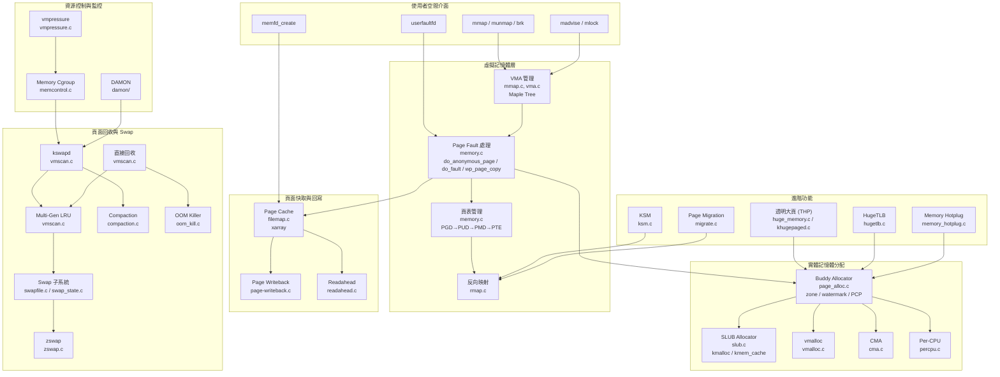

# 記憶體管理子系統 (Memory Management)

## 目的

記憶體管理子系統（`mm/`）是 Linux 核心中最龐大且最關鍵的子系統之一，負責管理系統中所有實體記憶體與虛擬記憶體。它涵蓋從開機初始化的 memblock 分配器、執行期的 buddy allocator 與 SLUB slab 分配器、虛擬位址空間管理（VMA、mmap）、需求分頁（demand paging）與寫入時複製（CoW）、頁面快取（page cache）、頁面回收（kswapd/direct reclaim）、OOM killer、swap 子系統、記憶體壓縮（compaction）、透明大頁（THP）、記憶體 cgroup 資源限制，到 DAMON 存取監控等多個核心機制。

在 ACK（Android Common Kernel）中，mm 子系統在 upstream Linux 基礎上增加了 vendor hook 擴充點、memfd-ashmem 相容層、以及預設啟用的 Multi-Gen LRU 回收演算法，以滿足 Android 裝置的記憶體效率需求。

## 目錄地圖

`mm/` 目錄共包含約 **150 個原始碼檔案**（含子目錄），核心 `.c` 檔案總計超過 **140,000 行**程式碼。

| 檔案/目錄 | 行數 | 說明 |
|-----------|------|------|
| `slub.c` | 10,143 | SLUB slab 分配器（核心物件快取） |
| `vmscan.c` | 7,901 | 頁面回收：kswapd、直接回收、LRU、Multi-Gen LRU |
| `page_alloc.c` | 7,727 | Buddy 分配器、zone 管理、Per-CPU 頁面快取 |
| `memory.c` | 7,405 | Page fault 處理、頁表管理、CoW |
| `hugetlb.c` | 7,326 | HugeTLB 頁面池管理（2MB/1GB） |
| `shmem.c` | 6,045 | tmpfs/shmem 共享記憶體 |
| `memcontrol.c` | 5,643 | Memory cgroup v2 資源限制 |
| `vmalloc.c` | 5,472 | vmalloc 虛擬記憶體分配器 |
| `huge_memory.c` | 4,978 | 透明大頁（THP）分配與管理 |
| `filemap.c` | 4,741 | Page cache 管理、檔案 I/O |
| `swapfile.c` | 4,078 | Swap 裝置管理、slot 分配 |
| `ksm.c` | 4,020 | Kernel Samepage Merging（相同頁面合併） |
| `mempolicy.c` | 3,944 | NUMA 記憶體策略 |
| `gup.c` | 3,568 | Get User Pages（使用者頁面鎖定） |
| `percpu.c` | 3,377 | Per-CPU 分配器 |
| `compaction.c` | 3,334 | 記憶體壓縮與碎片整理 |
| `vma.c` | 3,295 | VMA 操作（合併、分割） |
| `page-writeback.c` | 3,137 | 髒頁回寫控制 |
| `rmap.c` | 3,015 | 反向映射（reverse mapping） |
| `khugepaged.c` | 2,863 | 自動大頁摺疊守護行程 |
| `migrate.c` | 2,750 | 頁面遷移（NUMA 平衡、壓縮、熱插拔） |
| `memory_hotplug.c` | 2,415 | 記憶體熱插拔 |
| `memcontrol-v1.c` | 2,221 | Memory cgroup v1 相容實作 |
| `userfaultfd.c` | 2,120 | 使用者空間 fault 處理 |
| `zswap.c` | 1,857 | Swap 壓縮快取（zswap） |
| `mmap.c` | 1,885 | VMA 管理、mmap/munmap 系統呼叫 |
| `oom_kill.c` | 1,274 | OOM Killer |
| `cma.c` | 1,158 | Contiguous Memory Allocator |
| `swap.c` | 1,125 | LRU 列表管理、folio 活化/鈍化 |
| `swap_state.c` | 879 | Swap page cache |
| `vmpressure.c` | 481 | 記憶體壓力通知 |
| `memfd-ashmem-shim.c` | 214 | [android] memfd ashmem 相容層 |
| `damon/` | — | DAMON 資料存取監控框架（子目錄） |
| `kasan/` | — | Kernel Address Sanitizer（子目錄） |
| `kfence/` | — | Kernel Electric Fence（子目錄） |
| `kmsan/` | — | Kernel Memory Sanitizer（子目錄） |

## 架構

記憶體管理子系統可分為以下幾個主要層次：



### 核心設計概念

**1. 雙層分配架構：** Buddy allocator 以頁面（4KB）為最小單位管理實體記憶體，SLUB allocator 在其上建立物件快取，以更細粒度分配核心資料結構。vmalloc 則將不連續的實體頁面映射到連續的核心虛擬位址空間。

**2. 需求分頁（Demand Paging）：** 行程透過 `mmap()` 建立的虛擬記憶體區域（VMA）不會立即分配實體頁面，而是在首次存取時觸發 page fault，由 `memory.c` 中的 fault handler 按需分配。

**3. 寫入時複製（Copy-on-Write）：** `fork()` 後父子行程共享相同的實體頁面（唯讀），當任一方嘗試寫入時觸發 CoW fault，由 `wp_page_copy()` @ `memory.c:3701` 分配新頁面並複製內容。

**4. 頁面回收（Page Reclaim）：** 當可用記憶體低於 zone 的 LOW watermark 時，`kswapd` 背景守護行程啟動回收；若分配器在快速路徑失敗，則進入直接回收（direct reclaim）。ACK 預設啟用 Multi-Gen LRU（`CONFIG_LRU_GEN=y`），以存取頻率為基礎的世代模型取代傳統 active/inactive 雙列表。

**5. Maple Tree VMA 管理：** Linux 6.x 以 Maple Tree（`mm_struct.mm_mt`）取代紅黑樹管理 VMA，提供更高效的範圍查詢與遍歷。

**6. Folio 抽象：** `struct folio`（`mm_types.h:401`）封裝一個或多個連續的實體頁面，為大頁管理提供統一介面，取代直接操作 `struct page` 的舊模式。

## 關鍵資料結構

- [`struct page`](../data-structures/page.md) @ `include/linux/mm_types.h:79` — 表示單一實體頁面（4KB），包含 flags、\_refcount、\_mapcount、LRU 連結、mapping 等欄位
- [`struct folio`](../data-structures/page.md) @ `include/linux/mm_types.h:401` — 封裝 compound page 的多頁邏輯單元，包含 `_large_mapcount`、`_nr_pages_mapped`、deferred split 列表
- [`struct vm_area_struct`](../data-structures/vm_area_struct.md) @ `include/linux/mm_types.h:904` — 行程虛擬記憶體區域：vm_start/vm_end、vm_flags、vm_file、vm_ops，支援 per-VMA lock（`CONFIG_PER_VMA_LOCK`）
- [`struct mm_struct`](../data-structures/mm_struct.md) @ `include/linux/mm_types.h:1075` — 行程記憶體管理上下文：pgd、mm_mt（Maple Tree）、mmap_lock、RSS 統計、brk/stack 位址
- `struct scan_control` @ `mm/vmscan.c:78` — 頁面回收上下文：priority、order、target_mem_cgroup、GFP flags
- `struct compact_control` @ `mm/compaction.c` — 壓縮狀態：migrate_pfn、free_pfn、zone、order
- `struct oom_control` @ `mm/oom_kill.c` — OOM 上下文：memcg、nodemask、order
- `struct ptdesc` @ `include/linux/mm_types.h:572` — 頁表描述符，overlay struct page

## 關鍵程式碼路徑

### 1. 頁面分配（Buddy Allocator）

```
alloc_pages(gfp, order)
  → __alloc_pages()
    → get_page_from_freelist() @ page_alloc.c:3791
      → 遍歷 zonelist，檢查 watermark
      → rmqueue_buddy() @ page_alloc.c:3222
        → 嘗試 Per-CPU Page Cache (PCP)
        → __rmqueue_smallest() @ page_alloc.c:1914  （buddy 核心：找最小 free block）
        → 必要時 split higher-order block
    → 失敗 → __alloc_pages_slowpath() @ page_alloc.c:4693
      → 喚醒 kswapd
      → 嘗試直接回收 (direct reclaim)
      → 嘗試壓縮 (compaction)
      → 最後手段：OOM kill
```

### 2. Page Fault 處理

```
handle_mm_fault()
  → handle_pte_fault() @ memory.c:6233
    → PTE 不存在：
      → 匿名頁面 → do_anonymous_page() @ memory.c:5177
        → 分配 zero page 或新頁面、建立 PTE
      → 檔案映射 → do_fault() @ memory.c:5863
        → 呼叫 vm_ops->fault()（通常是 filemap_fault()）
        → 載入頁面到 page cache、建立 PTE
    → PTE 存在但唯讀寫入：
      → wp_page_copy() @ memory.c:3701  （CoW）
        → 分配新頁面、複製內容、更新 PTE
    → NUMA balancing fault → do_numa_page()
```

### 3. 頁面回收（kswapd 路徑）

```
kswapd() @ vmscan.c:7297
  → balance_pgdat() @ vmscan.c:6963
    → 對每個 zone 檢查 watermark
    → shrink_zones() @ vmscan.c:6227
      → shrink_lruvec() @ vmscan.c:5778
        → get_scan_count() @ vmscan.c:2524  （決定 anon/file 掃描比例）
        → 掃描 LRU 列表，isolate folios
        → shrink_folio_list()  （嘗試回收：unmap、writeback、free）
      → [CONFIG_LRU_GEN] lru_gen_shrink_lruvec() @ vmscan.c:5016
        → 依世代（generation）掃描，優先回收最老世代
```

### 4. OOM Killer

```
out_of_memory() @ oom_kill.c:1120
  → 檢查是否在 memcg 上下文
  → select_bad_process() @ oom_kill.c:365
    → 遍歷所有 task，呼叫 oom_badness() @ oom_kill.c:202
    → 分數 = (RSS + Swap) × (1000 + oom_score_adj) / 1000
  → oom_kill_process() @ oom_kill.c:1025
    → 發送 SIGKILL、回收記憶體
```

### 5. mmap 系統呼叫

```
sys_mmap()
  → do_mmap() @ mmap.c:334
    → 驗證參數（對齊、權限、flags）
    → 尋找可用虛擬位址空間（ASLR）
    → 建立 vm_area_struct
    → 插入 Maple Tree
    → 設定 page fault handler（vm_ops）
```

## Android 特定變更

### 1. Vendor Hooks

ACK 在 mm 子系統中定義了以下 vendor hooks，允許廠商模組在不修改核心程式碼的情況下擴充記憶體管理行為：

| Hook | 類型 | 位置 | 用途 |
|------|------|------|------|
| `android_rvh_set_balance_anon_file_reclaim` | Restricted | `include/trace/hooks/vmscan.h:12` | 控制回收時匿名/檔案頁面的平衡策略 |
| `android_vh_check_mmap_file` | Normal | `include/trace/hooks/syscall_check.h:15` | 攔截 mmap 檔案操作進行額外安全檢查 |

呼叫點：
- `android_rvh_set_balance_anon_file_reclaim` 於 `vmscan.c:2579` 被呼叫，影響 `get_scan_count()` 中 anon/file 掃描比例的決策
- `android_vh_check_mmap_file` 於 `mm/util.c:592` 被呼叫

另外，`include/trace/hooks/mm.h` 中定義了三個已被註解掉的 hook（`android_rvh_set_skip_swapcache_flags`、`android_rvh_set_gfp_zone_flags`、`android_rvh_set_readahead_gfp_mask`），保留供未來使用。

兩個活躍的 hook 均在 `drivers/android/vendor_hooks.c:78,86` 中以 `EXPORT_SYMBOL_GPL` 匯出。

### 2. Memfd-Ashmem 相容層

`mm/memfd-ashmem-shim.c`（214 行，作者：Isaac J. Manjarres, Google LLC, 2025）提供 Android 舊版 ashmem ioctl 命令到 memfd 的轉譯層，確保依賴 ashmem 的舊應用程式能在 memfd-based 核心上繼續運作。

支援的 ioctl 命令：`ASHMEM_SET_NAME`、`ASHMEM_GET_NAME`、`ASHMEM_SET_SIZE`、`ASHMEM_GET_SIZE`、`ASHMEM_SET_PROT_MASK`、`ASHMEM_GET_PROT_MASK`、`ASHMEM_PIN`、`ASHMEM_UNPIN`、`ASHMEM_GET_PIN_STATUS`、`ASHMEM_PURGE_ALL_CACHES`、`ASHMEM_GET_FILE_ID`。

啟用條件：`CONFIG_MEMFD_ASHMEM_SHIM`（依賴 `CONFIG_MEMFD_CREATE` 與 `CONFIG_ASHMEM_C`），整合點在 `shmem.c:89-91`（include）及 `shmem.c:5254-5258`（file operations hook）。

### 3. Multi-Gen LRU 預設啟用

ACK 的 GKI defconfig 預設啟用 `CONFIG_LRU_GEN=y` 與 `CONFIG_LRU_GEN_ENABLED=y`，使用多世代 LRU 回收演算法替代傳統 active/inactive 雙列表。MGLRU 根據頁面的存取時間將其分入不同世代，優先回收最老世代的頁面，在 Android 裝置的混合工作負載下顯著改善回收效率。

整合點分布於多個核心檔案：
- `vmscan.c:861-884` — `lru_gen_set_refs()`、`lru_gen_enabled()`
- `memory.c:6486-6505` — `lru_gen_enter_fault()`、`lru_gen_exit_fault()`
- `rmap.c:873-874` — `lru_gen_look_around()`
- `mmzone.c:93` — `lru_gen_init_lruvec()`
- `memcontrol-v1.c:185-187` — `lru_gen_soft_reclaim()`

### 4. Memfd LUO（Live Update Orchestrator）

`mm/memfd_luo.c` 支援在 kexec 操作中保留 memfd 內容（檔案內容、大小、位置、狀態標誌），作者為 Pasha Tatashin（Google）與 Pratyush Yadav（Amazon）。此 API 尚未穩定，且目前不支援 HugeTLB-backed memfd。

### 5. Ashmem Rust 實作

GKI defconfig 同時啟用 `CONFIG_ASHMEM=y` 與 `CONFIG_ASHMEM_RUST=y`，表明 ACK 正在將 ashmem 從 C 移植到 Rust 實作。`shmem.c:5259` 處有 `#elif defined CONFIG_ASHMEM_RUST` 的條件編譯分支。

## Vendor Hooks

| Hook 名稱 | 標頭檔 | 呼叫位置 | 參數 | 廠商可做的事 |
|-----------|--------|----------|------|-------------|
| `android_rvh_set_balance_anon_file_reclaim` | `hooks/vmscan.h` | `vmscan.c:2579` | `bool *balance_anon_file_reclaim` | 改變回收策略，偏好回收 anon 或 file 頁面 |
| `android_vh_check_mmap_file` | `hooks/syscall_check.h` | `mm/util.c:592` | `file, prot, flag, ret` | 對 mmap 檔案操作施加額外安全/策略限制 |

## 配置選項

### 核心 Kconfig（`mm/Kconfig`）

| 配置選項 | 預設值 | 說明 |
|----------|--------|------|
| `CONFIG_SWAP` | y | 匿名記憶體 swap 支援 |
| `CONFIG_ZSWAP` | 可選 | Swap 壓縮快取（RAM 中壓縮 swap 頁面） |
| `CONFIG_ZSWAP_DEFAULT_ON` | 可選 | 開機預設啟用 zswap |
| `CONFIG_TRANSPARENT_HUGEPAGE` | y | 透明大頁支援 |
| `CONFIG_KSM` | y | Kernel Samepage Merging |
| `CONFIG_MEMCG` | y | Memory cgroup v2 |
| `CONFIG_MEMCG_V1` | y | Memory cgroup v1 相容 |
| `CONFIG_CMA` | y | Contiguous Memory Allocator |
| `CONFIG_LRU_GEN` | y | Multi-Gen LRU 回收演算法 |
| `CONFIG_LRU_GEN_ENABLED` | y | 預設啟用 MGLRU |
| `CONFIG_DAMON` | y | Data Access MONitor 框架 |
| `CONFIG_DAMON_RECLAIM` | 可選 | 基於存取模式的主動回收 |
| `CONFIG_DAMON_LRU_SORT` | 可選 | 基於存取模式的 LRU 排序 |
| `CONFIG_USERFAULTFD` | y | 使用者空間 fault 處理 |
| `CONFIG_MEMFD_CREATE` | y | memfd 檔案描述符 |
| `CONFIG_MEMFD_ASHMEM_SHIM` | 可選 | [android] memfd ashmem ioctl 相容層 |
| `CONFIG_ASHMEM_RUST` | y | [android] Rust 版 ashmem 實作 |
| `CONFIG_MEMORY_HOTPLUG` | y | 記憶體熱插拔 |
| `CONFIG_NUMA` | arch-dep | NUMA 記憶體策略 |
| `CONFIG_KASAN` | 除錯 | Kernel Address Sanitizer |
| `CONFIG_KFENCE` | 除錯 | Kernel Electric Fence |

### DAMON 子模組（`mm/damon/Kconfig`）

DAMON（Data Access MONitor）是一個基於取樣的記憶體存取監控框架，包含以下子組件：

- `CONFIG_DAMON` — 核心框架（`damon/core.c`，約 80K 位元組）
- `CONFIG_DAMON_VADDR` — 虛擬位址空間監控（`damon/vaddr.c`）
- `CONFIG_DAMON_PADDR` — 實體位址空間監控（`damon/paddr.c`）
- `CONFIG_DAMON_SYSFS` — Sysfs 使用者空間介面（`damon/sysfs.c`）
- `CONFIG_DAMON_RECLAIM` — 基於存取模式的主動頁面回收（`damon/reclaim.c`）
- `CONFIG_DAMON_LRU_SORT` — 智慧 LRU 列表排序（`damon/lru_sort.c`）
- `CONFIG_DAMON_STAT` — 監控統計資訊匯出（`damon/stat.c`）

## 子系統組件詳述

### Buddy Allocator（`page_alloc.c`，7,727 行）

Buddy allocator 以 2 的冪次方頁面為單位管理 free pages。每個 zone 維護 `MAX_PAGE_ORDER+1` 個 free_area 列表（order 0 到 order 10，即 4KB 到 4MB）。分配時從最小滿足 order 開始搜尋；若無可用 block，則分割更高 order 的 block。釋放時嘗試與 buddy 合併為更大 block。

Per-CPU Page Cache（PCP）為 order-0 分配提供無鎖快速路徑，批次從 buddy 取得頁面放入 per-CPU hot list，減少 zone lock 競爭。

水位線（watermark）機制控制回收行為：WMARK_MIN（最低限，觸發直接回收）、WMARK_LOW（觸發 kswapd 背景回收）、WMARK_HIGH（kswapd 回收目標）。

### SLUB Allocator（`slub.c`，10,143 行）

SLUB 是 Linux 核心預設的 slab 分配器，為核心物件（task_struct、inode、dentry 等）提供高效快取。每個 `kmem_cache` 管理一種固定大小的物件，使用 per-CPU freelist 提供無鎖快速路徑。

三級鎖定策略：
1. **Per-CPU freelist**（無鎖 cmpxchg）— 最快路徑
2. **Per-slab lock** — slab 級別操作
3. **Per-node partial list lock** — 跨 slab 操作

`kmalloc()` 系列函式透過 size class（8, 16, 32, ..., 8192 位元組）映射到對應的 kmem_cache。

### Page Cache（`filemap.c`，4,741 行）

Page cache 使用 xarray（`address_space.i_pages`）索引檔案頁面，提供 O(log n) 查找。`filemap_fault()` @ `filemap.c:3507` 是檔案映射的 fault handler，在 page miss 時從磁碟讀入頁面。

鎖定階層（`filemap.c:81-127` 有詳細記載）確保 page cache、page table lock、anon_vma lock 之間不產生死鎖。

### 頁面回收與 Multi-Gen LRU（`vmscan.c`，7,901 行）

傳統回收使用 active/inactive 雙 LRU 列表，以存取位元（accessed bit）決定頁面在列表間的移動。

Multi-Gen LRU（`CONFIG_LRU_GEN`）引入多世代模型：頁面依據最後存取時間被歸入不同世代（generation），新分配或最近存取的頁面在最年輕世代，隨時間老化到更老的世代。回收時從最老世代開始，大幅減少對仍在使用的頁面的無效掃描。

`scan_control` 結構（`vmscan.c:78`）控制回收行為：`priority`（掃描強度，0-12，12 最低）、`nr_to_reclaim`（目標回收頁數）、`target_mem_cgroup`（cgroup 限定回收範圍）。

### 記憶體壓縮（`compaction.c`，3,334 行）

壓縮通過雙向掃描減少記憶體碎片：從 zone 高位址隔離可移動頁面（`isolate_migratepages()` @ `compaction.c:2045`），從低位址隔離空閒頁面（`isolate_freepages()` @ `compaction.c:1677`），然後將可移動頁面遷移到低位址的空閒區域，騰出高位址的連續空間。

主要觸發場景：高 order 分配失敗、透明大頁分配、主動壓縮（`/proc/sys/vm/compaction_proactiveness`）。失敗後採用指數退避策略（最多延遲 64 次嘗試）。

### Memory Cgroup（`memcontrol.c` + `memcontrol-v1.c`，共 7,864 行）

Memory cgroup 為行程群組提供記憶體資源限制與統計。v2（`memcontrol.c`）是主要實作，v1（`memcontrol-v1.c`）提供向後相容。

核心功能：記憶體使用上限（`memory.max`）、低水位保護（`memory.low`）、swap 限制、per-cgroup OOM killer、記憶體壓力通知（`vmpressure.c`）。

### 透明大頁 THP（`huge_memory.c` + `khugepaged.c`，共 7,841 行）

THP 自動將連續的 4KB 頁面合併為 2MB 大頁（PMD level），減少 TLB miss。`do_huge_pmd_anonymous_page()` @ `huge_memory.c:1458` 在 anonymous page fault 時嘗試直接分配大頁。

`khugepaged` 守護行程（`khugepaged.c:2618`）在背景掃描行程的頁表，將可合併的小頁摺疊（collapse）為大頁。`retract_page_tables()` @ `khugepaged.c:1749` 回收被大頁取代的小頁表。

### KSM（`ksm.c`，4,020 行）

Kernel Samepage Merging 在背景掃描標記為 `MADV_MERGEABLE` 的記憶體區域，使用穩定樹（stable tree，紅黑樹）儲存已合併的頁面。`ksm_scan_thread()` @ `ksm.c:2801` 是主掃描執行緒，`stable_tree_search()` @ `ksm.c:1825` 搜尋匹配頁面，`cmp_and_merge_page()` @ `ksm.c:2248` 執行比較與合併。

### Swap 子系統（共 7,939 行）

- **swapfile.c**（4,078 行）：Swap 裝置/檔案管理、slot 分配（`folio_alloc_swap()` @ line 1421）
- **swap_state.c**（879 行）：Swap page cache，加速重複存取已 swap 出的頁面
- **swap.c**（1,125 行）：LRU 列表管理，`folio_add_lru()` @ line 500
- **zswap.c**（1,857 行）：Swap 壓縮快取，在頁面寫出到 swap 裝置前先壓縮存放於 RAM 中（`zswap_store()` @ line 1494、`zswap_load()` @ line 1600）

## 交叉參考

- [記憶體分配](../concepts/memory-allocation.md) — Buddy 系統、GFP 標誌、SLUB、vmalloc、CMA、Per-CPU 分配器的概念說明
- [鎖定原語](../concepts/locking-primitives.md) — mm 子系統使用的鎖（mmap_lock、page table lock、per-VMA lock）
- [Vendor Hooks](../concepts/vendor-hooks.md) — Vendor hook 框架與 mm 相關 hook
- [GKI](../concepts/gki.md) — GKI 架構下的 mm 模組配置
- [RCU](../concepts/rcu.md) — mm 中的 RCU 保護（SLAB_TYPESAFE_BY_RCU、VMA RCU free）
- [BPF](../concepts/bpf.md) — BPF 與 mm 的交互（memory-mapped BPF maps）
- [Scheduler](../subsystems/scheduler.md) — PSI（Pressure Stall Information）與記憶體壓力的關聯
