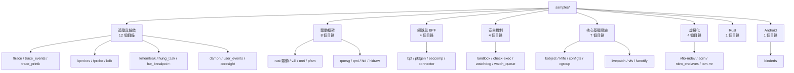

# Samples（核心範例程式碼）

## Purpose

`samples/` 目錄是 Linux 核心的官方範例程式碼集合，提供核心子系統 API 的參考實現與使用範本。它涵蓋兩大類別：**核心模組範例**（編譯為 .ko，在核心空間執行）和**使用者空間工具範例**（編譯為 ELF 執行檔，示範如何從使用者空間與核心互動）。這些範例既是 API 文件的補充，也是開發者學習核心內部機制的實用教材。

## Evidence Snapshot

| Claim | Source anchor |
|-------|---------------|
| `samples/` 由 `SAMPLES` menuconfig 統一控制 | `common/samples/Kconfig:1-7` |
| ftrace、trace events、kobject、kprobes 等範例透過 Kconfig 獨立開關 | `common/samples/Kconfig:13-31`, `common/samples/Kconfig:63-82` |
| Android BinderFS sample 是 ACK samples 之一 | `common/samples/Makefile:4-6` |
| Rust samples、DAMON samples、fprobe samples 等由 Makefile 依 CONFIG 納入 | `common/samples/Makefile:39-47` |

## Directory Map

```
samples/                          # 40,417 行程式碼、289 個檔案、46 個子目錄
├── Kconfig                       # 頂層配置選單（~35 個選項）
├── Makefile                      # 頂層建置規則（47 個目標）
│
├── bpf/                          # [最大] BPF 範例集（~100 檔案、17,797 行）
│   ├── *.bpf.c                   #   BPF 核心程式（CO-RE 格式）
│   ├── *_kern.c / *_user.c       #   傳統 kern/user 分離程式
│   ├── *.sh                      #   測試腳本（XDP、LWT）
│   └── Makefile.target           #   BPF 編譯目標定義
│
├── rust/                         # Rust 核心範例（17 個 .rs、1,795 行）
│   ├── rust_minimal.rs           #   最小模組範例
│   ├── rust_misc_device.rs       #   Misc 裝置（ioctl 示範）
│   ├── rust_driver_platform.rs   #   Platform 驅動（DT/ACPI 匹配）
│   ├── rust_driver_pci.rs        #   PCI 驅動
│   ├── rust_driver_i2c.rs        #   I2C 驅動
│   ├── rust_driver_usb.rs        #   USB 驅動
│   ├── rust_driver_faux.rs       #   Faux 驅動
│   ├── rust_driver_auxiliary.rs  #   Auxiliary 驅動
│   ├── rust_dma.rs               #   DMA 操作
│   ├── rust_debugfs.rs           #   DebugFS 介面
│   ├── rust_configfs.rs          #   ConfigFS 介面
│   ├── Kconfig                   #   15 個 Rust 配置選項
│   └── hostprogs/                #   Rust 主機端程式
│
├── ftrace/                       # ftrace 追蹤範例（1,921 行）
│   ├── ftrace-direct*.c          #   register_ftrace_direct() 範例
│   ├── ftrace-ops.c              #   自定義 ftrace ops 計時
│   └── sample-trace-array.*      #   Ftrace instance 存取
│
├── trace_events/                 # Trace event 定義範例
│   ├── trace-events-sample.*     #   標準 trace event 範例
│   └── trace_custom_sched.*      #   自定義排程 trace event
│
├── seccomp/                      # Seccomp BPF 範例（1,111 行）
│   ├── bpf-direct.c              #   直接 BPF 過濾
│   ├── bpf-fancy.c               #   進階 BPF 過濾
│   ├── dropper.c                 #   系統呼叫攔截
│   └── user-trap.c               #   使用者空間陷阱處理
│
├── livepatch/                    # 即時修補範例（888 行、7 個範例）
│   ├── livepatch-sample.c        #   基本 livepatch 範例
│   ├── livepatch-callbacks-*.c   #   回呼機制範例
│   └── livepatch-shadow-*.c      #   Shadow 變數範例
│
├── vfio-mdev/                    # VFIO 媒介裝置範例（3 個虛擬裝置）
│   ├── mtty.c                    #   虛擬 tty 裝置
│   ├── mdpy.c / mdpy-fb.c       #   虛擬顯示裝置 + fbdev
│   └── mbochs.c                  #   Bochs 相容虛擬顯示
│
├── kprobes/                      # Kprobe/Kretprobe 範例
├── fprobe/                       # Fprobe 範例
├── kfifo/                        # KFIFO 環形緩衝區範例（4 種模式）
├── kobject/                      # Kobject/Kset 範例
├── connector/                    # 核心-使用者空間 connector 範例
├── configfs/                     # ConfigFS 範例
├── hid/                          # HID BPF 範例（Surface Dial/Mouse）
├── pktgen/                       # 封包產生器腳本（11 個 .sh）
├── damon/                        # DAMON 記憶體監控範例（3 個模組）
│
├── binderfs/                     # [Android] Binderfs 使用範例
├── cgroup/                       # Cgroup 事件監聽範例
├── landlock/                     # Landlock 沙箱範例
├── vfs/                          # 新 VFS API 範例（mount API、statx）
├── check-exec/                   # SECBIT_EXEC 安全位元範例
├── watchdog/                     # Watchdog 裝置範例
├── watch_queue/                  # 通知佇列 API 範例
├── hidraw/                       # HID Raw 裝置範例
├── pidfd/                        # pidfd 使用範例
├── timers/                       # HPET 計時器範例
├── mei/                          # Intel MEI 裝置範例
├── pfsm/                         # TPS6594 PFSM 範例
├── qmi/                          # Qualcomm QMI/QRTR 範例
├── rpmsg/                        # Remote Processor Messaging 範例
├── acrn/                         # ACRN hypervisor VM 範例
├── nitro_enclaves/               # AWS Nitro Enclaves ioctl 範例
├── coresight/                    # CoreSight 配置範例
├── kmemleak/                     # 記憶體洩漏測試
├── hung_task/                    # Hung task 偵測觸發
├── tsm-mr/                       # TSM 測量暫存器範例
├── hw_breakpoint/                # 硬體斷點範例
├── kdb/                          # KDB 自定義命令範例
├── auxdisplay/                   # 輔助顯示器範例
├── fanotify/                     # Fanotify 監控範例
├── v4l/                          # V4L2 PCI 骨架驅動
├── trace_printk/                 # trace_printk 格式測試
└── user_events/                  # 使用者事件範例
```

## Architecture

### 編譯模型

samples/ 使用兩種截然不同的編譯模型：

1. **核心模組（`obj-$(CONFIG_*)`）：** 編譯為 .ko 檔案，透過 `insmod`/`modprobe` 載入到核心空間。大部分追蹤、驅動框架、livepatch 範例使用此模式。
2. **使用者空間程式（`subdir-$(CONFIG_*)`）：** 編譯為獨立 ELF 執行檔，展示如何從使用者空間存取核心功能。binderfs、seccomp、landlock、VFS、pidfd 等範例使用此模式。

### 範例分類

按照目標子系統，46 個範例目錄可分為以下幾大類：



## Key Sample Groups（重點範例群組）

### BPF 範例集（`samples/bpf/`）— 最大子目錄

BPF 範例集是 samples/ 中規模最大的子目錄，包含 ~100 個檔案、17,797 行程式碼，涵蓋幾乎所有 BPF 程式類型：

- **XDP 範例：** `xdp_fwd`（封包轉發）、`xdp_adjust_tail`（封包截斷）、`xdp_tx_iptunnel`（IP 隧道）、`xdp_router_ipv4`（IPv4 路由）
- **追蹤範例：** `tracex1`-`tracex6`（kprobe 追蹤）、`trace_event`（tracepoint）、`sampleip`（IP 採樣）、`offwaketime`（喚醒延遲）
- **TC 範例：** `tc_l2_redirect`（L2 重定向）、`tcbpf1`（TC classifier）
- **Socket 範例：** `sockex1`-`sockex3`（socket filter）、`per_socket_stats_example`
- **LWT 範例：** `lwt_len_hist`（封包長度直方圖）
- **HBM 範例：** `hbm`（Host Bandwidth Manager，限速）
- **Map 範例：** `test_map_in_map`（巢狀 map）、`map_perf_test`（map 效能測試）
- **Android 相關：** `cookie_uid_helper_example`（UID-cookie 映射，Android 網路流量統計用）

### Rust 核心範例（`samples/rust/`）— 15 個模組

Rust 範例展示了核心 Rust 抽象層的各種用法，是學習 Rust-in-kernel 的主要入口：

| 範例 | 行數 | 展示功能 |
|------|------|---------|
| `rust_minimal.rs` | 49 | 最小模組框架：`module!` 巨集、`KVec`、模組參數 |
| `rust_misc_device.rs` | 273 | Misc 裝置：ioctl 處理、`Mutex`、`UserSlice`、`Pin`、`read_iter`/`write_iter` |
| `rust_driver_platform.rs` | 192 | Platform 驅動：DT/ACPI 匹配表、`fwnode` 屬性解析 |
| `rust_driver_pci.rs` | ~150 | PCI 驅動：BAR 映射、中斷處理 |
| `rust_driver_i2c.rs` | ~90 | I2C 驅動：bus 匹配、資料傳輸 |
| `rust_driver_usb.rs` | ~60 | USB 驅動：endpoint 配置 |
| `rust_driver_faux.rs` | ~30 | Faux 驅動：最簡驅動框架 |
| `rust_driver_auxiliary.rs` | ~160 | Auxiliary bus 驅動 |
| `rust_dma.rs` | ~170 | DMA 操作：coherent/streaming 映射 |
| `rust_debugfs.rs` | ~240 | DebugFS 檔案建立與讀寫 |
| `rust_debugfs_scoped.rs` | ~200 | Scoped DebugFS（自動清理）|
| `rust_configfs.rs` | ~270 | ConfigFS 子系統介面 |
| `rust_i2c_client.rs` | ~200 | I2C client 手動建立 |
| `rust_print_main.rs` | ~170 | 列印巨集：`pr_info!`、`pr_warn!`、`pr_err!` + trace event |

**關鍵設計模式：**
- 所有範例使用 `module!` 巨集定義模組 metadata
- 驅動範例使用 `module_platform_driver!` 等特化巨集
- `Pin`-based 初始化（`try_pin_init!`）用於有自引用的結構
- `ARef<Device>` 用於裝置引用計數
- `KBox`/`KVec` 取代標準庫的 `Box`/`Vec`，使用 `GFP_KERNEL` 分配

### Ftrace 範例（`samples/ftrace/`）— 追蹤框架教學

8 個範例展示 ftrace 的不同使用方式：
- **Direct function：** `register_ftrace_direct()` 直接掛接到 `wake_up_process`、`schedule` 等函式
- **Direct modify：** 動態修改已註冊的 direct trampoline
- **Multi-function：** 同時掛接多個函式的 direct call
- **Ftrace ops：** 自定義 `ftrace_ops` 結構，測量函式呼叫時間
- **Trace array：** 從核心模組存取 ftrace instance

### Livepatch 範例（`samples/livepatch/`）— 即時修補教學

7 個範例漸進式展示 livepatch 機制：
- `livepatch-sample.c`：基本修補（替換 `cmdline_proc_show` 輸出）
- `livepatch-callbacks-*.c`：pre/post 回呼、模組載入/卸載順序
- `livepatch-shadow-*.c`：shadow 變數（為已有結構附加額外資料）

### DAMON 範例（`samples/damon/`）— 記憶體監控

3 個範例展示 DAMON 的實際應用場景：
- `wsse.c`：工作集大小估算（接收 PID，監控虛擬位址空間存取，輸出工作集大小）
- `prcl.c`：主動回收（監控存取模式，回收未被存取的記憶體區域）
- `mtier.c`：記憶體階層化（假設雙 NUMA 節點，DDR5 + CXL DDR4 架構）

## Android-Specific Changes

### Binderfs 範例 [android]

`samples/binderfs/binderfs_example.c` 是 samples/ 中唯一直接與 Android 相關的範例。它展示了：

1. **Namespace 隔離：** `unshare(CLONE_NEWNS)` 建立獨立掛載命名空間
2. **Binderfs 掛載：** `mount(NULL, "/dev/binderfs", "binder", 0, 0)`
3. **裝置建立：** `ioctl(fd, BINDER_CTL_ADD, &device)` 動態建立 binder 裝置
4. **裝置刪除：** `unlink("/dev/binderfs/my-binder")`
5. **功能探測：** 讀取 `/dev/binderfs/features/` 獲取支援功能

此範例對應 `CONFIG_SAMPLE_ANDROID_BINDERFS`，依賴 `CC_CAN_LINK && HEADERS_INSTALL`。

### BPF Cookie-UID Helper [android]

`samples/bpf/cookie_uid_helper_example.c` 雖未明確標記為 Android，但使用了 Android 網路堆疊中的 cookie-to-UID 映射機制，用於流量統計與網路策略執行。

## Configuration

- **總開關：** `CONFIG_SAMPLES=y` 啟用所有範例的配置選項
- **GKI 配置：** GKI defconfig 通常**不啟用**任何 SAMPLE_* 選項（範例僅供開發/測試）
- **編譯類型：** 大多數核心模組範例要求 `m`（模組編譯），不支援直接編入核心
- **架構限制：** `SAMPLE_FTRACE_DIRECT` 需要 `HAVE_SAMPLE_FTRACE_DIRECT`（x86、arm64）；`SAMPLE_QMI_CLIENT` 限 Qualcomm 平台

## Statistics

| 指標 | 數值 |
|------|------|
| 子目錄數 | 46 |
| 總檔案數 | 289 |
| 總程式碼行數 | ~40,417 |
| C 原始檔 (.c) | 155 |
| Rust 原始檔 (.rs) | 17 |
| 標頭檔 (.h) | 19 |
| Shell 腳本 (.sh) | 18 |
| Kconfig 選項 | ~35 + 15 (Rust) + 3 (DAMON) = ~53 |

## Cross-References

- [追蹤與 ftrace](../concepts/tracing-and-ftrace.md) — ftrace/trace_events/kprobes/fprobe 範例的目標子系統
- [BPF](../concepts/bpf.md) — BPF 範例集的核心框架
- [Rust in Kernel](../concepts/rust-in-kernel.md) — Rust 範例展示的抽象層
- [Binderfs](../entities/binderfs.md) — binderfs 範例的對應實體
- [Driver Model](../concepts/driver-model.md) — Rust 驅動範例展示的 Bus-Device-Driver 模型
- [鎖定原語](../concepts/locking-primitives.md) — Rust misc_device 中的 Mutex 使用
- [安全](../subsystems/security.md) — seccomp/landlock/check-exec 範例
- [記憶體管理](../subsystems/memory-management.md) — DAMON/kmemleak 範例
- [Cgroup Controllers](../entities/cgroup-controllers.md) — cgroup 範例
- [Source: samples/Kconfig](../sources/src-samples-Kconfig.md) — 完整配置選項列表
