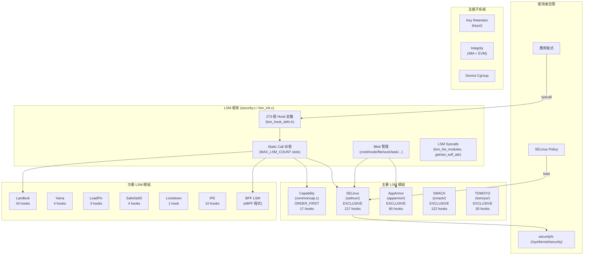

# Security 子系統

## 概述

Security 子系統是 Linux 核心的強制存取控制（MAC）與安全策略執行框架。其核心是 **Linux Security Module（LSM）** 框架——一套可插拔的 hook 機制，讓多個安全模組可同時對核心物件（程序、檔案、socket、IPC 等）進行存取控制決策。整個子系統位於 `security/` 目錄下，包含 163 個 `.c` 檔案、95 個 `.h` 檔案，總計約 110,586 行程式碼。

在 Android Common Kernel (ACK) 中，SELinux 是主要的強制存取控制引擎，GKI defconfig 啟用了 SELinux、Landlock、SafeSetID 與 BPF LSM 四個安全模組。

## 目錄地圖

| 路徑 | 行數 | 說明 |
|------|------|------|
| `security.c` | 5,595 | LSM 框架核心——273 個 hook 的派發實作、blob 分配 |
| `lsm_init.c` | 564 | LSM 初始化：排序、blob 大小計算、static call 註冊 |
| `commoncap.c` | 1,523 | POSIX Capabilities 預設實作 (17 hooks) |
| `lsm_audit.c` | 457 | LSM 稽核日誌格式化 |
| `lsm_syscalls.c` | 122 | `lsm_list_modules`/`lsm_get_self_attr`/`lsm_set_self_attr` 系統呼叫 |
| `device_cgroup.c` | 870 | Device cgroup 控制器 |
| `inode.c` | 380 | securityfs 虛擬檔案系統 |
| `lsm.h` | 58 | LSM 內部標頭 |
| `Kconfig` | 290 | 主配置（LSM 選擇、順序） |
| `Kconfig.hardening` | 356 | 核心強化選項（stack init、FORTIFY_SOURCE、usercopy、randstruct） |
| **selinux/** | 25,424 | SELinux 強制存取控制（217 hooks） |
| **apparmor/** | 19,069 | AppArmor 路徑型 MAC（80 hooks） |
| **keys/** | 13,508 | 核心金鑰管理（key retention service） |
| **integrity/** | 12,462 | IMA/EVM 完整性度量與驗證 |
| **tomoyo/** | 11,220 | TOMOYO 路徑型 MAC（30 hooks） |
| **smack/** | 9,244 | SMACK 簡化 MAC（122 hooks） |
| **landlock/** | 5,208 | Landlock 非特權沙箱（34 hooks） |
| **ipe/** | 3,068 | Integrity Policy Enforcement（10 hooks） |
| **safesetid/** | 640 | SafeSetID UID/GID 過渡控制（4 hooks） |
| **yama/** | 481 | Yama ptrace 限制（4 hooks） |
| **loadpin/** | 446 | LoadPin 核心模組來源鎖定（3 hooks） |
| **lockdown/** | 172 | Kernel Lockdown 完整性/機密性保護（1 hook） |
| **bpf/** | 39 | BPF LSM 入口（0 hooks 自身，轉由 BPF 程式實作） |

## 架構



## 核心設計：LSM 框架

### Hook 派發機制

LSM 框架定義了 **273 個安全 hook**（`include/linux/lsm_hook_defs.h`），涵蓋核心所有敏感操作：Binder IPC（4 hooks）、ptrace（2）、capability（4）、檔案操作（~40）、inode 操作（~30）、superblock（~15）、IPC（~15）、網路/socket（~30）等。

每個 hook 使用 **static call** 機制進行派發。`security.c` 中為每個 hook 建立 `MAX_LSM_COUNT` 個 static call slot，各啟用的 LSM 在初始化時透過 `security_add_hooks()` @ `lsm_init.c:367` 將自己的回呼函式註冊到對應的 slot。執行時，LSM 框架依序呼叫每個 slot 的回呼——這比傳統的間接函式指標呼叫有更好的分支預測效能。

### Blob 管理

LSM 框架為核心物件提供統一的安全資料（blob）管理。在 `lsm_init.c:285`（`lsm_prepare`）中，框架匯總所有啟用 LSM 所需的 blob 大小，並按 `sizeof(void *)` 對齊。支援的 blob 類型共 17 種：

cred、file、inode、ipc、key、msg_msg、perf_event、sock、superblock、task、tun_dev、xattr_count、bdev、bpf_map、bpf_prog、bpf_token、ib

`security.c` 中的 `lsm_file_cache` 和 `lsm_inode_cache` 使用 `kmem_cache` 進行高頻物件的 slab 分配。

### 初始化順序

LSM 初始化分為三個階段：

1. **Early LSM**（`early_security_init` @ `lsm_init.c:383`）：僅限 `DEFINE_EARLY_LSM` 定義的模組（如 Lockdown），在核心啟動最早期執行。
2. **LSM 排序**（`security_init` @ `lsm_init.c:405`）：解析 `CONFIG_LSM` 字串或 `lsm=` 命令列參數，按序啟用模組。
3. **分階段 initcall**：pure → early → core → subsys → fs → device → late，共 7 個階段（`lsm_init.c:490-564`）。

LSM 排序邏輯（`lsm_order_parse` @ `lsm_init.c:198`）：
- `LSM_ORDER_FIRST`：最先執行（Capability 模組）
- `LSM_ORDER_MUTABLE`：按 `CONFIG_LSM` 字串順序排列
- `LSM_ORDER_LAST`：最後執行
- `LSM_FLAG_EXCLUSIVE`：互斥模組，僅允許一個（SELinux/AppArmor/SMACK/TOMOYO 四選一）

GKI 預設 LSM 順序：`landlock,lockdown,yama,loadpin,safesetid,selinux,smack,tomoyo,apparmor,ipe,bpf`

### LSM Syscall 介面

`lsm_syscalls.c`（122 行）提供三個系統呼叫：
- `lsm_list_modules`：列出當前啟用的 LSM ID 列表
- `lsm_get_self_attr`：取得當前程序的 LSM 屬性（如 SELinux context）
- `lsm_set_self_attr`：設定當前程序的 LSM 屬性

## 關鍵資料結構

- **`struct lsm_info`**：每個 LSM 模組的描述符——名稱、flags、init 回呼、blob 大小、enabled 狀態
- **`struct security_hook_list`**：單個 hook 註冊記錄——hook 函式指標、所屬 LSM ID、static call 陣列
- **`struct lsm_blob_sizes`**：匯總各 LSM 所需的每種 blob 大小（17 種物件類型）
- **`struct lsm_static_calls_table`** @ `security.c:138`：所有 273 hooks × MAX_LSM_COUNT slots 的 static call 表，標記為 `__ro_after_init`
- **`struct avc_node`**（SELinux）：AVC（Access Vector Cache）快取節點——ssid/tsid/tclass → 允許/拒絕向量

## 關鍵程式碼路徑

### 1. LSM 初始化流程

```
start_kernel()
  → early_security_init() @ lsm_init.c:383
    → 遍歷 __start_early_lsm_info ~ __end_early_lsm_info
    → lsm_prepare() 計算 blob 大小
    → lsm_init_single() 呼叫 LSM init()
  → security_init() @ lsm_init.c:405
    → lsm_order_parse(CONFIG_LSM) 按序啟用 LSM
    → lsm_prepare() 匯總所有 blob 大小
    → kmem_cache_create("lsm_file_cache"/"lsm_inode_cache")
    → lsm_cred_alloc(current->cred) 為 init 程序分配 cred blob
    → lsm_init_single() 依序初始化各 LSM
```

### 2. Hook 派發流程（以 security_file_open 為例）

```
do_dentry_open() @ fs/open.c
  → security_file_open() @ security.c
    → LSM_LOOP_UNROLL 展開 MAX_LSM_COUNT 次：
      → static_branch_unlikely(SECURITY_HOOK_ACTIVE_KEY(file_open, i))
      → static_call(LSM_STATIC_CALL(file_open, i))(file)
        → selinux_file_open()      [SELinux 檢查]
        → landlock_file_open()      [Landlock 檢查]
        → ... (其他啟用的 LSM)
    → 任一 LSM 回傳非零即拒絕存取
```

### 3. SELinux 存取決策流程

```
selinux_inode_permission() @ selinux/hooks.c
  → inode_has_perm()
    → avc_has_perm()
      → avc_lookup() @ selinux/avc.c
        → 查詢 AVC hash table (ssid, tsid, tclass)
        → [命中] 回傳快取的 allowed vector
        → [未命中] → security_compute_av() @ selinux/ss/services.c
          → 查詢 SELinux policy database (policydb)
          → 評估 type enforcement、MLS/MCS 規則、conditional rules
          → 計算 allowed/auditallow/auditdeny vectors
          → 插入 AVC cache
      → 比對 requested permissions vs. allowed vector
      → [拒絕] → avc_denied() → 稽核日誌
```

### 4. Capability 檢查流程

```
capable() → ns_capable()
  → security_capable() @ security.c:629
    → cap_capable() @ commoncap.c
      → 檢查 task cred 的 cap_effective bitfield
      → 考慮 user namespace 層級映射
    → selinux_capable() [如啟用]
      → cred_has_capability()
        → avc_has_perm(sid, sid, SECCLASS_CAPABILITY, CAP_TO_MASK(cap))
```

### 5. Key Retention Service 流程

```
add_key() syscall
  → key_create_or_update() @ security/keys/key.c
    → security_key_alloc() → LSM hook
    → key_alloc()
      → 分配 struct key、設定 perm/uid/gid
    → key->type->instantiate() → 依 key type 執行
    → security_key_post_create_or_update() → LSM hook
```

## 各安全模組詳述

### SELinux（25,424 行）[android：主要 MAC]

SELinux 是 Android 的核心強制存取控制引擎，實作 Type Enforcement (TE)、Role-Based Access Control (RBAC) 與 Multi-Level Security (MLS/MCS)。

**核心檔案：**
- `hooks.c`（7,751 行）：217 個 LSM hook 實作，涵蓋 Binder、檔案、socket、IPC、key、BPF、io_uring 等
- `ss/services.c`（4,073 行）：安全伺服器核心——policy 載入、存取向量計算、SID 管理
- `ss/policydb.c`（3,804 行）：Policy 資料庫讀取與驗證
- `avc.c`（1,216 行）：Access Vector Cache——hash table 實作、LRU 淘汰
- `selinuxfs.c`（2,151 行）：selinuxfs 虛擬檔案系統（/sys/fs/selinux/）——policy 載入介面

**標記為 `LSM_FLAG_EXCLUSIVE`**：與 AppArmor/SMACK/TOMOYO 互斥，同時僅能啟用一個。

### AppArmor（19,069 行）

路徑型 MAC 系統，使用設定檔（profile）而非標籤。80 個 LSM hooks。`LSM_FLAG_EXCLUSIVE`。GKI 未預設啟用。

### SMACK（9,244 行）

簡化的強制存取控制核心。122 個 LSM hooks，使用簡單文字標籤進行存取決策。`LSM_FLAG_EXCLUSIVE`。GKI 未預設啟用。

### TOMOYO（11,220 行）

路徑型 MAC，30 個 hooks。`LSM_FLAG_EXCLUSIVE`。GKI 未預設啟用。

### Landlock（5,208 行）[android：GKI 啟用]

非特權沙箱機制，允許程序自行限縮檔案系統、網路存取權限（無需 root）。34 個 hooks。`CONFIG_SECURITY_LANDLOCK=y` 在 GKI defconfig 中啟用。

### SafeSetID（640 行）[android：GKI 啟用]

控制 UID/GID 過渡——限制哪些 UID 可以 setuid 到哪些 UID。4 個 hooks。`CONFIG_SECURITY_SAFESETID=y` 在 GKI 中啟用。

### BPF LSM（39 行）[android：GKI 啟用]

允許透過 eBPF 程式動態實作安全策略。`CONFIG_BPF_LSM=y` 在 GKI 中啟用。BPF 程式可附加到任意 LSM hook 上，提供極大的靈活性。

### LoadPin（446 行）

限制核心模組只能從初始掛載的同一檔案系統載入。3 個 hooks。GKI 未在 defconfig 中顯式啟用。

### Yama（481 行）

擴展 ptrace 限制（4 種模式：classic / restricted / admin-only / no-attach）。4 個 hooks。GKI 未在 defconfig 中顯式啟用。

### Lockdown（172 行）

核心鎖定——兩級保護（integrity / confidentiality），限制 kexec、/dev/mem、kprobes、debugfs 等。1 個 hook + Early LSM。

### IPE（3,068 行）

Integrity Policy Enforcement——根據檔案的完整性屬性（dm-verity、fsverity）允許/拒絕執行。10 個 hooks。

### Capability（commoncap.c，1,523 行）

POSIX Capabilities 預設實作。`LSM_ORDER_FIRST`——永遠最先執行。17 個 hooks，包括 `capable`、`capget`、`capset`、`bprm_creds_from_file`（setuid/setgid 處理）等。

## 支援子系統

### Key Retention Service（keys/，13,508 行）

核心金鑰管理服務，提供 `add_key`/`request_key`/`keyctl` 系統呼叫。支援多種金鑰類型：user defined、keyring、big_key、encrypted-keys、trusted-keys（TPM）。Diffie-Hellman 金鑰交換支援（`dh.c`）。

### 完整性子系統（integrity/，12,462 行）

- **IMA**（Integrity Measurement Architecture）：度量核心載入的檔案內容，維護度量日誌（PCR extend）。
- **EVM**（Extended Verification Module）：保護檔案安全擴展屬性（security xattrs）的完整性。
- **Platform Certs**：載入 UEFI db/dbx 憑證。

### Device Cgroup（device_cgroup.c，870 行）

控制 cgroup 內程序可存取的裝置號碼範圍（type/major/minor/access）。

## 核心強化選項（Kconfig.hardening）

| 配置選項 | GKI 狀態 | 說明 |
|----------|---------|------|
| `INIT_STACK_ALL_ZERO` | 預設 | 函式入口時將所有棧變數初始化為零 |
| `INIT_ON_ALLOC_DEFAULT_ON` | **啟用** | slab/page 分配時零初始化 |
| `FORTIFY_SOURCE` | **啟用** | 編譯時 + 執行時字串/記憶體函式越界檢查 |
| `HARDENED_USERCOPY` | **啟用** | copy_to/from_user 越界檢查 |
| `SLAB_FREELIST_HARDENED` | **啟用** | SLUB freelist 指標混淆 |
| `CFI` | **啟用** | Control Flow Integrity（間接呼叫目標驗證） |
| `SHADOW_CALL_STACK` | **啟用** | Shadow Call Stack（ARM64 返回地址保護） |
| `LIST_HARDENED` | — | 鏈結串列完整性檢查 |
| `RANDSTRUCT` | — | 結構體隨機化 |

## Android 特定變更

### GKI 啟用的安全模組

GKI defconfig（`arch/arm64/configs/gki_defconfig`）啟用的安全相關配置：

```
CONFIG_SECURITY=y
CONFIG_SECURITY_SELINUX=y          # 主要 MAC
CONFIG_SECURITY_SAFESETID=y        # UID/GID 過渡控制
CONFIG_SECURITY_LANDLOCK=y         # 非特權沙箱
CONFIG_BPF_LSM=y                   # BPF 動態安全策略
CONFIG_CFI=y                       # Control Flow Integrity
CONFIG_SHADOW_CALL_STACK=y         # ARM64 返回地址保護
CONFIG_FORTIFY_SOURCE=y            # 記憶體安全強化
CONFIG_HARDENED_USERCOPY=y         # usercopy 檢查
CONFIG_INIT_ON_ALLOC_DEFAULT_ON=y  # 分配時零初始化
CONFIG_SLAB_FREELIST_HARDENED=y    # SLUB freelist 保護
```

**注意**：AppArmor、SMACK、TOMOYO、Yama、LoadPin、Lockdown、IPE 在 GKI defconfig 中 **未啟用**。`CONFIG_LSM` 未在 defconfig 中顯式設定，使用 Kconfig 預設值（包含所有已編譯的 LSM）。

### Binder 安全 Hooks

SELinux 在 `hooks.c:7312-7315` 註冊了 4 個 Binder 專用 hooks：
- `binder_set_context_mgr`：servicemanager 註冊控制
- `binder_transaction`：跨程序交易授權
- `binder_transfer_binder`：Binder 物件傳遞授權
- `binder_transfer_file`：fd 傳遞授權

這些 hooks 是 Android IPC 安全的基礎——每次 Binder 交易都會經過 SELinux 的 type enforcement 檢查。

## Vendor Hooks

Security 子系統包含 **5 個 Android restricted vendor hooks**，全部位於 SELinux 內部：

### AVC Hooks（include/trace/hooks/avc.h）

| Hook | 位置 | 參數 | 用途 |
|------|------|------|------|
| `android_rvh_selinux_avc_insert` | `avc.c` | `const struct avc_node *node` | 通知廠商模組 AVC 快取插入新節點 |
| `android_rvh_selinux_avc_node_delete` | `avc.c` | `const struct avc_node *node` | 通知 AVC 節點被刪除（LRU 淘汰） |
| `android_rvh_selinux_avc_node_replace` | `avc.c` | `old, new` | 通知 AVC 節點被替換 |
| `android_rvh_selinux_avc_lookup` | `avc.c` | `node, ssid, tsid, tclass` | 通知 AVC 查詢結果 |

### SELinux State Hook（include/trace/hooks/selinux.h）

| Hook | 位置 | 參數 | 用途 |
|------|------|------|------|
| `android_rvh_selinux_is_initialized` | `ss/services.c` | `const struct selinux_state *state` | 通知 SELinux 初始化完成 |

所有 5 個 hooks 均為 **DECLARE_RESTRICTED_HOOK**（限制型 hook，僅允許一個註冊者），讓廠商模組可以監控 SELinux AVC 快取行為與初始化狀態，但不能修改存取控制決策本身。

## 配置選項

### 核心安全框架

| 選項 | 說明 |
|------|------|
| `CONFIG_SECURITY` | 啟用 LSM 框架 |
| `CONFIG_SECURITYFS` | securityfs 虛擬檔案系統 |
| `CONFIG_SECURITY_NETWORK` | Socket/Networking 安全 hooks |
| `CONFIG_SECURITY_PATH` | 路徑型存取控制 hooks |
| `CONFIG_LSM` | LSM 啟用順序字串 |

### SELinux

| 選項 | 說明 |
|------|------|
| `CONFIG_SECURITY_SELINUX` | 啟用 SELinux |
| `CONFIG_SECURITY_SELINUX_DEVELOP` | 允許切換 permissive/enforcing |
| `CONFIG_SECURITY_SELINUX_AVC_STATS` | AVC 快取統計 |
| `CONFIG_SECURITY_SELINUX_CHECKREQPROT_VALUE` | checkreqprot 預設值 |
| `LSM_MMAP_MIN_ADDR` | 低位址保護（ARM/ARM64 compat: 32768, 其他: 65536） |

### 強化

| 選項 | 說明 |
|------|------|
| `CONFIG_FORTIFY_SOURCE` | 字串/記憶體函式邊界檢查 |
| `CONFIG_HARDENED_USERCOPY` | copy_to/from_user 檢查 |
| `CONFIG_INIT_ON_ALLOC_DEFAULT_ON` | 分配零初始化 |
| `CONFIG_CFI` | Control Flow Integrity |
| `CONFIG_SHADOW_CALL_STACK` | ARM64 Shadow Call Stack |
| `CONFIG_SLAB_FREELIST_HARDENED` | SLUB freelist 保護 |
| `CONFIG_RANDSTRUCT` | 結構體佈局隨機化 |

## 交叉參考

- [BPF](../concepts/bpf.md)——BPF LSM 允許動態附加安全策略
- [Vendor Hooks](../concepts/vendor-hooks.md)——AVC/SELinux vendor hooks 機制
- [Module 系統](../concepts/module-system.md)——LoadPin 限制模組載入來源
- [GKI](../concepts/gki.md)——GKI defconfig 安全配置
- [鎖定原語](../concepts/locking-primitives.md)——AVC cache 鎖定機制
- [檔案系統](../subsystems/filesystems.md)——fscrypt/fsverity 與 IMA/IPE 的整合
- [網路](../subsystems/networking.md)——SELinux 網路安全 hooks（Netfilter、socket）
